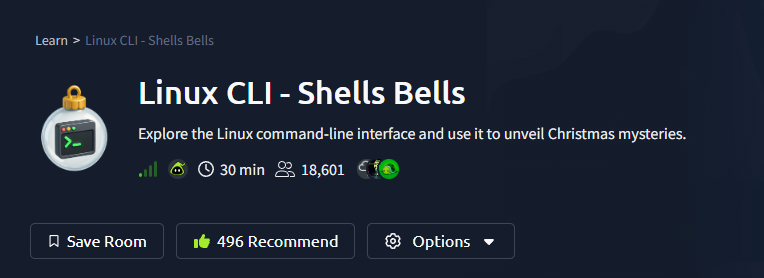

# Room Name: Linux CLI - Shells Bells



## Objective
- Learn the Linux CLI
- Explore its use for personal objectives and IT administration

Spin up your Target Machine; it opens as a side screen.

There is no GUI on the server; we have to use the Linux CLI.

## Linux CLI
Linux CLI is the command line interface of Linux.

First, type `echo "Hello World!"` and press enter.
This will print `Hello World!` in the terminal.

Then type `ls` and press enter.
This will list the files in the current directory (McSkidy's files).

You can see a txt file named `README.txt` in yellow color.

Type `cat README.txt` and press enter to see the message.

> [!TIP]
> **Trick:** If you press `TAB` before completing the entire `README.txt`, it will auto-complete the file name.


If you run `pwd` command, it will print the current directory, which is `/home/mcskidy`.

According to the message, McSkidy has left a security guide. Also, if you look at the list of files, you can see a directory named "Guides".
Looks like we do have our answers in the Guides directory.

## Guides Directory
Let's navigate to the Guides directory.

```bash
cd Guides
```

If we do `ls`, we don't see any files in the Guides directory.
Looks like we need to look for hidden files.

Let's try `ls -la`. `-l` is for long listing and `-a` is for hidden files.
(Well, `ls -la` and `ls -al` are the same command).

On doing `ls -la` we can see a hidden file named `.guide.txt`.

Now if we do `cat .guide.txt` we can see the message. Don't forget the `.` before `guide.txt`.


From this, we come to know that King Malhare from HopSec Island is preparing to attack.
And we need to protect Christmas to follow the guide to check `/var/log` and grep inside, to let logs become our guide.

## Checking Logs
Let's navigate to `/var/log` and do `ls`.

```bash
cd /var/log
```

Now we need to run `grep "Failed password" auth.log` to look for failed password attempts.

```bash
grep "Failed password" auth.log
```

- Here `grep` is used to search for a specific pattern in a file. In this case, `"Failed password"` is the pattern and `auth.log` is the file.


Here we see a lot of failed password attempts on the "socmas" account.
We clearly see they were trying to break into SOC-mas, Wareville's Christmas ordering platform.

## Finding Eggsploits
Based on the earlier guide, we need to look for Eggsploits and Eggshells with the `find` command - a command to search for files and directories with specific parameters.

You can clear the terminal by typing `clear` and pressing enter.

```bash
find /home/socmas -name "*egg*"
```

We find a file `eggstrike.sh`.
It is a shell script - used to execute CLI commands, used by both attackers and defenders to run automation scripts.

First, we need to navigate to the file.

```bash
cd /home/socmas/2025
```

Then read the file:

```bash
cat eggstrike.sh
```

We see:


It looks like it would execute some complex command. Let's decipher it:

```bash
cat wishlist.txt | sort | uniq > /tmp/dump.txt
rm wishlist.txt && echo "Christmas is fading..."
mv eastmas.txt wishlist.txt && echo "EASTMAS is invading!"
```

- `cat wishlist.txt | sort | uniq`: Lists unique items from the `wishlist.txt`.
- The command then sends the output (unique orders) to the `/tmp/dump.txt` file.
- `rm wishlist.txt`: Deletes the wishlist file (containing Christmas wishes).
- `mv eastmas.txt wishlist.txt`: Replaces the original file with `eastmas.txt`.

It also uses some special symbols like:
- `|` - Pipe symbol: sends output of one command to another command.
- `>` / `>>` - Redirect symbol: `>` overwrites file, `>>` appends to file.
- `&&` - AND symbol: execute next command only if previous command is successful.

From this, it is clear that the server has been breached, and the Christmas waitlist has been replaced with the EASTMAS one.

You can see how Sir Carrotbane replaced the wishlist by visiting the "attackbox link" from the VM's web browser.

## System Utilities
There are a lot of system utilities to view and manage your system:

- `uptime` - Shows system uptime.
- `ip addr` - Shows IP address.
- `ps aux` - Shows running processes.

To check username and their hashed password we can use `cat /etc/shadow`.
But we need root permissions to do so.

To switch to root user we can use `sudo su`.
And to return to our user we can use `exit`.

So let's do:

```bash
sudo su
```

Typing `whoami` will show `root`.

Then try:

```bash
cat /etc/shadow
```

## History
Also, every command run is saved in a hidden history file called `.bash_history`.

- Located in `/root/.bash_history` for root.
- And `/home/mcskidy/.bash_history` for mcskidy.

You can also use the `history` command to see the history of commands run.

Navigate to root:

```bash
cd /root
cat .bash_history
```


Based on all what we did above, you can answer the questions, and input the flags wherever we found it.

Thanks for joining and reading this walkthrough, have a great day! :)


