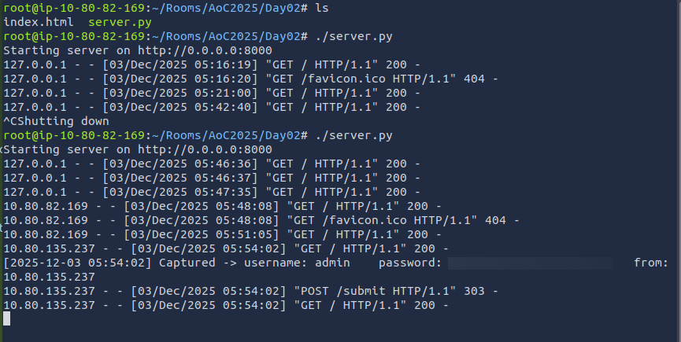

# **Phishing - Merry Clickmas: My Hands-On Walkthrough**


Alright, so TBFC (The Best Festival Company) wants us to run an *authorized* phishing campaign to see how their employees hold up. My job? Plan and execute the whole thing to test their security awareness. Let's dive in.

First things first – I need to fire up the virtual environment (the target machine and my attacker machine).

---

## **What I Need to Understand First**

Before jumping into the tasks, there are a couple of core concepts to wrap my head around:

### **1) Social Engineering**
Basically, it's the art of manipulating people into doing things they normally wouldn't – like sharing a password, opening a shady file, or approving a weird payment.

Here's the kicker: this is an attack on *people*, not machines. The attacker plays on human psychology – think urgency, curiosity, or pretending to be an authority figure. No wonder they sometimes call it "human hacking."

### **2) Phishing**
This is a specific type of social engineering where the attacker pretends to be someone you trust to steal your info. It used to be just emails, but now with smartphones everywhere, it's spread to text messages (smishing), calls (vishing), QR codes (quishing), and even social media DMs. The goal? Get you to click, open, or reply so they can grab information, money, or access.

TBFC's security team actually trains their employees using two techniques from **All Things Secured**:

1.  **The S.T.O.P. Checklist** (Ask yourself):
    *   Is this **S**uspicious?
    *   Is it **T**elling me to click something?
    *   Is it **O**ffering an amazing deal?
    *   Is it **P**ushing me to act right now?

2.  **The S.T.O.P. Action Plan**:
    *   **S**low down. Scammers want you to panic.
    *   **T**ype the address yourself. Never trust a link in a message.
    *   **O**pen nothing unexpected. Verify first.
    *   **P**rove the sender. Check the actual email address/number, not just the friendly display name.

Cool, training's done. Now for the fun part – let's see if I can actually pull this off.

---

## **My Mission: Steal Some Credentials**

The first task is straightforward: get employee credentials by creating a fake login page to capture them.

### **Step 1: Setting Up the Fake Page**
Luckily, there's already a script waiting for me on the AttackBox. I just need to navigate to it and run it.

```bash
cd ~/Rooms/AoC2025/Day02
```

Once it's running, I check it out at `http://127.0.0.1:8000`. Looks like a legit login page – perfect.


The trap is set. Now I need bait.

### **Step 2: Crafting the Phishing Email**
I can't send this from my personal email – that's a terrible idea. The email needs to look like it's from a legitimate sender. The tool for this job? The **Social-Engineer Toolkit (SET)**. It's a bit of a process, so I'll take it slow.

I start it up in the terminal:
```bash
setoolkit
```


I'm presented with a menu. I go with:
1. **Option 1** → Social-Engineering Attacks
2. **Option 5** → Mass Mailer Attack


Now for the detailed setup. I choose to target a single email address first to test the waters.

Here’s how I configured my attack:
*   **Send email to**: `factory@wareville.thm` (My target at the toy factory)
*   **How to deliver**: Use my own server / open relay
*   **From address**: `updates@flyingdeer.thm` (I know the factory guys talk to this shipping company often)
*   **From name**: `Flying Deer` (Sounds official)
*   **SMTP server**: I enter the `<Target Machine IP>` to deliver directly to TBFC's mail server.
*   **Port**: `25` (the default for SMTP)


Next, I decide on the email content:
*   **High priority?** Nah, I'll keep it normal.
*   **Attach a file?** No.
*   **Subject**: "Shipping Schedule Changes" (Something relevant and believable)
*   **Format**: Plaintext is fine.
*   **Body**: I write a convincing message about updated delivery times and crucially, I slip in my phishing link: `http://10.80.82.169:8000`. I type `END` when I'm finished.

And... send!

### **Step 3: The Waiting Game**
Now I switch over to the terminal where my `server.py` script is running and watch. This is the moment of truth – will someone take the bait?

I wait a minute... nothing. Maybe it didn't work?
I wait another minute... and bingo! Credentials start popping up in the terminal.



The first email might have been ignored, but the second one worked. This confirms it – my phishing attack was successful. It's honestly a bit alarming how well this works.

---

## **What Can I Do With These Credentials?**

The room now asks me to put the stolen password to use.

1.  I browse to the target machine's web interface: `http://10.80.135.237`
2.  I try to log into the mailbox for the `factory` user with the password I just captured.


I'm in! I have full access to the factory user's email.


Looking at the inbox, I can even see the two phishing emails I sent. The first one failed, but the second one did the trick. From the emails, I can also answer the room's question about the total number of toys expected for delivery.

---

## **My Final Thoughts**

This room was a fantastic, hands-on simulation. It really drove home how a simple, well-crafted phishing email can bypass training and lead to a full credential compromise. As an attacker, it's powerful. As a defender, it's a stark reminder that human vigilance is the last and most critical layer of defense.

Thanks for following along with my walkthrough. Stay safe out there, and always think before you click! :)