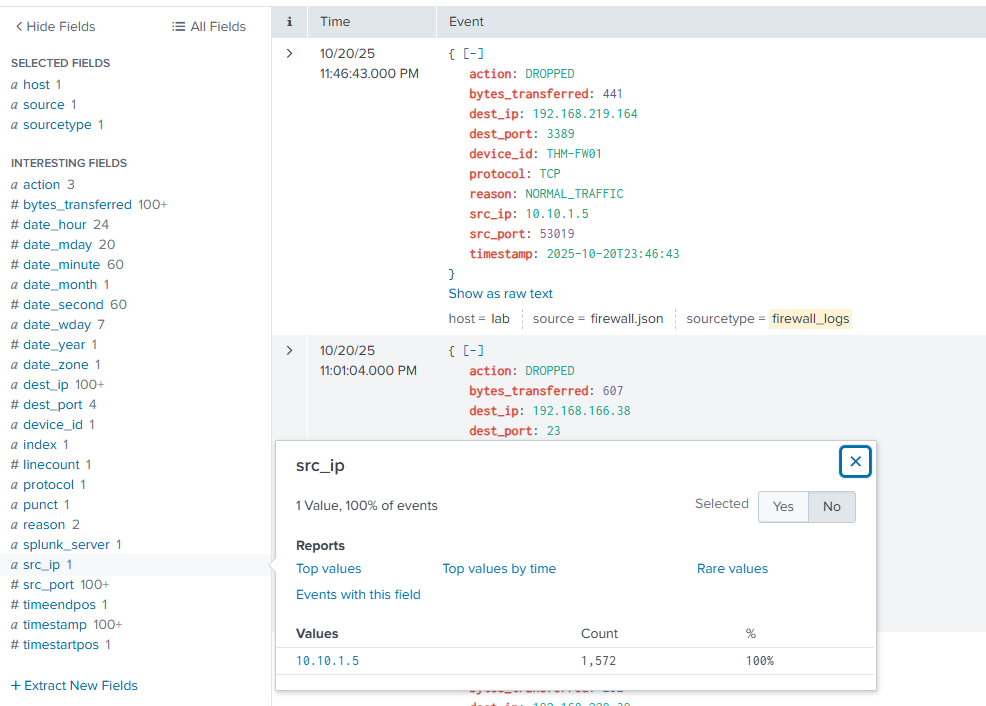
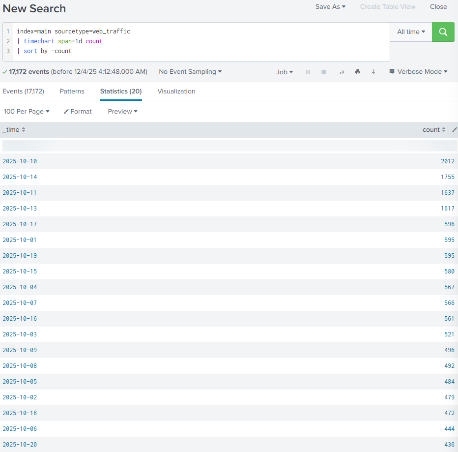
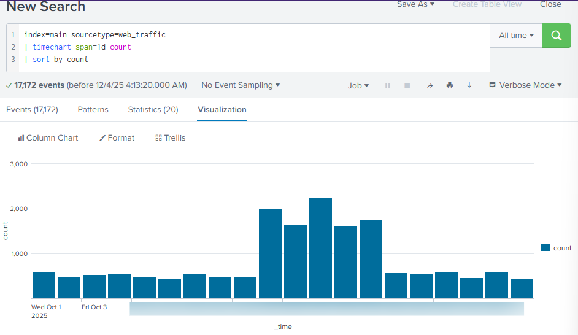
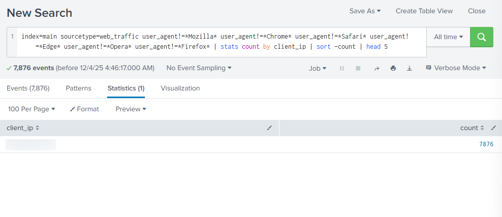
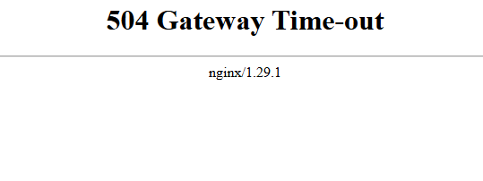
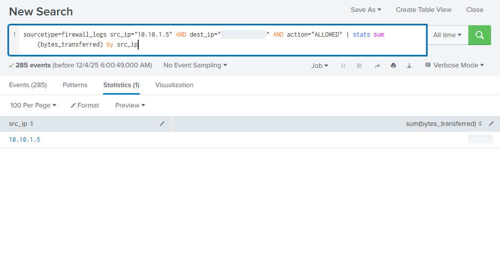

# Room Name: Splunk Basics - Did you SIEM?

Well, as we are approaching Christmas, TBFC (The Best Festival Company) is preparing for the big celebration.

Until the SOC dashboard flashes red.

A ransom message appears on the screen.

> "ATTACK  
> 1000 HopSec Coins for McSkidy..  
> or SOC-mas ends tonight"

Sent by none other than King Malhare from HopSec Island.

With McSkidy still missing, and the network under attack,  
the TBFC SOC team will utilize Splunk to investigate the attack and prevent King Malhare's plan from succeeding.

Let's first connect to the machine.  
As we are on the defender side, we only need a target machine to work on, which is our Splunk instance.

Once the machine is up and running, we need to connect to it by visiting the link given to you in your browser.

---

First of all, we need to understand what is Splunk.

Splunk is a platform for collecting, storing, and analysing machine data. It provides various tools for analysing data, including search, correlation, and visualisation. It is a powerful tool that organisations of all sizes can use to improve their IT operations and security posture.

For this room, we are provided with a Splunk instance with pre-ingested data for us to investigate the incident.

Once we have opened up the Splunk instance,  
click on **Search & Reporting** on the left panel.

On the next page, type `index=main` in the search bar to show all the data ingested in the Splunk instance.

Select **All time** from the dropdown at the right end of the search bar, and click on **Search**.

Now if you have a look in the **SELECTED FIELDS**, you will see **sourcetype**. On clicking on it you will see all the sourcetype in the Splunk instance (`web_traffic` and `firewall_logs`).

Here **sourcetype** means the type of data that is being ingested in the Splunk instance.

*   **web_traffic**: This data source contains events related to web connections to and from the web server.
*   **firewall_logs**: This data source contains the firewall logs, showing the traffic allowed or blocked. The local IP assigned to the web server is `10.10.1.15`. (We know this from the `src_ip` field)

---

## Initial Triage

Start a basic search across the index using your custom source type `web_traffic`.

**2 ways to do it:**
1.  `index=main sourcetype=web_traffic` (type it in the search bar)
2.  Simply click on **web_traffic** in the **SELECTED FIELDS**

Now let's understand what do we see on our screen:

1.  **Search query**: This query retrieves all events from the `main` index that were tagged with the custom source type `web_traffic`. This marks the beginning of the investigation.
2.  **Time range**: The time range is currently set to "All time". In security analysis, this range would be tightened (e.g., to the spike window) after initial data loading.
3.  **Timeline**: This visual histogram shows the distribution of the 17,172 events over time. The graph indicates the successful daily log volume followed by a distinctive traffic spike (a period of high activity, likely the attack window).
4.  **Selected fields**: These are the fields currently chosen to be displayed in the summary column of the event list (`host`, `source`, `sourcetype`). They represent basic metadata about the log file itself.
5.  **Interesting fields**: This pane lists all fields that Splunk has automatically extracted or manually added. Fields prefixed with `#` (e.g., `#date_hour`) are automatically generated by Splunk's time commands. The presence of `user_agent`, `path`, and `client_ip` confirms the successful parsing of the web log structure.
6.  **Event details & field extraction**: This section shows the parsed details of a single event with extracted fields like `user_agent`, `path`, `status`, `client_ip`, and more.

Now as we have got an understanding of the Splunk layout, let's see how to read logs in Splunk.

---

## Visualizing the Logs Timeline

Let's group all the events (17,172) by day, to see the number of events captured per day.

For that, simply modify the search query to:

`index=main sourcetype=web_traffic | timechart span=1d count | sort by count`

*   `timechart` is a command that creates a time-based chart of the data.
*   `span=1d` means we want to group events by 1 day.
*   `count` is a function that counts the number of events in each group.
*   `sort by count` means we want to sort the events by count (by default ascending).

If we do `sort by -count` it will sort the events by count in descending order.  
Or  
Add `reverse` at the end of the search query to sort the events by count in descending order.  
e.g.,  
`index=main sourcetype=web_traffic | timechart span=1d count | sort by count | reverse`

Back to `sort by count`.

To see visualization of the data, we can use the **Visualization** tab besides the **Statistics (20)** tab.

Based on the visualization we can see that there is a clear spike in the number of events in a particular period of time when King Malhare launched the attack.

---

## Anomaly Detection

Let's get back to the **Events** tab.  
Either by using the back button of the browser or by using the search bar (`index=main sourcetype=web_traffic`).

Let's hunt for suspicious values in the data.

If you go to the last option in the **INTERESTING FIELDS**, you will see a field named **`user_agent`**.

Here `user_agent` is a field that contains the user agent string of the client that made the request.

We see there were 11 unique user agents in the data.  
Some legitimate user agents are Mozilla, Chrome, Safari, and Edge.  
And we see Mozilla is the most used user agent with 3160 + 3075 + 3061 events.  
The rest do look suspicious.

Next, let's have a look at **`client_ip`**.

Oh boy, we see `>100` Values, but the 1st IP contributes to **45.865%** of the total events, making it highly suspicious.

Next, let's have a look at **`path`**.

Here `path` is a field that contains the path of the requested or accessed resource by the client IPs.

If we look at the last 2 values of the Top 10 Values:

We see:

1.  **`/item.php?id=1 AND SLEEP(5)--`**  
    Well haha, this is a SQL Injection attack specifically a time-based SQL Injection attack.  
    `AND SLEEP(5)--` forces the server to sleep for 5 seconds. This is used to test if the parameter is injectable or not.
2.  **`/download?file=../../etc/passwd`**  
    Again, this is a classic path traversal attack to read a sensitive file.

Based on these 2 we can clearly say there was an attempt to steal sensitive data.

## Filtering out Benign Values

Based on the `user_agent`, we know that King Malhare used scripts and tools, not standard browsers to launch the attack.

Let's actually filter the data to see only the suspicious user agents.

**Search query:**  
`index=main sourcetype=web_traffic user_agent!=*Mozilla* user_agent!=*Chrome* user_agent!=*Safari* user_agent!=*Edge* user_agent!=*Opera* user_agent!=*Firefox*`

(Basically we are removing all the legitimate user agents.)

Now if we again look at the `client_ip`, we see just 1 `client_ip` contributing to **100%** of the events, making this solely responsible for all suspicious `user_agents`.

## Narrowing Down Suspicious IPs

If we modify our search query to:

`index=main sourcetype=web_traffic user_agent!=*Mozilla* user_agent!=*Chrome* user_agent!=*Safari* user_agent!=*Edge* user_agent!=*Opera* user_agent!=*Firefox* | stats count by client_ip | sort -count | head 5`

Here:
*   `stats count by client_ip` means we want to count the number of events for each `client_ip`.
*   `sort -count` means we want to sort the events by count in descending order.
*   `head 5` means we want to show only the top 5 events.

Again, we see the IP we found earlier contributing to 100% of the events.  
Confirming our suspicion it was used by the bandit bunnies to launch the attack.

## Tracing the Attack Chain

Let's recon the `client_ip` by using the search query:

`sourcetype=web_traffic client_ip="198.51.100.55" AND path IN ("/.env", "/*phpinfo*", "/.git*") | table _time, path, user_agent, status`

Here:
*   `client_ip="198.51.100.55"` means we want to filter the events by `client_ip`.
*   `AND path IN ("/.env", "/*phpinfo*", "/.git*")` means we want to filter the events by `path`.
    *   **`/.env`** - Attackers probe this file because `.env` often contains sensitive environment variables like database passwords and API keys. Accessing it would give an attacker direct insight into critical credentials and system configuration.
    *   **`/*phpinfo*`** - Requests for `phpinfo` pages indicate someone trying to view detailed server configuration information. If exposed, this page reveals versions, modules, and settings that attackers can use to plan exploits.
    *   **`/.git*`** - Access to `.git` directories can expose your entire website’s source code. Attackers look for this to download the repo and analyze it for vulnerabilities or credentials left in code.
*   `| table _time, path, user_agent, status` means we want to show only the `_time`, `path`, `user_agent`, `status` fields.
*   `AND` - means we want both conditions to be true.
*   `|` - similar to pipe command that takes output of previous command and passes it to next command.

These results confirm that the attacker used low-level tools (`curl`, `wget`) to launch the attack and was met with `401`, `403`, `404` errors.

Now let's search for common path traversal and open redirect vulnerabilities.

**Search query:**  
`sourcetype=web_traffic client_ip="198.51.100.55" AND path="*..*" OR path="*redirect*"`

Here:
*   `client_ip="198.51.100.55"` means we want to filter the events by `client_ip`.
*   `AND path="*..*" OR path="*redirect*"` means we want to filter the events by `path`.
    *   `*..*` means any path that contains `..` - possibility to catch any path traversal attack.
    *   `*redirect*` means any path that contains `redirect` - possibility to catch any open redirect attack.
*   **Path traversal attack** - attacker tries to access files or directories that are not accessible to the user.
*   **Open redirect attack** - attacker tries to redirect the user to a different website, often used to steal sensitive data or spread malware.

**New search query:**  
`sourcetype=web_traffic client_ip="198.51.100.55" AND path="*..\/..\/*" OR path="*redirect*" | stats count by path`

Here we changed `*..*` to `*..\/..\/*` to catch any path traversal attack (more proper compared to `*..*`).  
`stats count by path` means we want to count the number of events for each `path`.

*   **`/?redirect=http://evil.site`** - This indicates an attempted open redirect attack, where the attacker tries to force the site to send users to a malicious external domain.
*   **`/download?file=../../etc/passwd`** - This is a classic path traversal attempt, where the attacker tries to escape the web directory and access sensitive system files.

Earlier we had encountered some SQL Injection attacks. Let's search for them.

**Search query:**  
`sourcetype=web_traffic client_ip="198.51.100.55" AND user_agent IN ("*sqlmap*", "*Havij*") | table _time, path, status`

*   `user_agent IN ("*sqlmap*", "*Havij*")` filters events where the user agent matches known SQL injection tools (e.g., SQLMap or Havij).
*   `| table _time, path, status` displays only the relevant fields: timestamp, requested path, and HTTP status.

From the results, we observe multiple requests to `/item.php?id=1 AND SLEEP(5)--`, which confirms that the attacker was attempting to test whether the `id` parameter was injectable. The use of `SLEEP(5)` is a clear indicator of time-based SQL Injection, where the attacker forces the database to pause to determine if the payload executes.

We also see that these requests returned HTTP status code **504**, which indicates a Gateway Timeout. This is consistent with time-based SQL Injection attempts because the delayed database response causes the server to exceed its timeout threshold.

**Status code explanation:**  
The status code represents the HTTP response returned by the server. For example:
*   501 – Not Implemented
*   502 – Bad Gateway
*   503 – Service Unavailable
*   504 – Gateway Timeout
*   505 – HTTP Version Not Supported

## Exfiltration Attempts

Let's look for exfiltration attempts (stealing sensitive data).

**Search query:**  
`sourcetype=web_traffic client_ip="198.51.100.55" AND path IN ("*backup.zip*", "*logs.tar.gz*") | table _time path, user_agent`

*   `path IN ("*backup.zip*", "*logs.tar.gz*")` filters for any requests attempting to access backup archives, which may contain sensitive data such as configuration files, logs, or source code.
*   `| table _time, path, user_agent` displays only the relevant fields to help analyze when the requests occurred, what was targeted, and which user agent was used.

We see multiple automated tools including `zgrab`, `curl`, `Wget`, and `Go-http-client` repeatedly attempted to access the file `/logs.tar.gz` over several days.  
This filename is commonly associated with compressed server logs, which attackers try to download to gather sensitive information.  
The consistent requests across many scanning user-agents clearly indicate reconnaissance activity targeting exposed backup or log files.

Damn, this is a long room!

## Ransomware Staging & RCE

Now based on our findings we see the attackers having access to `/logs.tar.gz` and `/config`, which means they are preparing for double extortion.

**Search query:**  
`sourcetype=web_traffic client_ip="198.51.100.55" AND path IN ("*bunnylock.bin*", "*shell.php?cmd=*") | table _time, path, user_agent, status`

Here:  
`AND path IN ("*bunnylock.bin*", "*shell.php?cmd=*")` means we want to filter the events by `path`.  
*   `bunnylock.bin` - is a backdoor that allows the attacker to control the server.
*   `shell.php?cmd=` - is a command injection vulnerability that allows the attacker to execute commands on the server.

Above results clearly confirm a successful webshell. The attacker has gained full control over the web server and is also able to run commands. This type of attack is called Remote Code Execution (RCE). The execution of `/shell.php?cmd=./bunnylock.bin` indicates a ransomware-like program executed on the server.

## Correlate Outbound C2 Communication

As we have seen a ransomware-like program executed on the server, let's look for Outbound C2 traffic.

**Search query:**  
`sourcetype=firewall_logs src_ip="10.10.1.5" AND dest_ip="198.51.100.55" AND action="ALLOWED" | table _time, action, protocol, src_ip, dest_ip, dest_port, reason`

*   `sourcetype=firewall_logs` means we want to filter the events by `firewall_logs` (because we are looking for outbound C2 traffic).
*   `action="ALLOWED"` means we want to filter the events by action.
*   `table _time, action, protocol, src_ip, dest_ip, dest_port, reason` displays only the relevant fields to help analyze when the requests occurred, what was targeted, and which user agent was used.

Looks like I got hit with a 504 error in my Splunk instance, lol.

Back after some troubleshooting.

This query proves the server immediately established an outbound connection to the attacker's C2 IP on the suspicious `DEST_PORT`. The `ACTION=ALLOWED` and `REASON=C2_CONTACT` fields confirm the malware communication channel was active.

## Volume of Data Exfiltrated

At last, let's have a look at the total volume of data exfiltrated by the attacker.

**Search Query:**  
`sourcetype=firewall_logs src_ip="10.10.1.5" AND dest_ip="198.51.100.55" AND action="ALLOWED" | stats sum(bytes_transferred) by src_ip`

*   `action="ALLOWED"` filters for traffic that the firewall permitted to pass, which is necessary to measure any possible data exfiltration.
*   `stats sum(bytes_transferred) by src_ip` calculates the total amount of data sent from the attacker’s internal IP, helping us determine the volume of exfiltrated data.

We see a huge number of `bytes_transferred` value, which indicates a significant amount of data was exfiltrated from the server.

---

## Conclusion

*   **Identity found**: The attacker was identified via the highest volume of malicious web traffic originating from the external IP (ofcourse!).
*   **Intrusion vector**: The attack followed a clear progression in the web logs (`sourcetype=web_traffic`).
*   **Reconnaissance**: Probes were initiated via `cURL`/`Wget`, looking for configuration files (`/.env`) and testing path traversal vulnerabilities. (clearly bad intentions!)
*   **Exploitation**: The use of SQLmap user agents and specific payloads (`SLEEP(5)`) confirmed the successful exploitation phase. (those sleep payloads are damn creative!)
*   **Payload delivery**: The **Action on Objective** was established by the final successful execution of the command `cmd=./bunnylock.bin` via the webshell. 
*   **C2 confirmation**: The pivot to the firewall logs (`sourcetype=firewall_logs`) proved the post-exploitation activity. The internal, compromised server (`SRC_IP: 10.10.1.5`) established an outbound C2 connection to the attacker's IP. 

*   **It was a long room.**

To be honest this was incredible and a bit long, but I learned a lot from this.

Thank you for following along and reading this.

Keep Learning and Stay Safe :)