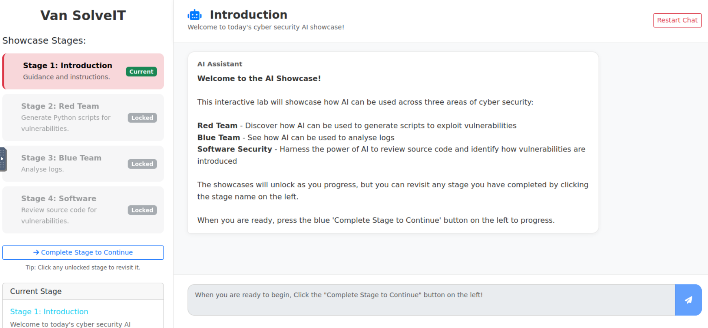
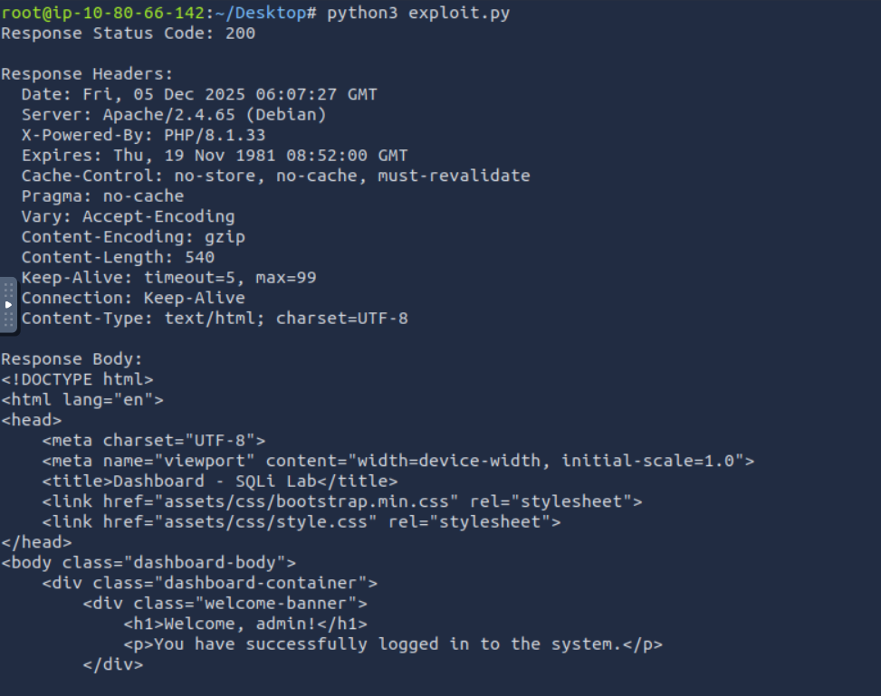
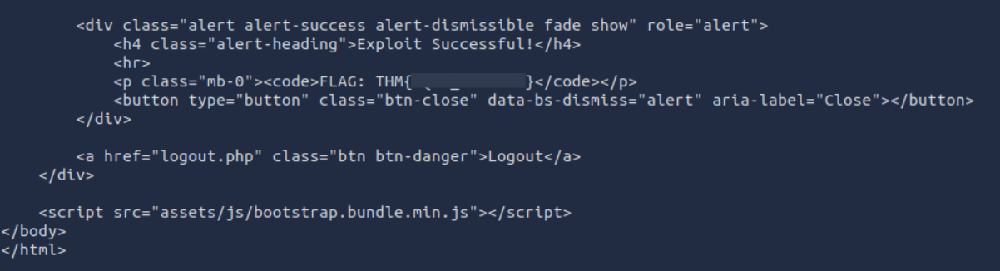
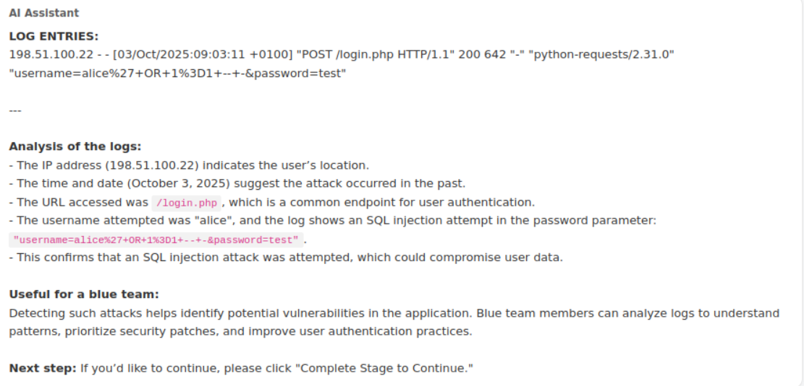
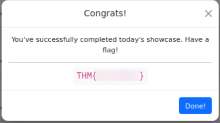

**Room Name:** AI in Security – old sAInt nick

TBFC (The Best Festival Company), continuing in its pursuit of AI excellence, realized after two years that their in-house chatbot, Van Chatty, was not meeting their standards.

Therefore, they have introduced a new cybersecurity AI assistant, Van SolveIT, capable of helping the elves with all their defensive, offensive, and software needs. Its purpose is to identify, confirm, and resolve any potential vulnerabilities before any critics can.

Let us start the attacker machine and the target machine.

---

### Let’s Talk About AI

To be honest, whether you are in tech or not, AI should not be a new term for you, unless you are living under a rock.

Let us first discuss what this buzzword **AI (Artificial Intelligence)** really means.

AI – Artificial Intelligence is technology that enables computers and machines to simulate human behaviour, such as learning and reasoning.

In this room, we will see some ways AI is utilised in cyber security.

Today, AI is heavily seen as a tool to handle tedious, time-consuming tasks, giving more room to humans to think and analyse.

We also frequently hear "GPT this, GPT that" – it is very common these days.

As AI's capabilities grow, we have observed a shift from searching for information to asking AI directly. Now, AI is embedded into everyday workflows, boosting productivity and efficiency like never before.

---

### Now Let’s Look at AI in Cyber Security

We see vendors using AI to power their solutions and enhance their operations. To actually benefit from AI, it is used for:

- Processing large amounts of data (examining multiple sources like network and system logs)
- Behavioural analysis (identifying patterns and anomalies, and flagging anything out of the norm)
- Generative AI (writing code, documents, reports, etc.)

---

#### **Defensive Security**

AI agents are used in blue team operations to speed up the detection, investigation, and response to threats. Automated assistants continuously process telemetry (network and system logs) to detect and respond to threats. Even AI-assisted firewalling and IDS/IPS systems are common these days.

AI can also assist in automating responses. Picture your system automatically isolating an infected device, blocking a suspicious email, or flagging an unusual login attempt – all in real time.

---

#### **Offensive Security**

AI can be used to assist in offensive security tasks, such as penetration testing and vulnerability assessment. This includes reconnaissance, information gathering – from OSINT to analysing noisy scanner outputs – and mapping attack surfaces.

---

#### **Software**

Again, we have heard a lot about AI-assisted coding and even more about vulnerabilities introduced by AI.

Still, AI has proven to be a valuable addition to the software development process, almost like a virtual assistant to bounce ideas off while writing code.

It is used as a SAST/DAST tool to find vulnerabilities in code.

- **SAST:** Static Application Security Testing
- **DAST:** Dynamic Application Security Testing

AI can audit and analyse code and applications for security vulnerabilities.

Well, here is the irony: AI is used to find vulnerabilities in code, but AI can also be used to introduce vulnerabilities in code.

---

### **Considerations of AI in Cyber Security**

The use of AI in activities like offensive penetration testing can be very beneficial, as we discussed earlier.

However, we do not want AI to expose any vulnerabilities in our system, especially client-related data, where it could change preset conditions and cause a race condition, leading to services and websites being taken down.

Also, we cannot assume that AI is always right. Data needs to be verified and validated.

Other challenges include:

- Data privacy and security
- Bias and discrimination

---

### **Let’s See a Practical Example: Interacting with Van SolveIT**

Access the target machine using the website link – simply open it in the AttackBox browser.

We always have the **Restart Chat** button to start a new chat session, or in case any other problem arises.

We have:

**Stage 1: Introduction** 

**Stage 2: Red Team**

**Stage 3: Blue Team**

**Stage 4: Software**

Follow the given instructions for each stage, and then click on the **"Complete Stage to Continue"** button to move to the next stage.

---

#### **In Stage 2: Red Team**

It asks for permission to generate a Python script to test vulnerabilities within today’s Advent of Cyber web application.

If we look at the code it generated, it performs a SQL Injection attack against the login page.

It sends a crafted POST request containing an `OR 1=1` injection in the username field.

The goal: bypass authentication and access the application as any user.

The script uses:

- A hardcoded malicious payload
- An HTTP POST request to `/login.php`
- Prints out the full server response

We simply need to paste that into a `script.py` file and run it. The only thing to change is the **MACHINE IP** – put the target machine IP that you have been provided with.

(We found the flag.)

---

#### **In Stage 3: Blue Team**

It asks us to allow it to analyse an example set of logs from the attack we just performed.

The AI is given a log entry generated by the attack. It identifies:

- The source IP
- Time of attack
- Endpoint targeted (`/login.php`)
- Python script user-agent
- Clear presence of URL-encoded SQL injection strings

This confirms an SQL injection attempt occurred. Blue teams can use this pattern to detect future attacks.

---

#### **In Stage 4: Software**

It asks us to allow it to take a look at the source code of today’s Advent of Cyber web application.

**What does it identify?**
User-controlled input is taken directly from `$_POST` without sanitisation.

The variables, when later used in a SQL query, enable SQL injection.

**Missing:**

- Prepared statements
- Input validation
- Output encoding

It explains secure coding best practices, including parameterised queries and usage of SAST/DAST tools.

Then, by clicking on the **"Click to Complete Showcase"**, we get the flag for the first question.

---

### **Conclusion**

This room showcased how AI can support Red Teaming, Blue Teaming, and Software Security by helping to:

- Generate exploits
- Analyse logs
- Review code
- Understand vulnerabilities
- Strengthen cyber defence

Van SolveIT demonstrates how AI can streamline cyber operations – but it also highlights the importance of caution, validation, and security best practices when relying on AI.

