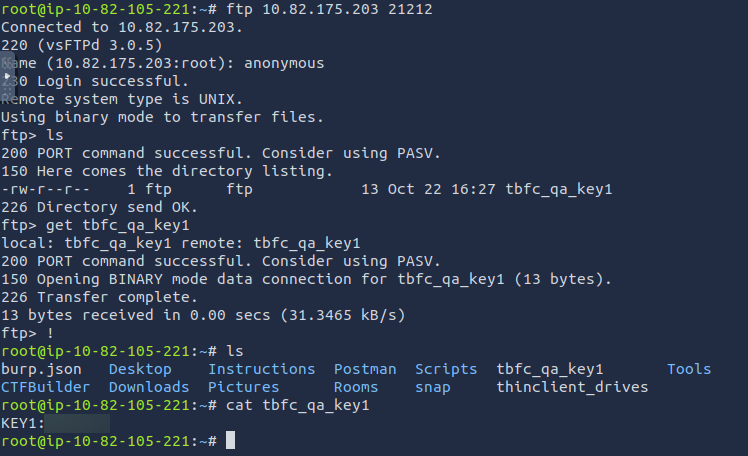
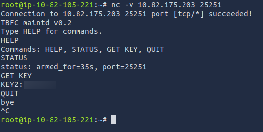
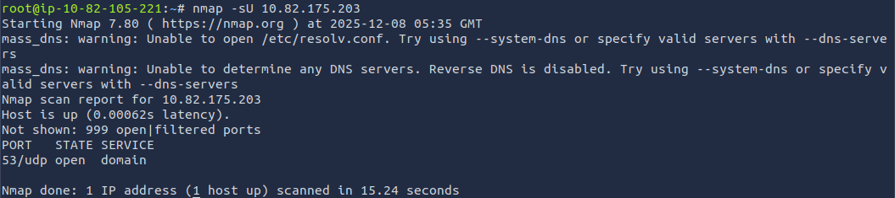
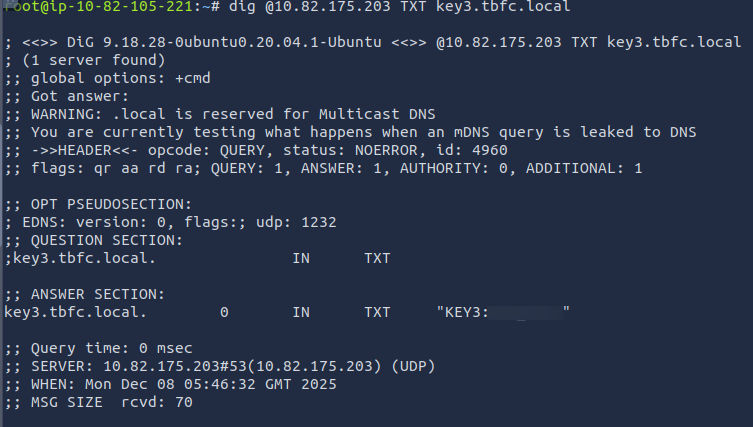
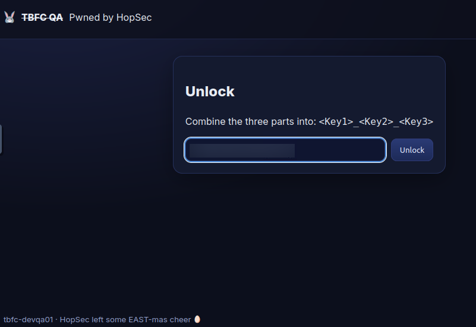
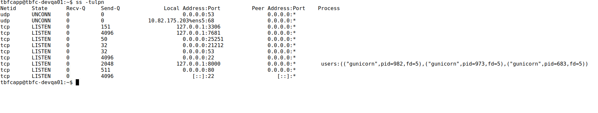
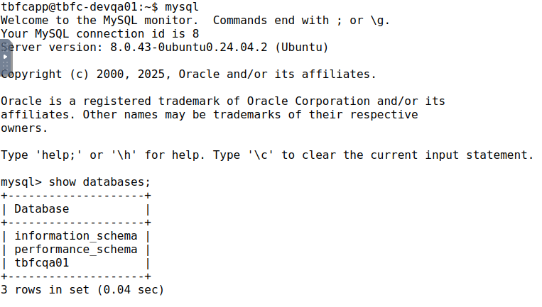
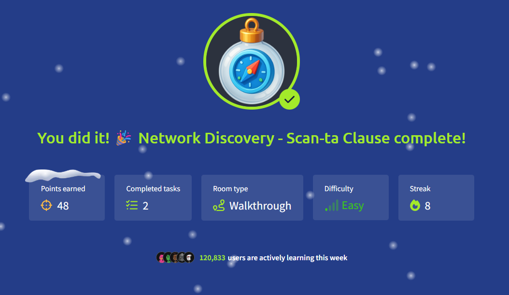

**Room Name: Network Discovery - Scan-ta Clause**


HopSec has breached TBFC's QA environment and locked them out. This has frozen the entire SOC-mas pipeline. Worse still, the server is transforming into an EAST-mas node.

We are here to find a way back into tbfc-devqa01 and restore the server before they completely take over.

To do this, we need to check every opened port that the bunnies left unprotected.

Let's boot up our attacker and target machines.

Here we directly start with the practical side, and I will cover the theory alongside to make it easy to understand.

We know that our server is tbfc-devqa01 with the IP address provided by the room, which in my case is 10.82.175.203.

We need to scan this IP for open ports and services running on them. We might find a vulnerable web server running on port 80. We need to expose the service, find a way in, and remove the bad bunnies from the server.

We will find 3 keys in total to complete this room, as they will be required for the web app.

Format: KEYNAME:KEY

Ports are not physical ports. They are the logical ports of a system used to run different services. Standard ports range from 0 to 1023. The entire range is from 0 to 65535 (0-1023 are well-known ports, 1024-49151 are registered ports, and 49152-65535 are dynamic ports). Here we have this interesting number 65535 (2^16 - 1). Try to find more about it.

---

## The Simplest Port Scan

We have a lot of tools to scan ports: netcat on Linux, PowerShell on Windows, and some specialized tools like nmap and naabu.

We will use nmap for this task.

Nmap (Network Mapper) is an open-source tool used for network discovery and security auditing. It also assists in the exploration of network hosts and services, providing information about open ports, operating systems, and other details.

So here we open the terminal in our attack box and run the following command:

```
nmap 10.82.175.203
```

Note: replace 10.82.175.203 with your target IP address provided by the room.

This command is used to scan the top 1000 commonly used ports and revert back with services running on them.


From the output we see 2 services open: SSH (on port 22) and HTTP (on port 80). This is great, as we can try to connect to SSH and try to log in if we somehow have the credentials.

Visit the website by typing `http://10.82.175.203` in your browser.


Okay, so we see that the website is defaced, and we are supposed to find 3 fragments of a passphrase to somehow enter it.

Looks like we might need to scan the entire range of ports to find more services running on them.

So we run the following command:

```
nmap -p- --script=banner 10.82.175.203
```

Here:
- `-p-` scans all ports (from 0 to 65535)
- `--script=banner` runs the banner script to get service information (what's likely running on the port)

(Be patient as it might take a while to scan all ports.)

For more information on nmap and its flags, try doing `man nmap`, or `nmap --help`, or visit https://nmap.org/


So from the output we see 2 extra ports open: 21212 (FTP) and 25251 (TBFC custom application).

Well, FTP normally runs on port 21, but we can change it to any port we want (in this case 21212). Maybe to trick us into thinking that there is no open port 21.

So to access the FTP server we run the following command:

```
ftp 10.82.175.203 21212
```

And put the Name as `anonymous`. And we are in, as we see:

```
ftp>
```

**Why Anonymous FTP Works Here:**

The server accepts anonymous authentication, indicating that anonymous FTP access has been enabled in the configuration. While anonymous FTP is a legitimate feature for public file distribution, its presence on non-public servers often suggests misconfiguration or oversight, allowing unauthenticated access to files that may contain sensitive information.

Try to list the files in the FTP server by typing `ls`.

We see a file named `tbfc_qa_key1` (we got our first fragment of passphrase).

Instead of `cat`, we use `get` to download the file.

**Why cat Doesn't Work in FTP:**

The `cat` command is a shell command available in Unix/Linux terminals, not an FTP client command. When connected via FTP, you're operating within the FTP client's command interface, which has its own limited set of commands for file transfer and navigation (`get`, `put`, `ls`, `cd`, etc.). To view a file's contents, you must first download it to your local machine using `get`, then use `cat` on your local terminal, or use the FTP client's limited text viewing capabilities if available.

So run the following command:

```
get tbfc_qa_key1
```

`!` to exit the FTP session.

And `cat` the file to get the first fragment of passphrase.



So we do not see much apart from the first fragment of passphrase.

Let's move to the custom application running on port 25251. As it is not well known, we cannot access it directly, but we can use netcat (nc), a tool to interact with network services universally.

So we run the following command:

```
nc -v 10.82.175.203 25251
```



Here we simply run the provided commands, one of which is `GET KEY` to get the second fragment of passphrase, and Ctrl + C to exit the session.

Okay, so we are left with just the third fragment of passphrase.

If you see the command that we had run earlier, `nmap -p- --script=banner` scanned all TCP ports by default. UDP requires a different approach. A full UDP scan of all 65535 ports (`nmap -p- -sU`) would be excessively time consuming, potentially taking hours or even days due to UDP's connectionless nature and default timeouts.

So we run the following command:

```
nmap -sU 10.82.175.203
```

It would scan for the 1000 most common ports for UDP.



Here we see port 53 open with service "DOMAIN". Here "domain" is the standard service name for DNS (Domain Name System).

DNS (port 53) is a fundamental internet service that translates domain names to IP addresses. In security assessments, DNS can reveal:
- Zone transfers (AXFR requests) that might leak internal network information
- DNS records containing hidden data or subdomains
- TXT records often used to store arbitrary text data (perfect for hiding passphrase fragments!)
- Service discovery through SRV records

Here we need to try a command to reveal the third fragment of passphrase.

From the earlier keys:
- tbfc_qa_key1
- tbfc_qa_key2

DNS needs a domain name to query. "tbfc" looks the most obvious. For TLD (top-level domain), we can try `.local`, `.internal`, or `.lan`.

DNS TXT records are used to store arbitrary text data, perfect for hiding passphrase fragments!

Let's try:

```
dig @10.82.175.203 TXT tbfc.local
```

It does not work. Maybe we need to specify a subdomain.

Let's try:

```
dig @10.82.175.203 TXT key3.tbfc.local
```



Well, we found the third fragment of passphrase.

Let's head back to the web app and unlock it with the three fragments.



Then we see a button to go to the terminal. Now we have access as tbfcapp. We can simply look for services running on the target machine.

So we run the following command:

```
ss -tulpn
```

(`ss` is socket statistics; `-t`: TCP; `-u`: UDP; `-l`: listening; `-p`: process; `-n`: numeric)

Basically it shows all the services running on our machine.



We can see 3 local-only services running (127.0.0.1):

1. 127.0.0.1:3306 – MySQL database (likely contains application data)
2. 127.0.0.1:8000 – gunicorn web app (backend for the public site)
3. 127.0.0.1:7681 – unknown service (requires investigation)

Let's focus now on port 3306 (MySQL database). As we are already inside the host, we can try to run some commands to get the database credentials.

Connect to MySQL and we see a database named "tbfcqa01".



Let's see what tables are there in this database.


Well, we get our flag.

---



**Conclusion:**

We regained control of the compromised QA server by exploiting a chain of security misconfigurations. Anonymous FTP on a non-standard port leaked the first key fragment. An unprotected custom application revealed the second. Exposed DNS TXT records provided the third. These combined credentials granted web app access, leading to shell privileges. From there, internal MySQL database access yielded the final flags.

The breach resulted from multiple oversights: exposed services, weak authentication, and poor network segmentation. This demonstrates how layered security failures enable attackers to escalate access and establish persistence.

---

Thanks for reading my writeup!

Keep Learning!