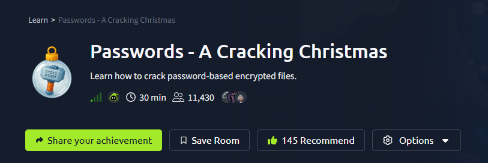
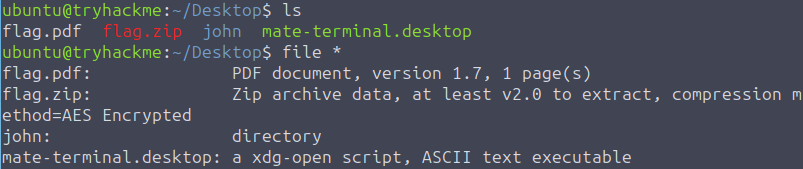
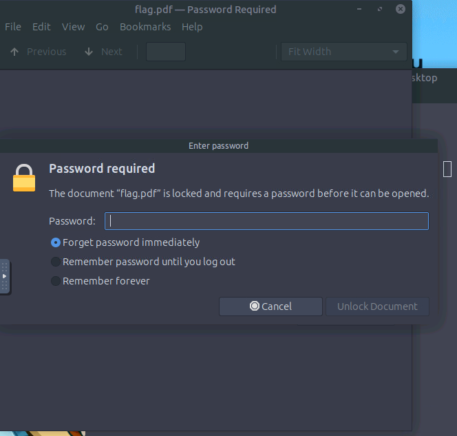
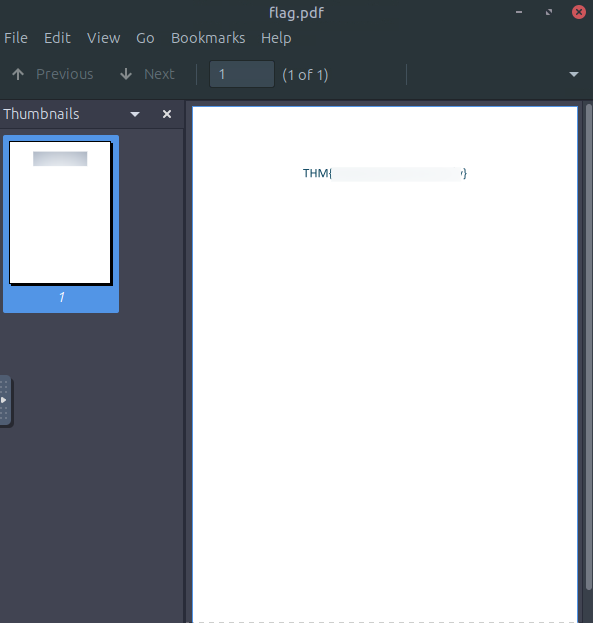
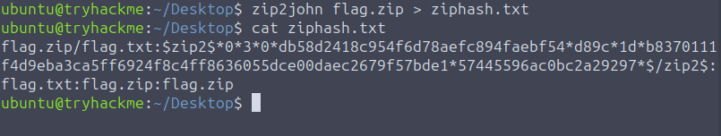
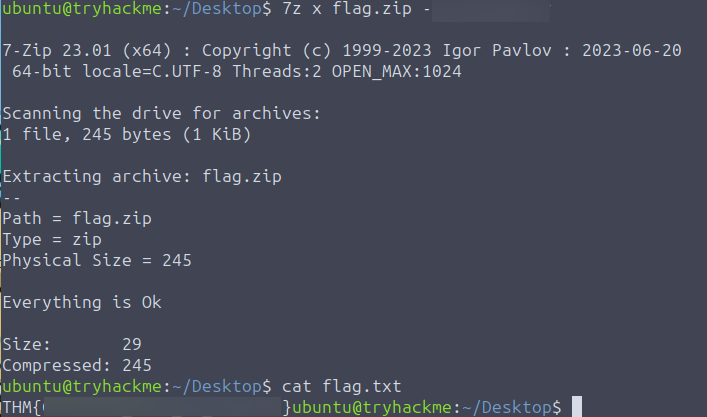
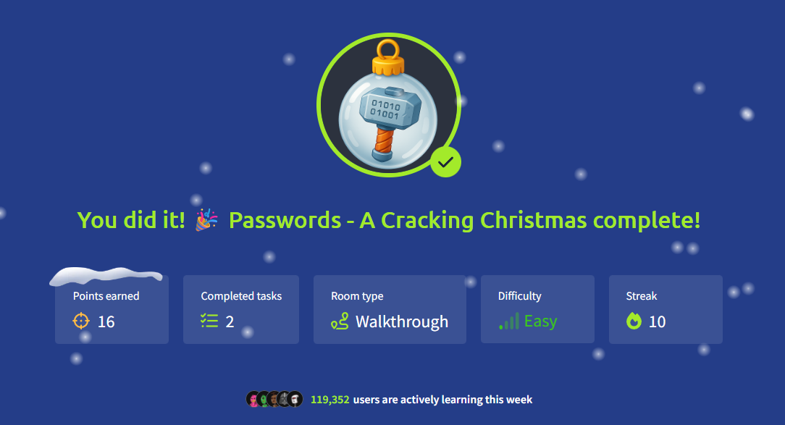

# Room Name: Passwords - A Cracking Christmas



Systems at TBFC have begun showing traces of encrypted data buried deep within their servers.

Sir Carrotbane found a series of locked PDF and ZIP files labeled "North Pole Asset List."

Rumors suggest they contain fragments of Santa's master gift registry (critical information) that could help Malhare control the festival balance between both worlds.

So Sir Carrotbane is looking to crack the encryption, learning how weak passwords can expose even the most secure data. The question remains: can the Elves adapt and prevent their secrets from being stolen?

## Some Simple Points to Keep in Mind:

* The strength of protection depends almost entirely on the password. Short or common passwords can be guessed; long, random passwords are far harder to break.
* Different file formats use different algorithms and key derivation methods. For example, PDF encryption and ZIP encryption differ in details (how the key is derived, salt usage, number of hash iterations). That affects how easy or hard cracking is.
* Many consumer tools still support legacy or weak modes (particularly older ZIP encryption). That makes some encrypted archives much easier to attack than modern, well-implemented schemes.
* Encryption protects data confidentiality only. It does not prevent someone with access to the encrypted file from trying to guess the password offline.

Let's connect to the target machine and see what we have.

---

## Let's First Look at Some Theory

### How Attackers Recover Weak Passwords

Attackers don't actually break encryption. (That would be way too hard and time-consuming.)

Instead, they try to recover the password by guessing it.

The two most common ways of doing this are:

#### 1. Dictionary Attack
A dictionary attack uses a prepared list of potential passwords called a "wordlist." The attacker tries each entry until they find the correct one. These wordlists are often built from leaked passwords, common patterns like password123, predictable names and dates, and other frequently used phrases. Because many people still rely on weak or common passwords, dictionary attacks tend to be quick and very effective.

#### 2. Mask Attack
Mask attacks, and their broader counterpart brute force attacks, take a more exhaustive approach. A pure brute force attack tries every possible character combination, guaranteeing eventual success. However, the time required grows dramatically as the password length and complexity increase.

Mask attacks refine this process by restricting guesses to a specific format. For example, an attacker might test all combinations of three lowercase letters followed by two digits (?l?l?l?d?d). By focusing the search on likely patterns, mask attacks offer a practical balance between speed and coverage, especially when the attacker has some insight into how the password might be constructed.

### Tips Used by Attackers (and Defenders Should Know About):

* Start with a wordlist (`rockyou.txt`, `common-passwords.txt`)
* Next, move to a targeted wordlist (`leaked-passwords.txt`, `custom-passwords.txt`)
* Next, try mask or incremental attacks on short passwords (e.g., `?l?l?l?d?d` = three lowercase letters + two digits, which is used as a password mask format by password cracking tools)
* GPU acceleration (use GPU for faster cracking)
* On a monitored endpoint, GPU/CPU cracking can be detected by defenders

---

## Let's Move to the Practicals

Open up the terminal of the target machine and `cd` to `Desktop`.

Using `ls`, look at the files, and try to confirm their file type.

Either do:
```bash
file flag.pdf
file flag.zip
```

Or just a single command:
```bash
file *
```
(Here `*` is a wildcard—it will match any filename, basically listing all files and their types.)



Here, the `john` directory is the tool we will use to crack the password, and we can see that `flag.zip` is AES encrypted.



Also, if you try to open `flag.pdf`, it will ask for a password.

Let's try a dictionary attack to crack the password.

We have `/usr/share/wordlists`—where we can find wordlists.

Let's use `rockyou.txt` as our wordlist.

Type this command to crack the password:
```bash
pdfcrack -f flag.pdf -w /usr/share/wordlists/rockyou.txt
```
(`pdfcrack` is a tool to crack PDF passwords, `-f` is for file, `-w` is for wordlist.)


We have found the password for `flag.pdf`.

Once opening the PDF, we see our flag.


---

OK, now let's try to crack the password for `flag.zip`.

First, let's understand the ZIP file structure:

`flag.zip`:

* **[File Header]** - Contains file info (name, size, etc.)
* **[Encryption Header]** - Contains password verification data
* **[Encrypted File Data]** - The actual compressed content (encrypted)
* **[Central Directory]** - File index (also encrypted)

So we use this command:
```bash
zip2john flag.zip > ziphash.txt
```
(Here `zip2john` extracts the hash of the encryption header and stores it in a format that John the Ripper can understand and use to crack the password.)



In the image above, we can see the content of `ziphash.txt`.

Here:
* `flag.zip/flag.txt` - tells us that the archive `flag.zip` contains file `flag.txt`

| Field | Example Value | Meaning | **Why It Matters / Security Implication** |
|-------|--------------|---------|-------------------------------------------|
| **File Identifier** | `flag.zip/flag.txt:` | Archive and contained filename | Helps identify which file is being cracked in multi-file ZIPs |
| **Hash Header** | `$zip2$` | Modern ZIP format (AES encryption) | Different from old `$pkzip$` format; indicates stronger crypto |
| **Compression** | `0` | No compression (STORED) | File size unchanged; faster to crack (less data to verify) |
| **Encryption Type** | `3` | **AES-256** (WinZip compatible) | **Military-grade encryption** - brute force is virtually impossible |
| **Flags** | `0` | Standard AES parameters | Usually 0; can indicate special modes (rare) |
| **Salt** | `db58d2418c...ebf54` (32 hex chars) | 16-byte random salt for PBKDF2 | **Prevents rainbow tables** - identical passwords give different hashes |
| **Password Check** | `d89c` (2 bytes) | Quick password verification | Fast rejection of wrong guesses; saves computation time |
| **Iterations** | `1d` (hex) = 29 (decimal) | PBKDF2 iteration count exponent | **Slows down cracking** - each guess takes 2³⁰ hash operations |
| **Main Derived Key** | `b83701...57bde1` (64 hex chars) | PBKDF2-HMAC-SHA1 output (32 bytes) | Contains both AES key (16 bytes) and authentication key (16 bytes) |
| **Encrypted Data Sample** | `57445596ac0bc2a29297` (20 hex chars) | First 10 bytes of actual encrypted file | **Final validation** - ensures password actually decrypts the content |
| **End Marker** | `$/zip2$` | Hash block terminator | Signals end of hash data for parsing tools |
| **Metadata** | `:flag.txt:flag.zip:flag.zip` | File reference info | Used by `zip2john` for reporting; ignored during cracking |

## Visual Flow of How This Works

```
Your Password Guess
        ↓
PBKDF2(password + salt, iterations=29)
        ↓
Produces: [AES Key (16B) + Auth Key (16B)]
        ↓
Compare Auth Key to "Main Derived Key" in hash
        ↓
If matches → Password Correct! 
If not → Try next password 
```

---

Let's use John the Ripper to crack the password:
```bash
john --wordlist=/usr/share/wordlists/rockyou.txt ziphash.txt
```

What this does:

* `john` = John the Ripper, our password cracking tool
* `--wordlist=/usr/share/wordlists/rockyou.txt` = Use the `rockyou.txt` wordlist (14 million common passwords)
* `ziphash.txt` = The hash file we extracted earlier


We get the password for `ziphash.txt`.

unzip flag.zip using the password we got.

7z x flag.zip -PASSWORD



now we have the flag.

---

## Detection of Indicators and Telemetry

Since offline password cracking doesn't connect to login systems, we need to spot it where it actually runs—on computers and servers.

### Here's What to Look For:

**1. Suspicious Programs Running:**

* Known cracking tools: `john`, `hashcat`, `fcrackzip`, `pdfcrack`
* Files being accessed: `rockyou.txt`, `john.pot`, encrypted files
* Command patterns: `--wordlist`, `zip2john`, `pdf2john`

**2. Unusual Computer Behavior:**

* GPU working overtime (fan noise, high power usage)
* Reading wordlists repeatedly (large text files with passwords)
* Installing cracking software suddenly

**3. Network Activity Clues:**

* Downloading password lists from GitHub
* Getting cracking tools online
* Updates for GPU drivers (for faster cracking)

### How to Detect This:

#### Detection Rules for Password Cracking

**Windows Detection (Sysmon):**
```
(ProcessName="C:\Program Files\john\john.exe" OR
 ProcessName="C:\Tools\hashcat\hashcat.exe" OR
 CommandLine="*pdf2john.pl*" OR
 CommandLine="*zip2john*")
```
This catches John the Ripper, Hashcat, and hash extraction tools.

**Linux Detection (auditd rules):**
```
auditctl -w /usr/share/wordlists/rockyou.txt -p r -k wordlists_read
auditctl -a always,exit -F arch=b64 -S execve -F exe=/usr/bin/john -k crack_exec
auditctl -a always,exit -F arch=b64 -S execve -F exe=/usr/bin/hashcat -k crack_exec
```
These rules track:
* Who reads the `rockyou.txt` password list
* When `john` or `hashcat` programs run

**Advanced Detection (Sigma Rule):**
```yaml
title: Password Cracking Tools Execution
id: 9f2f4d3e-4c16-4b0a-bb3a-7b1c6c001234
status: experimental
logsource:
  product: windows
  category: process_creation
detection:
  selection_name:
    Image|endswith:
      - '\john.exe'
      - '\hashcat.exe'
      - '\fcrackzip.exe'
      - '\pdfcrack.exe'
      - '\7z.exe'
      - '\qpdf.exe'
  selection_cmd:
    CommandLine|contains:
      - '--wordlist'
      - 'rockyou.txt'
      - 'zip2john'
      - 'pdf2john'
      - '--mask'
      - ' -a 3'
  condition: selection_name or selection_cmd
level: medium
```
This catches both suspicious program names AND suspicious command-line arguments.

### Response Playbook

**Immediate Actions:**

* Isolate the affected computer
* Save evidence: running programs, open files, command history
* Check if it's authorized (security testing) or malicious

**Investigation:**

* What passwords were cracked?
* Which files were accessed?
* Who was doing it and why?

**Fix & Prevent:**

* Change any compromised passwords
* Move testing tools to approved areas only
* Educate users about proper security testing
* Consider requiring multi-factor authentication

---

## Conclusion

* Weak passwords defeat strong encryption
* Dictionary attacks work because people reuse passwords
* ZIP AES-256 is secure, but passwords can still be weak
* Detection is possible through tool signatures and behavior



Thanks for reading.

Stay Safe and do recheck your passwords :)