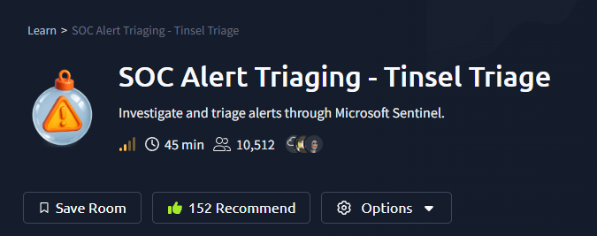
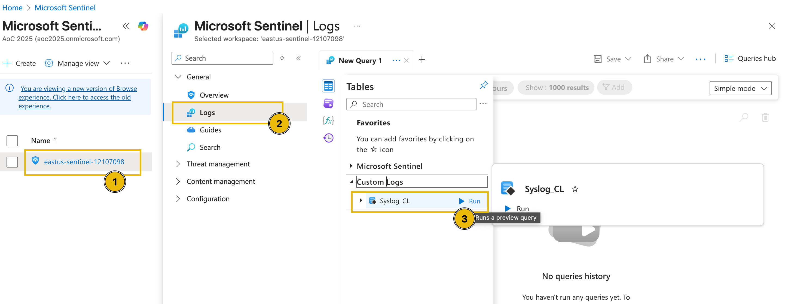
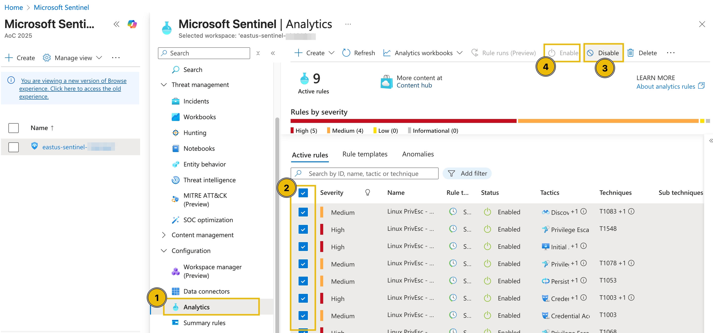
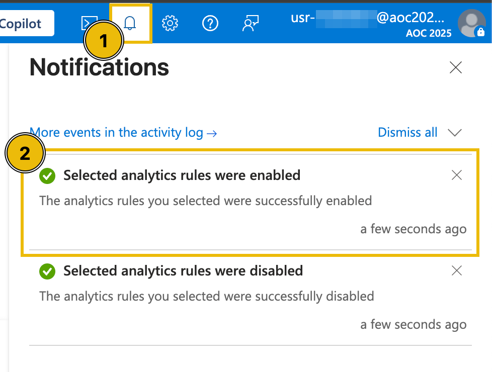
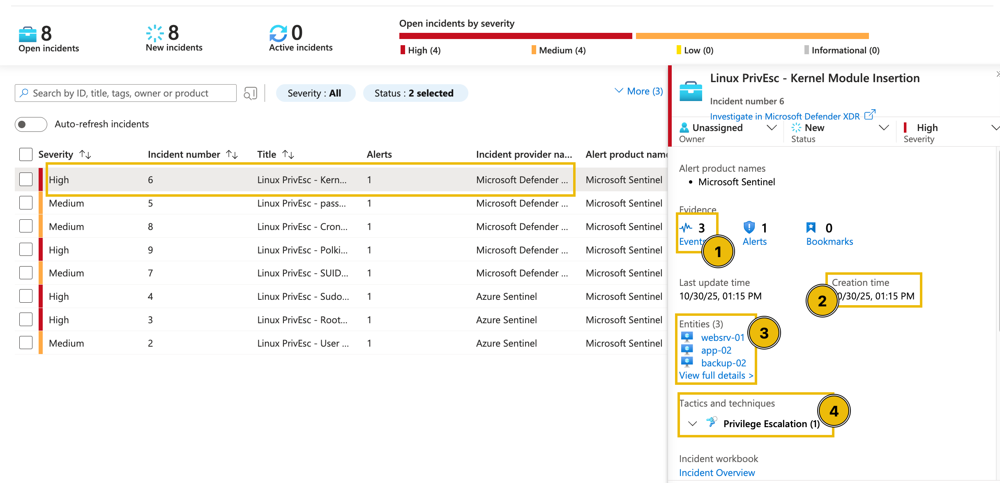
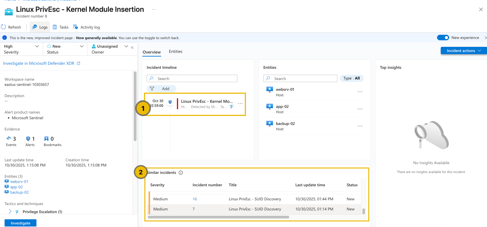
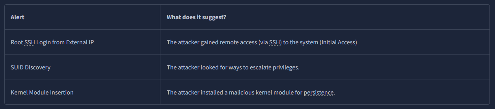
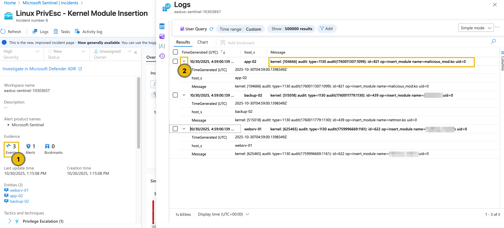
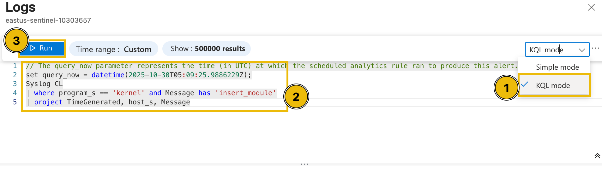
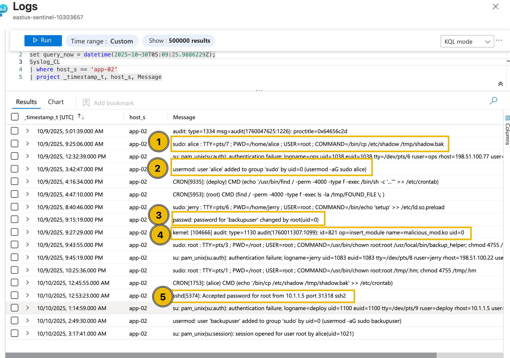

# SOC Alert Triaging: Tinsel Triage



The Security Operations Center (SOC) at TBFC is in disarray. Screens flicker erratically, warning lights flash, and the relentless sound of alert notifications echoes through the room. A widespread anomalous event is unfolding across the cloud environment. Intelligence reports have surfaced mentioning a threat actor dubbed the "Evil Easter Bunnies," but their current objectives remain unknown. It falls to the SOC team to restore order by investigating the alerts and uncovering the malicious activity.

## Lab Environment Initialization

To begin the investigation, you must first deploy the necessary lab environment.

1.  Navigate to the **Environment** tab and click the **"Join Lab"** button to initiate deployment.
2.  Proceed to the **Actions** tab.
    1.  Click **(1) Deploy Lab**. Wait 2-3 minutes for the initial setup to complete.
    2.  Click **(2) Deploy Rules** to configure the detection logic. **Note:** The full deployment process takes approximately 4-5 minutes.
3.  Click the **"Copy Lab URL"** button and open it in a new browser tab to access the Azure portal.
4.  Switch to the **Credentials** tab to obtain your login credentials.
5.  Sign in to the Microsoft Azure portal using the provided **Username** and **Temporary Access Pass (TAP)**.

> **Important:** Lab access is time-limited and will expire after 1 hour.

---

## Alert Triaging Primer

Before diving into the investigation within Microsoft Sentinel, it is essential to establish a foundational understanding of alert triaging. In any SOC, the alert stream consists of a mixture of benign noise, false positives, and genuine threats. The triage process is the critical mechanism that transforms this chaos into actionable intelligence, enabling security analysts to prioritize and respond to incidents effectively.

### Core Principles of Alert Triaging

When assessing an alert, analysts must evaluate four fundamental dimensions to determine its criticality and required response:

1.  **Severity Level**
    *   **What it is:** The assigned urgency rating of the alert (e.g., Informational, Low, Medium, High, Critical).
    *   **Why it matters:** It provides the first indication of potential business impact and required response timeline.

2.  **Timestamp and Frequency**
    *   **What it is:** The time the alert triggered and the recurrence of similar events.
    *   **Why it matters:** Helps establish a timeline, identify patterns, and determine if an attack is ongoing or historical.

3.  **Attack Stage**
    *   **What it is:** The phase of the cyber kill chain the alert maps to (e.g., Reconnaissance, Initial Access, Privilege Escalation, Exfiltration).
    *   **Why it matters:** Reveals the attacker's likely progress and intent, informing containment strategy.

4.  **Affected Asset**
    *   **What it is:** The specific user, host, application, or data resource impacted.
    *   **Why it matters:** Prioritization must consider the criticality of the affected asset to business operations.

These four factors answer the key triage questions: **How bad? When? What stage? Who/what is affected?**

Based on this assessment, the analyst decides the next step: escalate to incident response, initiate a deeper investigation, or close the alert as a false positive.

### Diving Deeper: The Investigation Workflow

Once an alert is deemed worthy of investigation, a structured approach is followed:

1.  **Investigate the Alert:** Examine the alert details, entities involved, and the underlying detection logic.
2.  **Review Related Logs:** Query raw log sources to gather contextual evidence and identify related anomalous activity.
3.  **Correlate Multiple Alerts:** Look for connections between alerts (shared users, IPs, hosts) to uncover broader attack campaigns.
4.  **Build a Timeline:** Reconstruct the sequence of events to understand the attack flow and scope.
5.  **Decide and Act:** Escalate, investigate further, or close the case based on the accumulated evidence.
6.  **Document Findings:** Record all steps, evidence, and conclusions to support incident resolution and process improvement.

---

## Environment Setup

### Accessing the Data

With the theory in mind, we proceed to configure the investigative environment within Microsoft Sentinel.

1.  In the Azure Portal, search for and navigate to **Microsoft Sentinel**.
2.  Select your dedicated Sentinel workspace.
3.  Go to the **Logs** section and run a query on the custom log table `Syslog_CL` to verify data ingestion.





> **Note:** Log ingestion may take a few minutes. Use the refresh button to update the results.

### Triggering Detection Rules

To generate the incidents for analysis, we need to activate the deployed analytics rules.

1.  Navigate to **Configuration > Analytics**.
2.  Select all active rules and click **Disable**.
3.  Re-select the disabled rules and click **Enable**. This process forces the rules to re-evaluate recent data and trigger alerts.




> **Tip:** If you encounter a message stating "This page has been moved to the Defender portal," simply refresh the page.

---

## Investigation Proper

### McSkidy Begins the Triage

Analyst McSkidy now leverages Microsoft Sentinel's capabilities to triage the generated incidents. Sentinel provides a unified view of alerts, correlates data across sources, and allows pivoting between entities for efficient investigation.

1.  Within your Sentinel instance, go to **Threat Management > Incidents**.
2.  Expand the view to see all triggered incidents. You should observe several incidents, categorized by severity (e.g., High and Medium).


> **Note:** The number of incidents may vary. If alerts have not triggered, repeat the enable/disable step for the analytics rules.

Prioritizing critical threats, McSkidy focuses first on the **High-severity** incidents, starting with **"Linux PrivEsc—Kernel Module Insertion."**

### Analyzing an Incident

Clicking on the incident reveals a summary pane with key details:
*   Number of related events.
*   Incident creation time.
*   Count and type of involved entities (e.g., hosts, accounts).
*   Associated MITRE ATT&CK tactic (**Privilege Escalation**).



Selecting **"View full details"** provides a deeper dive, including a potential incident timeline and a list of similar incidents based on shared entities.



### Correlating Related Alerts

A crucial insight emerges: multiple alerts are linked to the same affected entities (e.g., a specific virtual machine). This correlation suggests these are not isolated events but likely stages of a single, coordinated attack chain—from initial access to persistence.



This initial triage allows McSkidy to prioritize response efforts and recognize the scope of the potential compromise.

---

## Diving Deeper into Logs

### Validating Alerts with Raw Evidence

To confirm malicious activity and understand the exact actions taken, McSkidy moves from alert summaries to the underlying log data.

1.  From the incident's full details view, navigate to the **Evidence** section and click on **Events**.



This view reveals specifics, such as the name of the suspicious kernel module installed on each host.

### Conducting Targeted Log Analysis

For a granular view of activity on a specific host (`app-02`), a custom KQL query is executed.

1.  In the log query window, switch from **Simple mode** to **KQL mode**.
2.  Enter the following query:
    ```kql
    set query_now = datetime(2025-10-30T05:09:25.9886229Z);
    Syslog_CL
    | where host_s == 'app-02'
    | project _timestamp_t, host_s, Message
    ```
3.  Run the query.



### Interpreting the Sequence of Events

The query results paint a clear and concerning picture. Around the time of the kernel module insertion, the following suspicious events occurred on `app-02`:



1.  Execution of `cp` command to back up the `/etc/shadow` file.
2.  Addition of user `Alice` to the `sudoers` group.
3.  Modification of the `backupuser` account by `root`.
4.  Insertion of the malicious kernel module `malicious_mod.ko`.
5.  Successful SSH authentication by the `root` user.

**Conclusion:** This sequence is highly anomalous and indicative of a successful privilege escalation and persistence attack. The evidence strongly suggests the alert is a true positive, warranting immediate containment and response actions.

By applying a methodical triage and investigation process—assessing severity, correlating alerts, and analyzing raw logs—the SOC can effectively separate malicious activity from background noise and take decisive action to secure the environment.