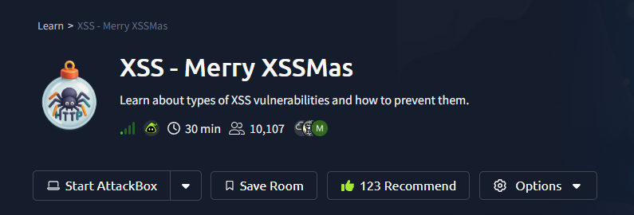
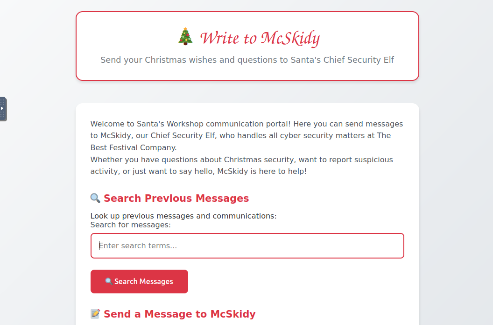
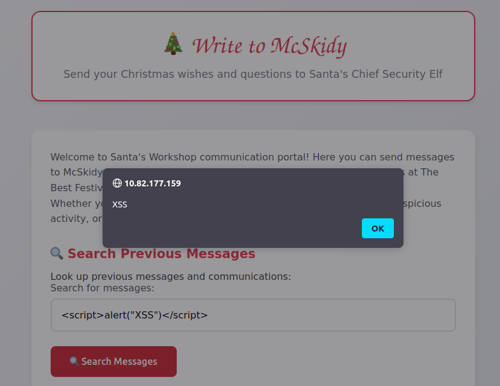
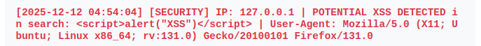
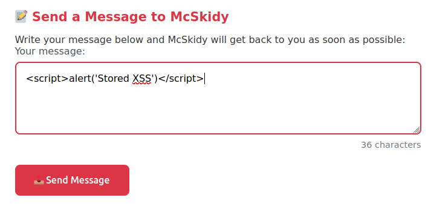
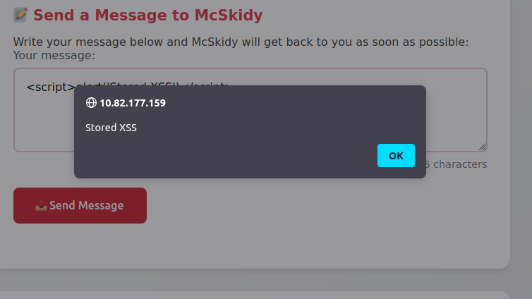
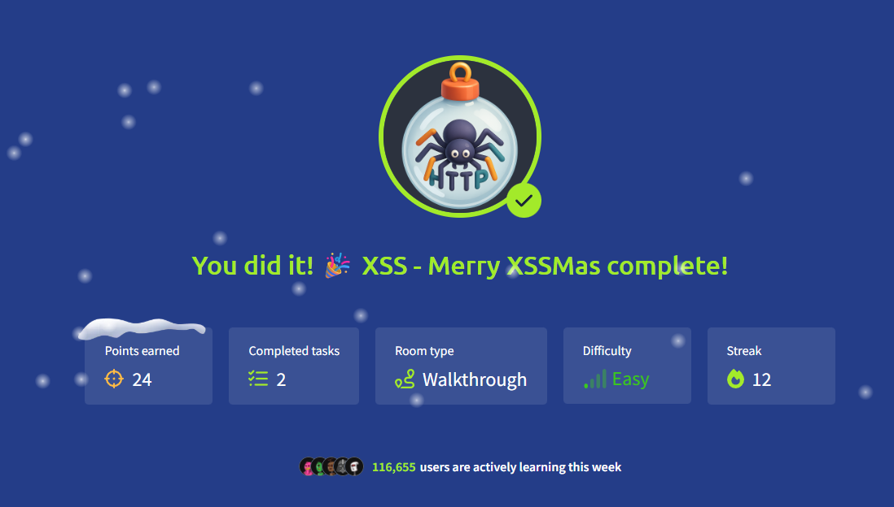

# Room Name: XSS - Merry XSSMas



Santa's workshop has a new makeover. McSkidy has a secure message portal where you can contact her directly with questions or concerns. However, the logs have recently been lighting up with unusual activity, ranging from odd messages to suspicious search terms. Even Santa's letters appear as scripts or random code.

Our assigned duty is to dig into the logs and find out what is happening.

Let's boot up the attacker and target machines and navigate to the target machine's IP address in the attacker's browser.



Let's understand more about potential website attacks, specifically Cross-Site Scripting (XSS) attacks in this context.

**XSS - Cross-Site Scripting** is a type of attack where an attacker injects malicious scripts into a website, which are then executed by a victim's browser. When an application does not properly validate user input, that input can be interpreted as code and executed. This can be used to steal sensitive information, such as cookies or session tokens, or to perform other malicious actions on behalf of the victim.

Today we will look at two specific types of XSS attacks: Reflected and Stored XSS.

### **Reflected XSS**

Reflected XSS attacks occur when an attacker injects a malicious script into a website, which is then executed by the victim's browser. The scripts are typically embedded in a URL or form submission, and the victim's browser interprets and executes them.

**Example:**
`https://trygiftme.thm/search?term=<script>alert(atob("VEhNe0V2aWxfQnVubnl9"))</script>`

When the user visits this URL, an alert box will pop up with the message "THM{****_*****}" because `atob()` decodes the base64-encoded string.

This is a harmless example of a reflected XSS attack. However, it could have been a malicious script that steals the victim's session cookies, redirects them to a phishing page, or performs unauthorized actions on their behalf.

**Impact:**
You could act, view information, or modify information that your friend or any user could do, view, or access. It is usually exploited via phishing to trick users into clicking a link with injected malicious code.

### **Stored XSS**

A Stored XSS attack occurs when a malicious script is saved on the server and then loaded for every user who views the affected page. Unlike Reflected XSS, which targets individual victims, Stored XSS becomes a "set-and-forget" attack: anyone who loads the page runs the attacker's script.

**Example:**

```
POST /post/comment HTTP/1.1
Host: tgm.review-your-gifts.thm

postId=3
name=Tony Baritone
email=tony@normal-person-i-swear.net
comment=<script>alert(atob("VEhNe0V2aWxfU3RvcmVkX0VnZ30="))</script> + "This gift set my carpet on fire but my kid loved it!"
```

Here, anyone who views the comment would trigger the Stored XSS attack, and the alert box would pop up with the message "THM{\*\*\*\_\*\*\*\*\*\_\*\*\*}".

Again, this could have been used to perform malicious activities like:
*   Stealing session cookies
*   Triggering fake login popups
*   Defacing the page

### **Protecting Against XSS Attacks**

*   **Disable dangerous input rendering:** Replace the `innerHTML` property with `textContent` when handling user input. The `textContent` property treats input as plain text instead of HTML, preventing unintended code execution.
*   **Restrict JavaScript cookie access:** Configure session cookies with the `HttpOnly`, `Secure`, and `SameSite` attributes. These settings help protect cookies from being stolen or misused during an XSS attack.
*   **Sanitize and encode data:** For applications that must accept limited HTML input, such as formatting or links, implement strict sanitization and encoding. This ensures that potentially dangerous elements like scripts, event handlers, and JavaScript URLs are neutralized, while allowing safe content to display as intended.

Now let's try to perform an XSS attack on the target website.

### **Exploiting Reflected XSS**

[https://portswigger.net/web-security/cross-site-scripting/cheat-sheet](https://portswigger.net/web-security/cross-site-scripting/cheat-sheet) (Cheat sheet for XSS attack payloads)

Let's try a basic XSS attack. Enter the following script into the search field and click the "Search Messages" button:
`<script>alert("XSS")</script>`



You will see an alert box pop up with the message "XSS," confirming that reflected XSS works on this site.

At the bottom of the page, in the System Logs section, you can see the script we ran, and it is detected as a potential XSS attack.

The System logs record the date , time ,what script was run, page accessed and the user agent. (This is something to be useful for the blue team to track down the attacker and what they did)



### **Checking for Stored XSS**

Let's also check if stored XSS works. Enter the following script into the message field:
`<script>alert('Stored XSS')</script>`




if you try to reload the site, you will see the alert box pop up again. This is because the script is stored in the database and is retrieved every time the page is loaded.

Again, checking the System Logs section, we can see the script we ran, and it is detected as a potential XSS attack.


### Understanding the Distinction: Payload vs. Attack Vector

At this point, you might notice that both the reflected and stored XSS payloads look similar:

**Example Payloads:**
- `<script>alert("XSS")</script>`
- `<script>alert('Stored XSS')</script>`

**Important:** The message in the payload can be anything. I kept them different only for context. **The payload itself does not define the type of XSS attack; it only contains the script to execute.**

**What actually determines the XSS type is the application's input processing and validation logic.**

- **The first input field** was designed for looking up previous messages, which immediately reflects user input in the response. This makes it vulnerable to a **Reflected XSS** attack if unprotected.
- **The second input field** was for posting a message to McSkidy, which matches our earlier clue about McSkidy receiving random code. Since the input is stored and later retrieved, this is the vector for a **Stored XSS** attack.

In summary, the same script payload could be used in either scenario. The classification as Reflected or Stored XSS depends entirely on **how the server handles the input**, not the content of the payload itself.

### **Wrapping Up**

Our responsibility was to check for reflected and stored XSS attacks on the target website, which we successfully did. Now the team can harden the site to prevent further malicious attacks.

You can check the **Intro to Cross-site Scripting** room for more information on XSS attacks: [https://tryhackme.com/room/xss](https://tryhackme.com/room/xss)

### **Conclusion**

We successfully identified and exploited both vulnerabilities: a Reflected XSS in the search function and a Stored XSS in the message submission form. 

Through this process, we also explored key prevention techniques including proper input validation, output encoding, secure cookie handling with HttpOnly and Secure flags, and safe content rendering practices. 

This hands-on experience demonstrates that effective XSS defense requires a multi-layered approach combining secure coding practices, input sanitization, and appropriate security headers to protect web applications from this widespread vulnerability.





Thanks for reading! :)

Keep Learning and Stay Safe! 

