# Phishing - Phishmas Greetings

**Room Name:** Phishing - Phishmas Greetings

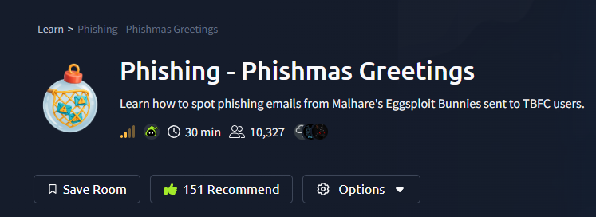

TBFC's defenses have weakened, and the Email Protection Platform is now offline. Staff must manually review every suspicious message.

The SOC Team suspects that Malhare's Eggsploit Bunnies have sent phishing emails to TBFC users to steal credentials and disrupt SOC-mas.

We have joined the Incident Response Task Force to help determine which emails are legitimate and which are phishing attempts.

We're dealing with clever phishing attempts disguised as routine TBFC operations.

Let's boot up the target machine and begin our investigation.

First, let's review some key concepts.

## Phishing Overview

Phishing is one of the oldest cyber tricks and remains highly effective. As companies like TBFC deploy advanced email filters and security tools, attackers continuously adapt their tactics to evade detection.

Modern phishing emphasizes precision and persuasion. Attackers craft convincing messages that mimic real people, trusted portals, or internal processes to deceive even vigilant users.

Common objectives of phishing campaigns include:
*   **Credential Theft:** Tricking users into revealing passwords or login details.
*   **Malware Delivery:** Disguising malicious attachments or links as safe content.
*   **Data Exfiltration:** Gathering sensitive company or personal information.
*   **Financial Fraud:** Persuading victims to transfer money or approve fraudulent invoices.


In the image above, we see a sample phishing email where an attacker impersonates an employee using a free domain (gmail.com) in an attempt to modify payroll information and commit financial fraud.

With corporate perimeters heavily fortified, phishing remains a primary method for gaining initial access. It exploits a vulnerability that technology cannot fully eliminate: human psychology. In Wareville, a single convincing email from the Eggsploit Bunnies could compromise the entire EAST-mas operation.

## Why Spam Is Not Phishing?

Spam is digital noise, annoying but generally harmless. Phishing, on the other hand, is a targeted attack. In this scenario, it's a precision strike from Malhare's Eggsploit Bunnies, designed to deceive TBFC employees and breach the company's defenses.

Spam prioritizes quantity over precision. Unlike phishing, which targets specific users, spam floods inboxes with bulk, unwanted content like marketing or scams. Its goal is typically promotion or exposure, not direct data theft.

Common objectives of spam messages include:
*   **Promotion:** Advertising products, services, or events (often unsolicited).
*   **Scams:** Promoting fake offers or "get rich quick" schemes to generate clicks.
*   **Traffic Generation (Clickbait):** Driving users to external sites to boost metrics.
*   **Data Harvesting:** Collecting active email addresses for future campaigns.

Always assess the intent behind a message. If it requests credentials or sensitive actions, it is likely a phishing attempt.

## Phishing Techniques

Attackers commonly employ several techniques in phishing campaigns. A typical phishing attempt will include at least one of the following:

### Impersonation

In impersonation attacks, the attacker pretends to be a trusted person or organization (e.g., a boss, co-worker, or vendor) to deceive the victim. This is often combined with social engineering to trick the target into revealing information or clicking malicious links.

### Social Engineering

Social engineering uses psychological manipulation to deceive victims. Attackers exploit emotions like urgency, curiosity, or fear to trick individuals into revealing sensitive information, clicking malicious links, or performing unsafe actions.

### Typosquatting and Punycode

*   **Typosquatting:** An attacker registers a domain that is a common misspelling of a legitimate organization's domain (e.g., `glthub.com` instead of `github.com`, or `amozon.com` instead of `amazon.com`).
*   **Punycode:** A special encoding system that converts Unicode characters (e.g., from Greek or Cyrillic alphabets) into ASCII format, which is accepted by DNS. Attackers can use this to replace identical-looking Latin letters with visually similar characters from other alphabets (e.g., replacing a standard Latin `a` with a Greek `α`).


Both techniques allow attackers to create deceptive domains, tricking users into believing they are interacting with legitimate emails or websites.

A practical way to identify punycode is by examining the `Return-Path` field in the email headers. Look for the `ACE` prefix followed by encoded non-ASCII characters.

### Spoofing

Email spoofing is a technique where attackers forge the sender's address to make a message appear as if it came from a trusted domain. While the displayed "From" name and address may look legitimate, the underlying email headers reveal the deception. Modern email clients can block many spoofing attempts, but with Wareville's email protection down, some may slip through.

Key email authentication headers to examine are:
*   **SPF (Sender Policy Framework):** Specifies which mail servers are authorized to send email for a domain (an approved sender list).
*   **DKIM (DomainKeys Identified Mail):** Adds a digital signature to verify the email's integrity and authenticate the sending domain.
*   **DMARC (Domain-based Message Authentication, Reporting & Conformance):** Uses SPF and DKIM results to define policies for handling emails that fail authentication (e.g., reject or quarantine).

If both SPF and DKIM checks fail, it strongly indicates the email is spoofed.

### Malicious Attachments

A classic phishing method involves sending emails with malicious attachments. These are often disguised using social engineering tactics within the email body.

Malicious attachments can serve various purposes, such as installing malware, stealing passwords, or providing attackers with network access. For example, **HTA/HTML files** are commonly used in phishing because they can execute scripts with extensive system access, bypassing typical browser security sandboxes.

## Modern Phishing Trends

As email platforms and security tools have improved at blocking suspicious messages and attachments, attackers like Malhare's Eggsploit Bunnies have shifted their strategies:

Instead of directly sending malware-laden files (which are easily detected), they now focus on luring users outside the company's secure environment.

They frequently abuse legitimate tools and trusted websites to make their lures appear credible, tricking users into voluntarily surrendering credentials or downloading malicious files themselves.

In essence, most contemporary phishing attacks prioritize credential theft and initial access over direct malware delivery.

### Abuse of Legitimate Applications

Attackers often hide behind trusted services like Dropbox, Google Drive/Docs, and OneDrive. Links to these platforms appear legitimate and frequently bypass email filters. A common scenario involves a shared file with an enticing subject, such as a "salary raise document from HR" or a "laptop upgrade form." Clicking the link redirects the user to a fake document or a credential-harvesting page.

### Fake Login Pages

Since credentials are a primary target for attackers, fake login pages have become a favored tool. These pages convincingly mimic login portals for common applications like Microsoft 365, Google, or internal company systems, tricking users into entering their usernames and passwords.

### Side-Channel Communications

Side-channel communication involves an attacker moving the conversation from email to an alternative, less-monitored platform. This could be SMS, WhatsApp/Telegram, a phone/video call, or another shared document service. The goal is to continue the social engineering attack in an environment without the company's security controls.

---

Now that we've covered the theory, let's proceed with the practical task.

**Your Objective:** Triage the provided emails. Separate spam from phishing, and for every email you identify as phishing, document at least three clear indicators (e.g., spoofing, impersonation, social engineering).

## Email Analysis #1

**Email Preview:**


### Analysis & Findings

The `Authentication-Results` header shows:
```
Authentication-Results: spf=fail ...; dkim=fail ...; dmarc=fail ...
```

**Conclusion:** The email failed SPF, DKIM, and DMARC checks, proving the sender `service@paypal.com` is forged.

### Identified Phishing Signals

1.  **Spoofing** - Email authentication completely failed.
2.  **Fake Invoice** - Subject is "Invoice from Santa Claus (4103)".
3.  **Sense of Urgency** - Unexpected invoice creates pressure to act.

**Final Verdict:** **PHISHING**

**Header Evidence:**
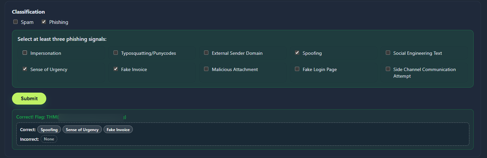

## Email Analysis #2

**Email Preview:**
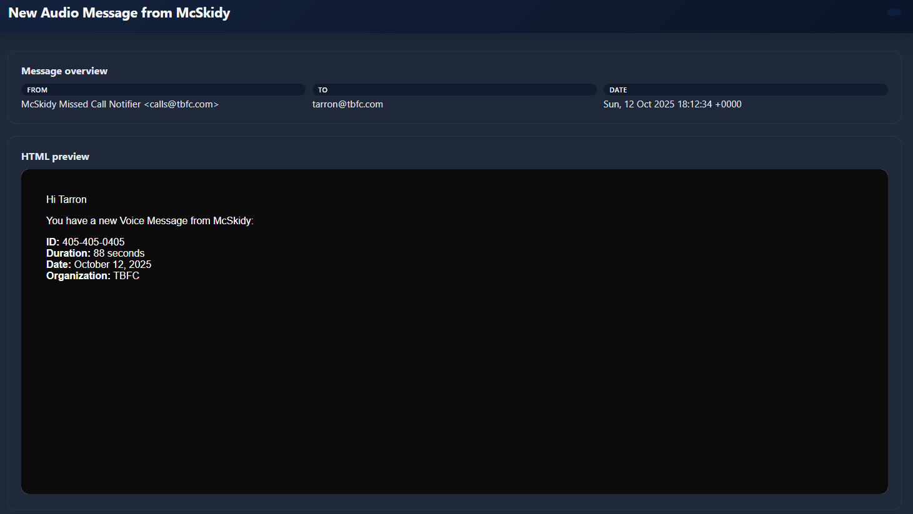

### Analysis & Findings

**Key Points:**
1. **SPF/DKIM/DMARC Failed** - Email authentication for `tbfc.com` failed.
2. **Suspicious Return Path** - Actual return path (`easterbb.com`) doesn't match sender domain (`tbfc.com`).
3. **Malicious Attachment** - HTML file disguised as MP3 audio.

### Identified Phishing Signals

1. **Spoofing** - Email authentication failures indicate forged sender.
2. **Malicious Attachment** - HTML file masquerading as audio (.mp3) file.
3. **Impersonation** - Pretending to be internal TBFC system/employee.

**Final Verdict:** **PHISHING**

**Header Evidence:**
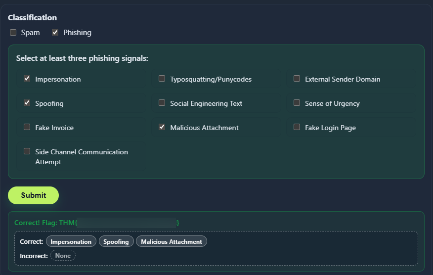

## Email Analysis #3

**Email Preview:**
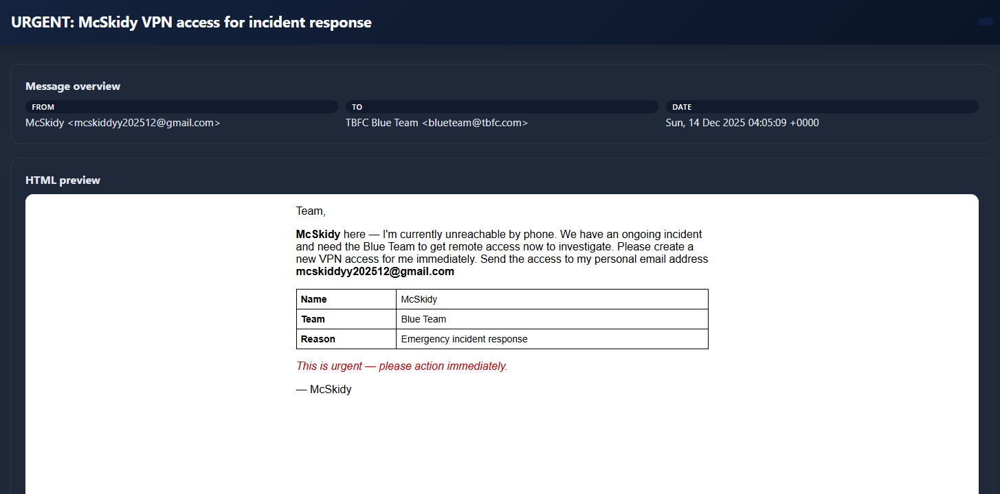

### Analysis & Findings

**Key Points:**
1. **Personal Email Account** - Sender uses personal Gmail (`gmail.com`) not official TBFC email.
2. **Urgent Subject Line** - "URGENT: McSkidy VPN access for incident response"
3. **Misspelled Name** - Email address contains "mcskiddyy" (extra 'd' and 'y')

### Identified Phishing Signals

1. **Impersonation** - Pretending to be McSkidy using misspelled personal email.
2. **Social Engineering Text** - Requests "VPN access for incident response" (sensitive access).
3. **Sense of Urgency** - Subject line emphasizes "URGENT" to pressure quick action.

**Final Verdict:** **PHISHING**

**Header Evidence:**
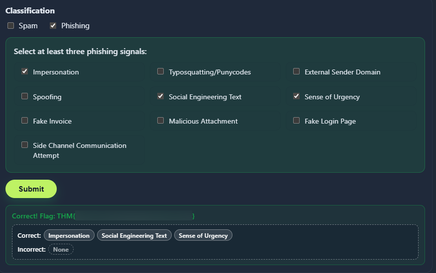

## Email Analysis #4

**Email Preview:**
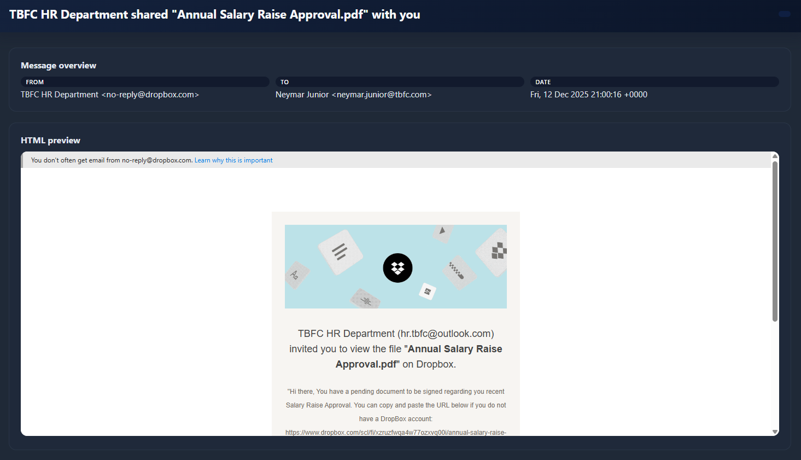

### Analysis & Findings

**Key Points:**
1. **External Domain** - Uses Dropbox (`dropbox.com`) instead of internal TBFC email.
2. **Impersonation Attempt** - Pretends to be TBFC HR Department.
3. **Enticing Subject** - "Annual Salary Raise Approval.pdf" designed to trigger curiosity.

### Identified Phishing Signals

1. **Impersonation** - Pretending to be TBFC HR Department.
2. **Social Engineering Text** - Using "salary raise" document as attractive lure.
3. **External Sender Domain** - Coming from Dropbox instead of internal TBFC system.

**Final Verdict:** **PHISHING**

**Header Evidence:**
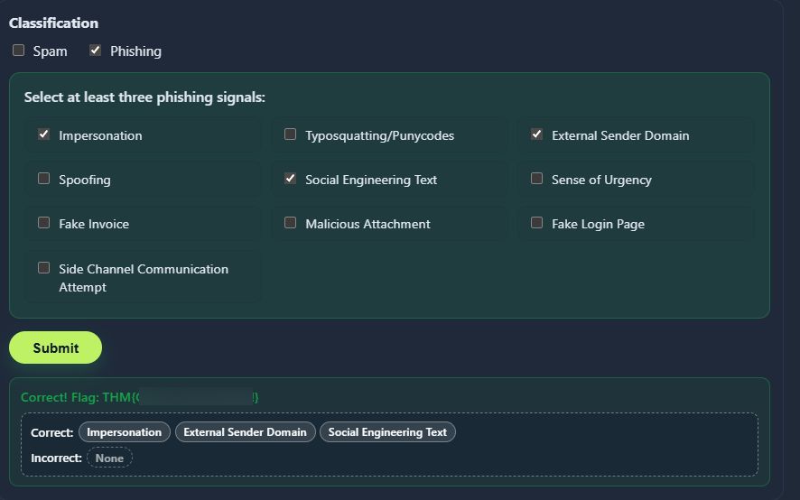

## Email Analysis #5

**Email Preview:**
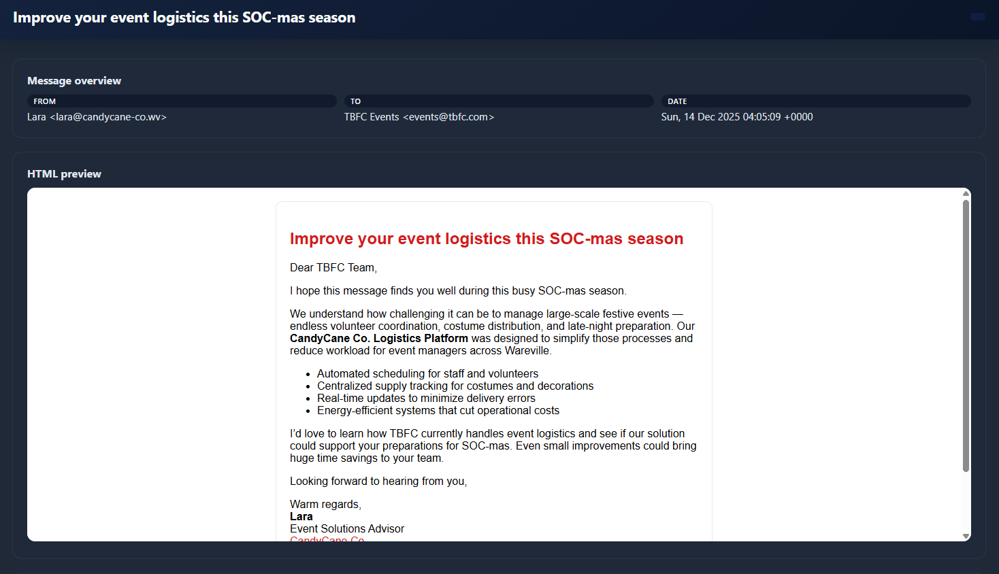

### Analysis & Findings

**Key Points:**
1. **Suspicious Domain** - Sender uses `candycane-co.wv` (unusual, likely fabricated).
2. **Timing Reference** - Mentions "SOC-mas season" (current event/theme).
3. **Business Proposal** - Subject suggests event logistics improvement.

### Identified Signals

1. **External Sender Domain** - Unfamiliar domain `candycane-co.wv` contacting internal team.
2. **Social Engineering Text** - Uses current "SOC-mas" theme to appear relevant.
3. **Spam Characteristics** - Unsolicited business proposal to corporate events team.

**Final Verdict:** **SPAM**

**Header Evidence:**
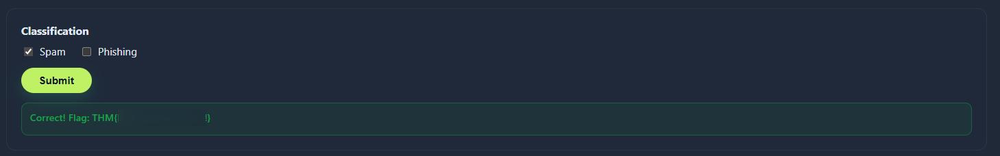

## Email Analysis #6

**Email Preview:**
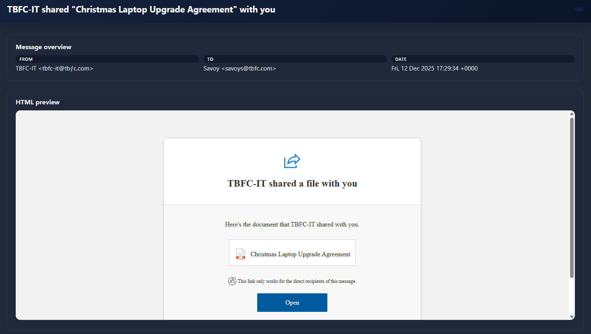

### Analysis & Findings

**Key Points:**
1. **Punycode Character** - Domain uses `tbƒc.com` (special `ƒ` character instead of regular `f`).
2. **IT Impersonation** - Pretends to be from "TBFC-IT" department.
3. **Holiday Theme** - Subject mentions "Christmas Laptop Upgrade Agreement".

### Identified Phishing Signals

1. **Typosquatting/Punycodes** - Uses special character `ƒ` in domain to mimic `tbfc.com`.
2. **Social Engineering Text** - "Laptop Upgrade Agreement" as attractive holiday offer.
3. **Impersonation** - Pretending to be TBFC's IT department.

**Final Verdict:** **PHISHING**

**Header Evidence:**
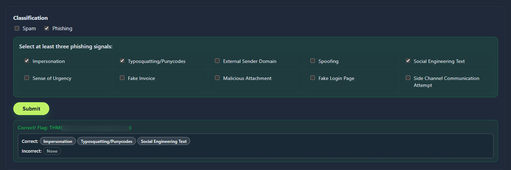


# Conclusion

The email triage exercise successfully identified **5 phishing attempts** and **1 spam email** from the analyzed messages. This analysis provides clear insights into modern email-based threats and effective detection methods.

## Key Takeaways for Email Security
1. **Header Analysis is Crucial:** Email headers provide definitive evidence of spoofing and domain manipulation that may not be visible in the message body.
2. **Multiple Signal Approach:** No single indicator is sufficient; phishing detection requires examining multiple aspects including technical headers, sender information, content, and attachments.
3. **Context Matters:** Legitimate-looking services (Dropbox, Google) can be abused, and timely themes (holidays, current events) make lures more effective.
4. **Human Judgment Remains Essential:** While technical indicators help, understanding intent and recognizing social engineering tactics requires human analysis.

This exercise reinforces that effective email security requires both technical controls and user awareness. A layered approach combining automated filtering, header verification, and educated user judgment provides the best defense against evolving phishing threats.

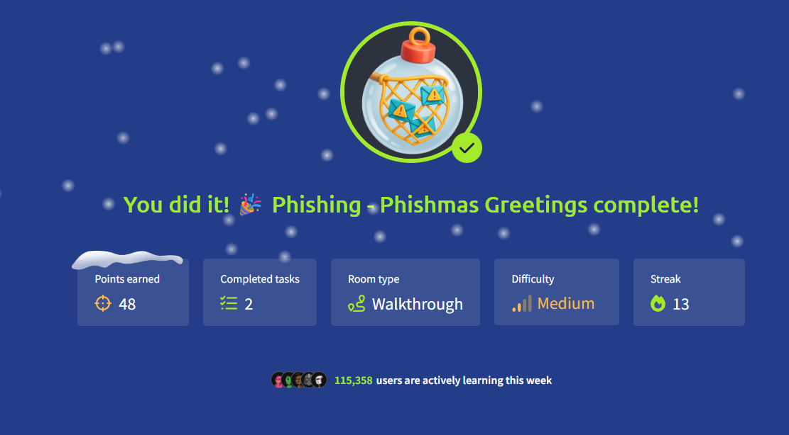

Thanks for reading!

Keep Learning and Stay Safe :)

