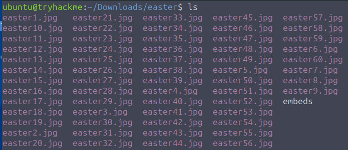
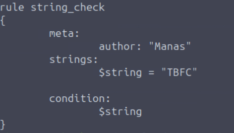
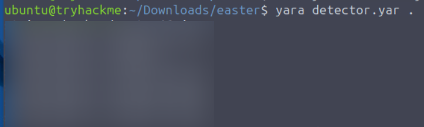
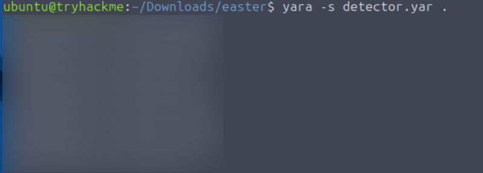

# Room: YARA Rules - YARA Means You're Ready for Anything!

## Mission Background

During McSkidy's disappearance from The Best Festival Company (TBFC), chaos and uncertainty spread through the organization. Yet even from her unknown location, McSkidy continued working to help the TBFC blue team. Following established crisis communication protocols, she sent what appeared to be ordinary Easter preparation images to the team. These images, however, contained hidden messages waiting to be decoded.

The crisis communication process specifies that messages may be concealed within folders of images, requiring a specific keyword for decryption. The blue team's mission is to create a YARA rule that scans the image directory, triggering on a keyword followed by a code word. By extracting all code words in ascending order, they'll unlock McSkidy's hidden message.

## Environment Setup

Begin by starting the target machine. While it boots up, let's explore YARA fundamentals.

## YARA Overview

YARA is a powerful tool designed to identify and classify malware by detecting unique patterns, essentially the digital fingerprints attackers leave behind. Think of it as a cyber detective's notebook: instead of searching for physical evidence, YARA scans code, files, and memory for subtle traces that reveal a threat's identity.

## Why YARA Matters and When to Use It

You might wonder why McSkidy chose this particular tool for our mission. In cybersecurity, defenders face constant streams of alerts, suspicious files, and anomalous network fragments. Threats do not always announce themselves; some hide in plain sight, disguised as harmless documents or scripts. This is where YARA proves invaluable.

YARA empowers defenders to detect malware by its behavior and patterns, not just by name. The tool allows you to define custom rules that reflect what you consider malicious behavior. Better yet, you are not starting from scratch, many YARA rules have been written by defenders from other organizations who faced similar threats. You can adapt and improve these shared rules to strengthen TBFC's defenses and protect our systems.

For SOC defenders, YARA means:
-   Faster threat detection
-   Smarter threat hunting
-   Fewer threats slipping through unnoticed

### Common YARA Applications

When might defenders rely on this tool?

1.  **Post-Incident Analysis**: Verifying whether malware traces found on one compromised host exist elsewhere in the environment.
2.  **Threat Hunting**: Systematically searching endpoints for signs of known or related malware families.
3.  **Intelligence-Based Scans**: Applying shared YARA rules from other defenders to detect new indicators of compromise.
4.  **Memory Analysis**: Examining active processes in memory dumps for malicious code fragments.

While these represent common uses, creative defenders often discover even more applications during investigations.

## YARA's Value Proposition

In the constant battle to protect systems, time and precision matter most. YARA delivers both, providing clarity amidst chaos. With YARA, you are not waiting for antivirus updates or third-party alerts, you have the power to create rules, detect new variants, and act before threats spread.

For TBFC's defenders, YARA offers key advantages:

-   **Speed**: Quickly scans large file sets or systems to identify suspicious content
-   **Flexibility**: Detects everything from text strings to binary patterns and complex logic
-   **Control**: Lets analysts define exactly what constitutes malicious behavior
-   **Shareability**: Rules can be reused and improved by defenders across organizations
-   **Visibility**: Helps connect scattered clues into a coherent attack picture

In short, YARA moves defenders from passive monitoring to active hunting, transforming intelligence into preventative action.

## Understanding YARA Rules

Now that you understand YARA's purpose and applications, let's examine how it actually works to uncover digital footprints left by threats.

A YARA rule consists of three key elements:

1.  **Metadata**: Information about the rule itself, who created it, when, and for what purpose
2.  **Strings**: The clues YARA searches for, text, byte sequences, or regular expressions marking suspicious content
3.  **Conditions**: The logic determining when the rule triggers, combining multiple strings or parameters

### Rule Structure Example

```yara
rule TBFC_KingMalhare_Trace
{
    meta:
        author = "Defender of SOC-mas"
        description = "Detects traces of King Malhare's malware"
        date = "2025-10-10"
    strings:
        $s1 = "rundll32.exe" fullword ascii
        $s2 = "msvcrt.dll" fullword wide
        $url1 = /http:\/\/.*malhare.*/ nocase
    condition:
        any of them
}
```

**Metadata Section**: Contains fields like author, description, and date. These are not strictly required but are highly recommended. Clear metadata helps you and other defenders understand the rule's purpose, origin, and context. As your rule collection grows, good metadata becomes essential for organization and maintenance.

**Strings Section**: Defines the actual clues, text, byte sequences, or regular expressions that YARA should search for.

**Condition Section**: Tells YARA when to flag a match based on your defined logic.

Together, these three components form every YARA rule's foundation. Let's explore strings and conditions in more detail.

## Strings: The Building Blocks of Detection

Strings represent signatures of malicious activity, fragments of text, bytes, or patterns that reveal threat presence. YARA supports three main string types, each serving different purposes.

### Text Strings

Text strings are YARA's simplest and most common string type. They represent words or short text fragments appearing in files, scripts, or memory. By default, YARA treats text strings as ASCII and case-sensitive, but you can modify their behavior using special modifiers added after string definitions.

Basic example:
```yara
rule TBFC_KingMalhare_Trace
{
    strings:
        $TBFC_string = "Christmas"
    condition:
        $TBFC_string
}
```

Attackers often try to hide code through encoding, case manipulation, or encryption. YARA counters these obfuscation methods with powerful modifiers:

#### Case-Insensitive Strings - `nocase`
Default YARA matches text exactly as written. The `nocase` modifier ignores letter casing:
```yara
strings:
    $xmas = "Christmas" nocase
```

#### Wide-Character Strings - `wide`, `ascii`
Many Windows executables use two-byte Unicode characters. `wide` tells YARA to search for this format, while `ascii` enforces single-byte search. Both can be combined:
```yara
strings:
    $xmas = "Christmas" wide ascii
```

#### XOR Strings - `xor`
Attackers often XOR-encode text to evade scanners. The `xor` modifier automatically checks all single-byte XOR variations:
```yara
strings:
    $hidden = "Malhare" xor
```

#### Base64 Strings - `base64`, `base64wide`
Malware often encodes payloads in Base64. These modifiers decode content and search for original patterns:
```yara
strings:
    $b64 = "SOC-mas" base64
```

Each modifier makes your rules more resilient, ensuring you detect threats even when they are disguised.

### Hexadecimal Strings

Sometimes threats do not leave readable text, they hide in raw bytes within executables or memory. Hexadecimal strings let YARA search for specific byte patterns written in hexadecimal notation. This detects malware fragments like file headers, shellcode, or binary signatures that cannot be represented as plain text.

```yara
rule TBFC_Malhare_HexDetect
{
    strings:
        $mz = { 4D 5A 90 00 }   // MZ header of Windows executable
        $hex_string = { E3 41 ?? C8 G? VB }
    condition:
        $mz and $hex_string
}
```

### Regular Expression Strings

Not all threat traces follow fixed patterns. Sometimes code mutates with small changes in filenames, URLs, or commands. Regular expressions provide flexible search patterns matching multiple malicious string variations.

Regex is especially useful for spotting URLs, encoded commands, or filenames sharing structure but differing slightly each time.

```yara
rule TBFC_Malhare_RegexDetect
{
    strings:
        $url = /http:\/\/.*malhare.*/ nocase
        $cmd = /powershell.*-enc\s+[A-Za-z0-9+/=]+/ nocase
    condition:
        $url and $cmd
}
```

**Note**: Regex strings are powerful but should be used carefully, overly broad patterns may slow scans.

## Conditions: The Decision Logic

Now that you know how to describe what to look for, you need to define when YARA should decide a threat has been found. This logic lives in the condition section, the heart of every YARA rule. Conditions tell YARA when to trigger based on string check results, serving as the final decision point confirming "This looks malicious."

### Match a Single String
The simplest condition triggers when one specific string is found:
```yara
condition:
    $xmas
```

### Match Any String
Triggers when any defined string is found:
```yara
condition:
    any of them
```
Useful for detecting early compromise signs, even one matching clue can warrant attention.

### Match All Strings
Requires all defined strings to appear together:
```yara
condition:
    all of them
```
Reduces false positives, YARA only flags files matching every indicator.

### Combine Logic Using: `and`, `or`, `not`
Logical operators provide precise control over rule behavior:
```yara
condition:
    ($s1 or $s2) and not $benign
```
This triggers if either `$s1` or `$s2` is found, but not `$benign`, detecting suspicious code while ignoring harmless system files.

### Use Comparisons: `filesize`, `entrypoint`, or Hash Values
YARA can check file properties beyond content. Detect unusually sized files, a common attacker tactic:
```yara
condition:
    any of them and (filesize < 700KB)
```
Triggers only when strings match AND file size is under 700KB.

## Practical Application: IcedID Trojan Case Study

Malhare's agents used the IcedID trojan to steal credentials from systems. McSkidy's analysts discovered malicious files across Wareville shared a common signature, the MZ header found in executable malware. These samples were small, lightweight loaders designed to infiltrate systems and summon more dangerous payloads.

Our detection rule:
```yara
rule TBFC_Simple_MZ_Detect
{
    meta:
        author = "TBFC SOC L2"
        description = "IcedID Rule"
        date = "2025-10-10"
        confidence = "low"

    strings:
        $mz   = { 4D 5A }                        // "MZ" header (PE file)
        $hex1 = { 48 8B ?? ?? 48 89 }            // malicious binary fragment
        $s1   = "malhare" nocase                 // story / IOC string

    condition:
        all of them and filesize < 10485760     // < 10MB size
}
```

Our analysts saved this to `icedid_starter.yar` and executed it:
```bash
yara -r icedid_starter.yar C:\
```
Result:
```
icedid_starter  C:\Users\WarevilleElf\AppData\Roaming\TBFC_Presents\malhare_gift_loader.exe
```

### Useful YARA Flags

-   `-r`: Recursively scans directories and follows symlinks
-   `-s`: Prints strings found within matching files

Complete command for our scenario:
```bash
yara -r -s icedid_starter.yar C:\
```

This recursively scans the C:\ drive using our rule and displays matching strings when found.

---

Well that was a lot of theory, lets apply it to our scenario.



I made a very simple yara file:



On running it as `yara detector.yar .` (which checks for all files in the current directory):



We found the images that contain the string TBFC.

For the 2nd question, we need a regex that matches a string `TBFC:` followed by 1+ alphanumeric ASCII characters. We modify the string to match the regex.

Let's run it:



We have the message. We then sort the message by filename.

# Conclusion

This exercise provided practical experience with YARA, developing essential cybersecurity analysis skills. Key learnings include:

**YARA Rule Development**: Created and refined detection rules with proper syntax, metadata, string modifiers, and logical conditions.

**Pattern Matching**: Applied regular expressions within YARA rules, mastering regex construction and special character handling.

**File Analysis**: Executed recursive directory scans for systematic pattern detection across multiple files.

**Data Processing**: Utilized YARA's output flags and command-line utilities to extract, organize, and present forensic findings.

**Methodical Approach**: Reinforced systematic forensic methodology through iterative testing, validation, and documentation.

These skills form a transferable foundation for malware analysis, digital forensics, threat hunting, and security tool development, demonstrating the practical application of pattern-based detection in real-world cybersecurity contexts.


Thanks for reading my walkthrough.

Keep Learning :)