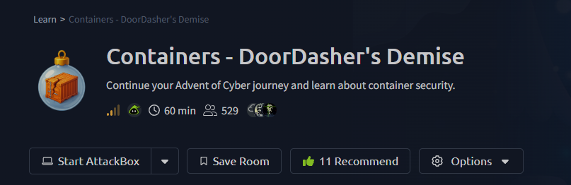
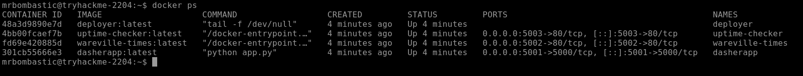
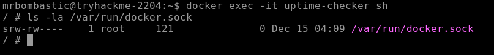
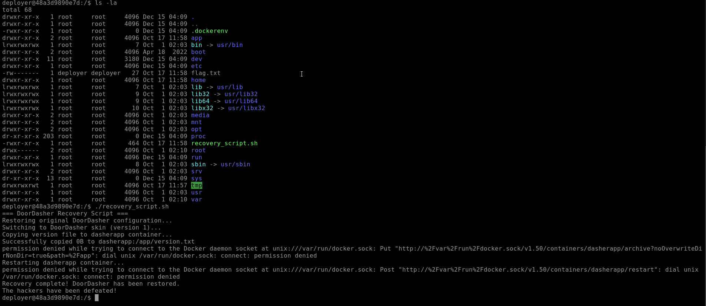
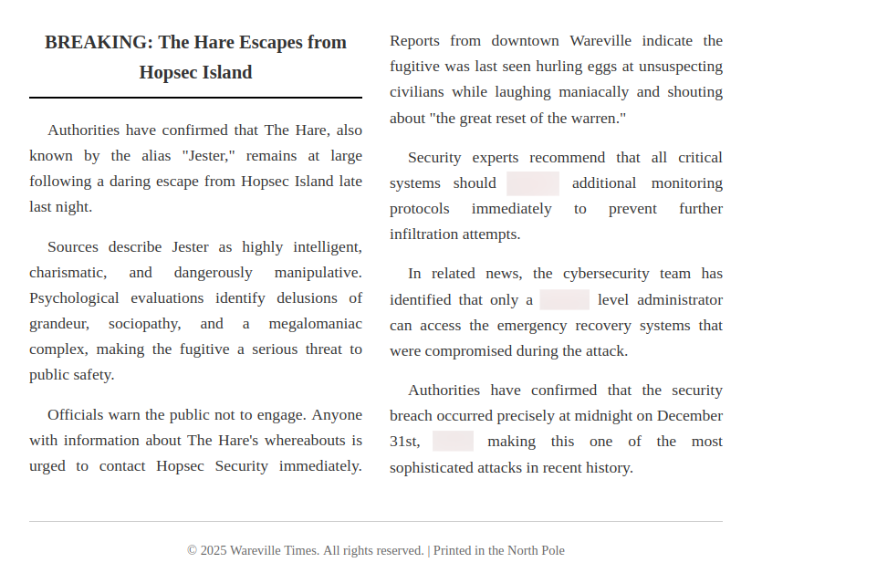
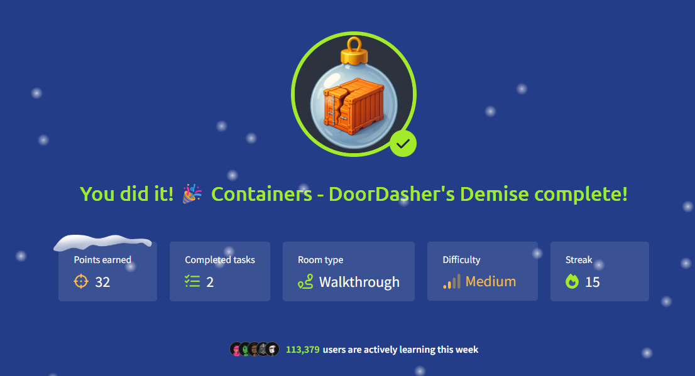

# Room Name: Containers - DoorDasher's Demise



DoorDasher is Wareville's local food delivery site. Some favorites of TBFC sometimes have quite long days.

Well, one of the Wareville residents, tired this morning, decided to order breakfast from DoorDasher. Only to find out that King Malhare and bandit bunnies had seized control of it.

DoorDasher had been rebranded as Hopperoo. Even the ware's favorite dishes were changed.

Well, DoorDasher call centre was flooding with calls not just from residents but also from the health and safety department. Because multiple residents were choking on Santa's beard. (oh no)

Instead of authentic noodles, they were served authentic strands of Santa's beard.

Immediately, one of the security engineers managed to log on and make a script to restore it to its original state, but Sir CarrotBane caught the attempt and locked the engineer out of the system.

All seems lost.

But the SOC team realized they had access to the system via a monitoring pod—the uptime checker for the site.

Here, we, as a SOC team member of DoorDasher, need to escape the container and save the site.

Let’s boot up both the attacker and target machine and look at what we need to work on.

It is recommended to have our attacker machine and target machine in full screen.

Let’s first study about Containers before we start our task.

---

## What Are Containers?

Well, first of all, modern applications today are quite complex:

- Installation (configuration files, time-consuming)
- Troubleshooting (sometimes applications don’t work as expected)
- Conflicts (multiple versions of the same application can cause issues, complicating the process)

Here is where containers come in.

Containers solve this by packing applications, along with their dependencies, in one isolated environment. Further, it is quite lightweight and portable.

Let’s understand the structure of a container.

### Containers v/s VMs


A virtual machine runs on a hypervisor, which is software that lets you run multiple operating systems on one physical computer. Each VM includes a full operating system, which makes it large and independent.

A container shares the host computer’s core operating system and only isolates the application and what it needs to run. This makes containers small and quick to start.

Virtual machines are best for running different operating systems or older applications. Containers are great for modern, portable applications that need to scale up easily.

### Applications at Scale

Traditionally, applications were built as one big unit, called a monolith. Now, many companies break their apps into smaller, independent parts based on business functions, called microservices. This means if one part of the app gets busy, only that part needs to be scaled up, not the whole app. Containers are perfect for this because they are lightweight and easy to scale. That’s why you hear about containers so often today.

In the diagram, you see a “Container Engine” layer. A container engine is software that builds, runs, and manages containers using the host system’s core features. Docker is a popular example of a container engine. It uses simple text files called Dockerfiles to define an app’s environment, ensuring it runs the same way on any system. At “DoorDasher,” Docker is the chosen container engine, and it’s what we’ll use in the lab.

### Docker

Docker is an open-source tool that helps developers build, deploy, and manage containers. Containers are small, portable packages that contain everything needed to run a service. They are lightweight because they share the host operating system’s core while keeping the application isolated.

### Escape Attack & Sockets

A container escape is when code inside a container breaks out of its isolated environment and gains access to the host system or other containers. For example, an attacker could create a privileged container with internet access from a test container that normally has none.

Containers work using a client-server setup on the host. The command-line tools act as the client, sending instructions to a background service (the daemon) that manages the containers. This service communicates through special files called Unix sockets. If an attacker inside a container can reach and use that socket, they can take control of the container runtime like creating that privileged container mentioned above.

---

## Challenge

Let’s start using the target machine.

To list the services running with Docker, we can use the following command:

```bash
docker ps
```



We can see that our main `dasherapp` is running on port 5001.

Let’s check it on our attacker machine:

`http://10.82.144.63:5001` (target machine IP and port)

We see that the website is defaced:


As we already know that DoorDasher (now Hopperoo) is a food delivery service, let’s check its uptime-checker by running the following command (on the target machine):

```bash
docker exec -it uptime-checker sh
```

### What This Does

This command gives us an interactive shell session inside the running `uptime-checker` container:

- **`docker exec`** → Execute a command inside a running container
- **`-it`** → Two flags that work together:
  - `-i` → Keep STDIN open (interactive input)
  - `-t` → Allocate a pseudo-TTY (terminal interface)
- **`uptime-checker`** → The name of the container we want to access
- **`sh`** → The shell program to run inside the container (typically `/bin/sh`)

Think of it like SSH-ing into a container! Once inside, you can:
- Explore the container's filesystem
- Check running processes
- Inspect installed packages
- Run diagnostic commands
- And crucially for our investigation to see what the container can access


This is our entry point into the compromised monitoring system that Sir CarrotBane overlooked. If this container has special permissions or access (like to the Docker socket), we might have a way to restore the site.

After this, check the socket access by running:

```bash
ls -la /var/run/docker.sock
```



Docker's documentation says that by default, "Enhanced Container Isolation" stops containers from accessing the Docker socket to prevent attacks. But sometimes, like with test containers, access is needed. The Docker socket lets you control containers through the Docker API. Let's see if we can access it.

Can we perform a Docker escape attack?

Let’s run `docker ps` again, and we still get to see other containers running on the host system.

This means we can:

- Start/stop other containers from inside the container
- Execute commands on other containers from inside the container
- Access the host filesystem through volume mounts
- Even gain root privileges on the host system

Let’s try to access the 'deployer' container, which could be a privileged container:

```bash
docker exec -it deployer sh
```

Looks like we have got access to the container from where we can restore the site back to its original state.

Navigate to the root directory; you will find a `recovery_script.sh` file.

Run it, and we will get the site back to its original state:

```bash
./recovery_script.sh
```



We can `cat` out the `flag.txt` to get the flag:


For the bonus question, go to:

`http://10.82.144.63:5002` - which hosts the news site.

Let’s try to find it.

Well, we see 3 words highlighted on the page (looks like combining the words reveals the answer):



It is not just our answer but also the password for the deployer user. They should definitely change it!

---

## Conclusion

This incident successfully demonstrated a critical container security vulnerability. Through the exposed Docker socket inside the `uptime-checker` monitoring container, we were able to execute a container escape attack. This gave us unauthorized control over the Docker engine, allowing us to access the privileged `deployer` container. From there, we executed the `recovery_script.sh` to restore the defaced DoorDasher (Hopperoo) website to its original state and recovered the flag.

The root cause was a misconfiguration that granted a non-privileged container access to the Docker daemon socket (`/var/run/docker.sock`), bypassing the intended security isolation. Furthermore, a weak password for the `deployer` user was discovered, compounding the security risk. This exercise highlights the importance of strictly following the principle of least privilege, enabling features like Enhanced Container Isolation, and ensuring strong credentials in containerized environments to prevent takeover and lateral movement by attackers.

Do check out the Container Vulnerabilities room (https://tryhackme.com/room/containervulnerabilitiesDG) for more such content.



Thanks for reading my walkthrough.

**Keep Learning and Stay Safe!!**
