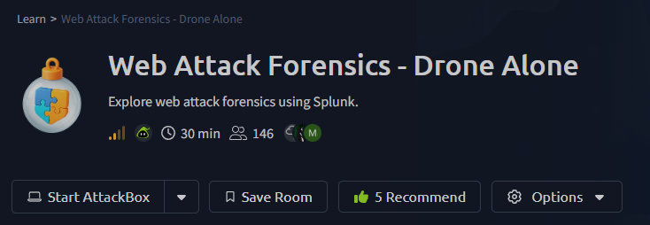
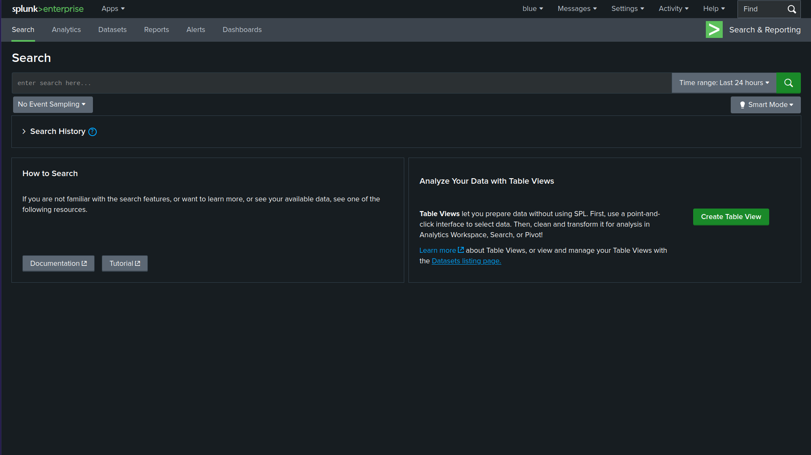
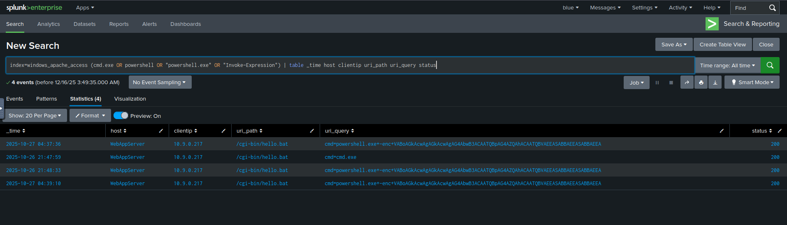
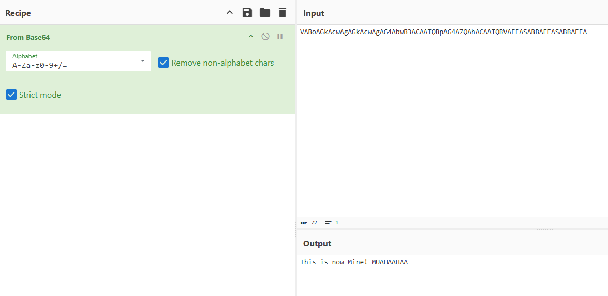
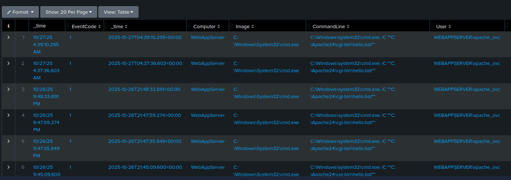
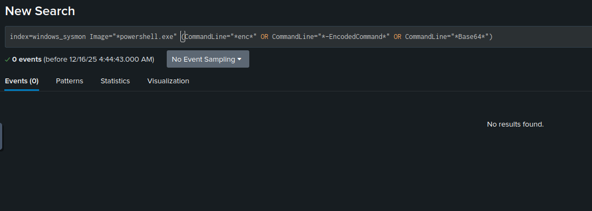
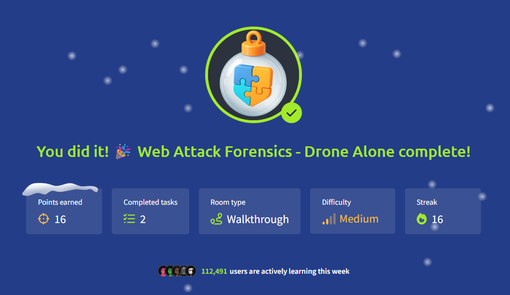

# Room Name: Web Attack Forensics - Drone Alone



TBFC’s drone scheduler web UI is receiving strange, long HTTP requests containing Base64 chunks.

Splunk raises an alert: **“Apache spawned an unusual process.”** On some endpoints, these requests cause the web server to execute shell code, which is obfuscated and hidden within the Base64 payloads.

Our role here as a Blue Teamer is to triage the incident, identify compromised hosts, extract and decode the payloads, and determine the scope.

---

## Environment Setup

Let’s connect the AttackBox and the target machine.

Use Firefox on the AttackBox to access the Splunk dashboard at  
`http://10.80.137.27:8000` (Target Machine IP) using the credentials provided.

After logging in, you will be taken to a search page like the one below.



Set the time range to **All time**.

In the search tab, start typing:

```
index
```

You will notice a dropdown, with one of the options being:

```
index = windows_apache_access
```

Select it and click **Search**.

---

## Detect Suspicious Web Commands

Now, we want to search specifically for HTTP requests that might indicate malicious activity.

We will use the following search query:

```
index=windows_apache_access (cmd.exe OR powershell OR "powershell.exe" OR "Invoke-Expression")
| table _time host clientip uri_path uri_query status
```

Here:

- `cmd.exe OR powershell OR "powershell.exe" OR "Invoke-Expression"` checks for signs of command execution  
- `table _time host clientip uri_path uri_query status` displays the relevant fields as columns



We can see `hello.bat` in the `uri_path` field, which is the file being executed, and the status code is `200`, indicating the request was successful.

In the `uri_query`, we observe encoded data:

```
VABoAGkAcwAgAGkAcwAgAG4AbwB3ACAATQBpAG4AZQAhACAATQBVAEEASABBAEEASABBAEEA
```

Some characteristics of Base64 encoding include:

- Uses only A–Z, a–z, 0–9, `+`, `/`
- Ends cleanly without random symbols
- Length is divisible by 4

### SOC Rule of Thumb

**Base64 + PowerShell = UTF-16LE (almost always)**

PowerShell’s `-EncodedCommand` parameter only accepts Base64-encoded UTF-16LE strings. When decoded, the output shows null bytes between characters, confirming UTF-16LE encoding.



---

## Looking for Server-Side Errors or Command Execution in Apache Error Logs

Now let’s look at the web server error logs.

We will use the following search query:

```
index=windows_apache_error ("cmd.exe" OR "powershell" OR "Internal Server Error")
```

We can see the following error:

```
'powershell.exe+-enc+VABoAGkAcwAgAGkAcwAgAG4AbwB3ACAATQBpAG4AZQAhACAATQBVAEEASABBAEEASABBAEEA'
is not recognized as an internal or external command,
C:/Apache24/cgi-bin/hello.bat
```

An **Internal Server Error (500)** is triggered for the request to  
`C:/Apache24/cgi-bin/hello.bat`, meaning the request was processed by the server but failed during execution.

---

## Trace Suspicious Process Creation From Apache

Next, we trace suspicious process creation activity.

We use the following search query:

```
index=windows_sysmon ParentImage="*httpd.exe"
```

Here:

- `index=windows_sysmon` searches Sysmon logs  
- `ParentImage="*httpd.exe"` identifies processes spawned by Apache

Typically, Apache should only spawn worker threads, not system processes like `cmd.exe` or `powershell.exe`.

Set the results view to **Table**.



You will repeatedly observe the following pattern:

```
ParentImage: C:\Apache24\bin\httpd.exe
Image:       C:\Windows\System32\cmd.exe
CommandLine: cmd.exe /C "C:\Apache24\cgi-bin\hello.bat"
User:        WEBAPPSERVER\apache_svc
```

This means:

- Apache is executing a Windows batch file  
- Through `cmd.exe`  
- As the Apache service account  

This finding is one of the strongest indicators that the web attack penetrated the operating system.

---

## Confirm Attacker Enumeration Activity

Here, we aim to find specific programs identified in previous queries.

We use the following search query:

```
index=windows_sysmon *cmd.exe* *whoami*
```

This looks for command execution logs where `cmd.exe` ran the `whoami` command.

Attackers commonly use `whoami` to confirm their execution context after achieving code execution.

The query returns multiple executions of `whoami.exe` originating from the Apache CGI directory:

```
Image:        C:\Apache24\cgi-bin\whoami.exe
CommandLine:  whoami
User:         WEBAPPSERVER\apache_svc
```

This activity is highly suspicious for several reasons:

- `whoami.exe` normally resides in `C:\Windows\System32`
- Execution from `C:\Apache24\cgi-bin` suggests it was copied or explicitly invoked from the web directory
- `whoami` is a common reconnaissance command used to verify execution context

The repeated execution confirms that the attacker successfully achieved **remote command execution (RCE)** and was actively interacting with the compromised host.

---

## Identify Base64-Encoded PowerShell Payloads

Finally, we search for additional Base64-encoded PowerShell payloads.

We use the following search query:

```
index=windows_sysmon Image="*powershell.exe"
(CommandLine="*enc*" OR CommandLine="*-EncodedCommand*" OR CommandLine="*Base64*")
```

This query detects PowerShell commands containing `-EncodedCommand` or Base64 text, a common technique attackers use to hide malicious commands.

If the query does not return any results, it indicates that defensive controls are working as expected.



No results were returned, confirming that no additional encoded PowerShell payloads were executed beyond those already identified.

---

## Conclusion

This investigation confirms that the TBFC drone scheduler web server was compromised through an insecure Command Gateway Interface (CGI) configuration. Malicious HTTP requests triggered the execution of a batch file (`hello.bat`), causing Apache to spawn `cmd.exe` and execute system commands under the Apache service account.

Base64-encoded payloads were used to obfuscate PowerShell commands, and repeated execution of the `whoami` command confirms successful remote command execution and active attacker interaction. Correlation of Apache logs and Sysmon events provided clear evidence of OS-level compromise.

This incident highlights the risk of exposed CGI scripts and demonstrates the importance of monitoring process creation and encoded command execution to detect web-based attacks early.

---




Thanks for reading my write-up.

**Keep learning and stay safe!**

