# Room Name: Forensics - Registry Furensics

TBFC is under attack.

McSkidy’s team, determined and well-trained, is fully confident in securing all the systems and regaining control before the big event, SOCMAS.

They have now decided to conduct a detailed forensic analysis on one of the most critical systems of TBFC, dispatch-srv01. The dispatch-srv01 coordinates the drone-based gift delivery during SOCMAS. However, it was recently compromised by King Malhare’s band of bunnies.

While the other team members are investigating logs, memory dumps, file systems, and other artifacts, we will be working on the registry of the compromised system.

Let's boot up the target machine.

Let's first look into the theory of the registry.

## Windows Registry

Just like our brain stores all sorts of information - behavior, habits, things to remember, etc. The Windows Registry stores the configuration of the Windows operating system. So, the Windows Registry is the brain of the Windows operating system, containing all the information the Windows OS needs to function.

Unlike our brain, the registry is not stored in a single location. It is made up of several separate files, each storing information on different configuration settings. These files are known as hives.

| Hive Name      | Contains                          | Location                                      |
|----------------|-----------------------------------|-----------------------------------------------|
| SYSTEM         | Services, Mounted Devices, Boot Configuration, Drivers, Hardware | C:\Windows\System32\config\SYSTEM             |
| SECURITY       | Local Security Policies, Audit Policy Settings | C:\Windows\System32\config\SECURITY           |
| SOFTWARE       | Installed Programs, OS Version and other info, Autostarts, Program Settings | C:\Windows\System32\config\SOFTWARE           |
| SAM            | Usernames and their Metadata, Password Hashes, Group Memberships, Account Statuses | C:\Windows\System32\config\SAM                |
| NTUSER.DAT     | Recent Files, User Preferences, User-specific Autostarts | C:\Users\username\NTUSER.DAT                  |
| USRCLASS.DAT   | Shellbags, Jump Lists             | C:\Users\username\AppData\Local\Microsoft\Windows\USRCLASS.DAT |

You might be tempted to check out these files, but the registry hives contain binary data that cannot be directly opened from a file.

Instead, we have a built-in tool called Registry Editor (regedit) that can be used to view and edit the registry.

Let's open it and follow along.

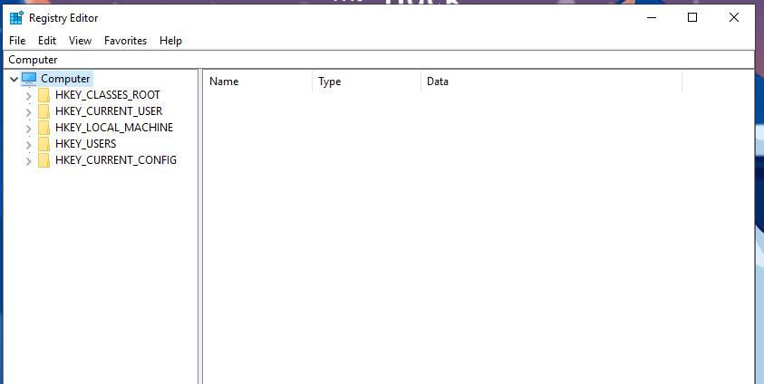

We see many folders like HKEY_CLASSES_ROOT, HKEY_CURRENT_USER, HKEY_LOCAL_MACHINE, HKEY_USERS, HKEY_CURRENT_CONFIG, but we were expecting to see SYSTEM, SECURITY, SOFTWARE, etc.

Actually, Windows organizes all registry hives into structures called root keys:
- HKEY_CLASSES_ROOT
- HKEY_CURRENT_USER
- HKEY_LOCAL_MACHINE
- HKEY_USERS
- HKEY_CURRENT_CONFIG

Under each hive, we have registry keys.

To know which registry hive is associated with which root key, we can refer to this table.

| Hive on Disk   | Where You See It in Registry Editor                     |
|----------------|----------------------------------------------------------|
| SYSTEM         | HKEY_LOCAL_MACHINE\SYSTEM                                |
| SECURITY       | HKEY_LOCAL_MACHINE\SECURITY                              |
| SOFTWARE       | HKEY_LOCAL_MACHINE\SOFTWARE                              |
| SAM            | HKEY_LOCAL_MACHINE\SAM                                   |
| NTUSER.DAT     | HKEY_USERS\<SID> and HKEY_CURRENT_USER                  |
| USRCLASS.DAT   | HKEY_USERS\<SID>\Software\Classes                       |

You will see most of the registry hives under the HKEY_LOCAL_MACHINE key.

Let's open the dropdown and see the contents of the HKEY_LOCAL_MACHINE key.

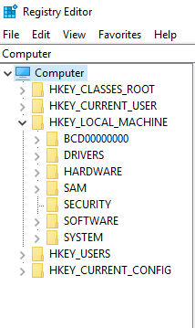

We can see SYSTEM, SECURITY, SOFTWARE, SAM, etc., under the HKEY_LOCAL_MACHINE key.

Note: The HKEY_CLASSES_ROOT and HKEY_CURRENT_CONFIG are not part of any separate hive file. They are dynamic hives that are created on the fly when Windows starts.

Now, let's see how we can extract information from the registry.

### Example 1: View Connected USB Devices

Note: This example is not available in the attached VM.

If we were to navigate to `HKEY_LOCAL_MACHINE\SYSTEM\CurrentControlSet\Enum\USBSTOR`, here you would see the USB device information (make, model, and device ID). Each device will have:
- A main subkey (identification of the type and manufacturer of the USB device)
- A subkey (represents the unique devices under this model)

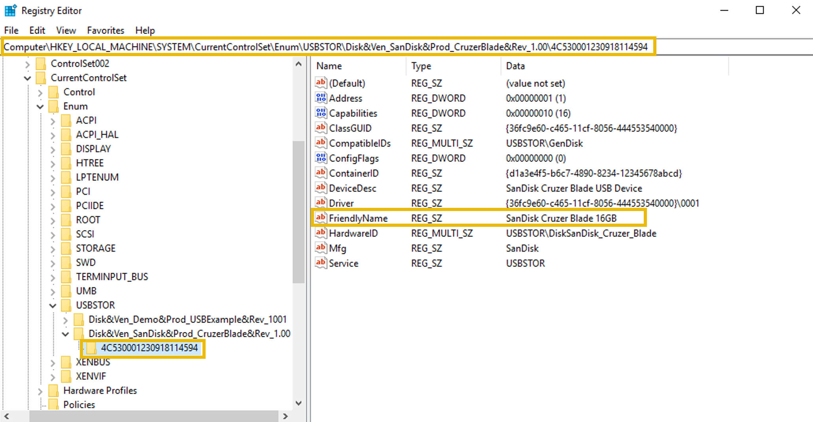

### Example 2: View Programs Run by the User

If we were to navigate to `HKEY_CURRENT_USER\Software\Microsoft\Windows\CurrentVersion\Explorer\RunMRU`, here we can see the commands that the user has run recently.

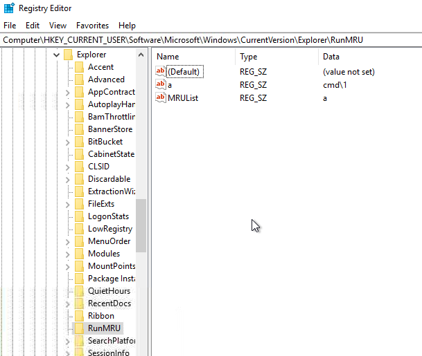

You can see that I had run `cmd`.

## Registry Forensics

The registry plays a crucial role in forensics as it contains a lot of information about the system.

Registry forensics is the process of extracting and analyzing evidence from the registry. In Windows digital forensic investigations, investigators analyze the registry, event logs, file system data, memory data, and other relevant data to construct the entire incident timeline.

The table below lists some registry keys that are particularly useful during forensic investigations.

| Registry Key                                                                 | Importance                                                                 |
|------------------------------------------------------------------------------|----------------------------------------------------------------------------|
| HKCU\Software\Microsoft\Windows\CurrentVersion\Explorer\UserAssist           | Stores information on recently accessed applications launched via the GUI. |
| HKCU\Software\Microsoft\Windows\CurrentVersion\Explorer\TypedPaths           | Stores all the paths and locations typed by the user inside the Explorer address bar. |
| HKLM\Software\Microsoft\Windows\CurrentVersion\App Paths                     | Stores the path of the applications.                                       |
| HKCU\Software\Microsoft\Windows\CurrentVersion\Explorer\WordWheelQuery       | Stores all the search terms typed by the user in the Explorer search bar.  |
| HKLM\Software\Microsoft\Windows\CurrentVersion\Run                           | Stores information on the programs that are set to automatically start (startup programs) when the user logs in. |
| HKCU\Software\Microsoft\Windows\CurrentVersion\Explorer\RecentDocs           | Stores information on the files that the user has recently accessed.       |
| HKLM\SYSTEM\CurrentControlSet\Control\ComputerName\ComputerName              | Stores the computer's name (hostname).                                     |
| HKLM\SOFTWARE\Microsoft\Windows\CurrentVersion\Uninstall                     | Stores information on the installed programs.                              |

The investigation of these registry keys during forensics cannot be done via the built-in Registry Editor tool because registry analysis cannot be performed on the system under investigation (due to the chance of modification). Instead, we collect the registry hives and open them offline on our forensic workstation. However, the Registry Editor does not allow opening offline hives. The Registry Editor also displays some of the key values in binary, which are not readable.

So, we use a tool called Registry Explorer, which is a registry forensics tool. It can parse the registry, and we can analyze it offline.

## Practical

For the practical, we will use the Registry Explorer tool to analyze dispatch-srv01.

The registry hives have been collected from dispatch-srv01 and are stored in the folder `C:\Users\Administrator\Desktop\Registry Hives`.

**Step 1: Open the Registry Explorer tool.**

From the taskbar, click on the Registry Explorer icon.

**Step 2: Load the registry hives.**

Click on `File -> Load Hive`.

**Step 3: Handling Dirty Hives**

Here, a "Dirty Hive" means that the hive can sometimes be "dirty" when collected from live systems, meaning they may contain incomplete transactions or partial data.

To ensure clean loading:
1. On the Load Hives pop-up, navigate to the `C:\Users\Administrator\Desktop\Registry Hives` folder.
2. Select the desired hive file (e.g., SYSTEM).
3. Press `Shift + Open` to load associated log files. This ensures that the hive is loaded in a clean state.
4. You will be prompted with a message indicating successful replay of transaction logs.
5. Repeat the same process for other hives.

**Step 4: Investigating Registry Keys**

Navigate to the following registry key:
`ROOT\ControlSet001\Control\ComputerName\ComputerName`

Or type "ComputerName" in the search bar, or click the Available Bookmarks tab and navigate to the ComputerName key from there.

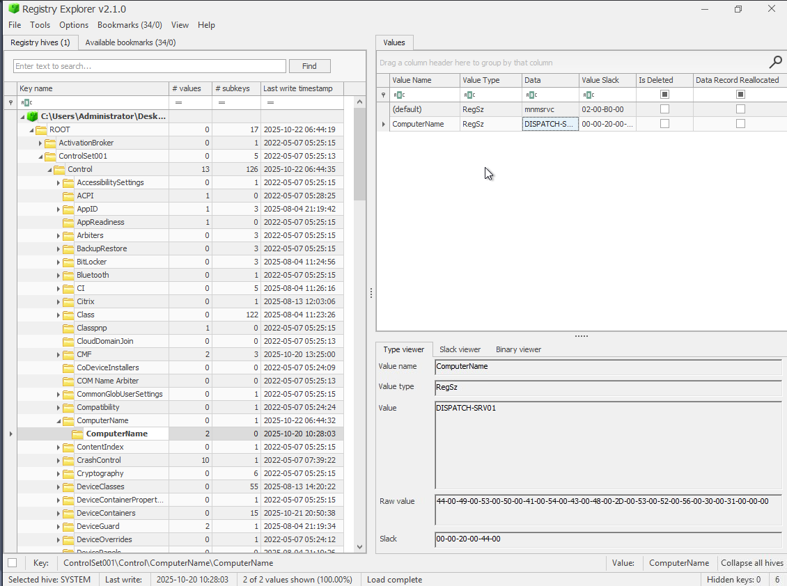

And we have the hostname of dispatch-srv01. Therefore, we know we are investigating dispatch-srv01.

We are told that the abnormal activity on dispatch-srv01 started on 21st October 2025.

Also, the table provided earlier in the Registry Forensics section is going to be useful in our tasks.

Let's answer the questions.

For the 1st question, we need to find the application that was installed on dispatch-srv01 before the abnormal activity started.

For that, we need to load the SOFTWARE hive and check inside the Uninstall key, as if we were to perform malicious activity, we might install the application and then uninstall it.

From the table earlier:

We can navigate to this key:
`ROOT\Software\Microsoft\Windows\CurrentVersion\Uninstall`

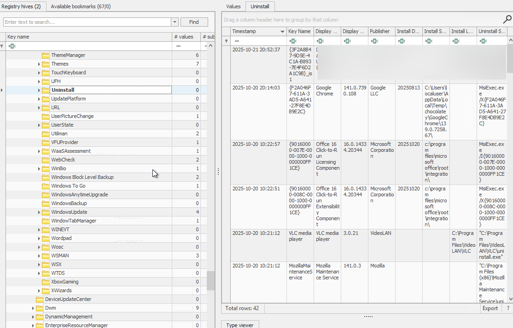

We can find it if we sort by the timestamp of the Uninstall key. Also, we can notice that it was the only application installed on 21st October 2025.

For the 2nd question, we need the full path from where the user launched the application (found in question 1).

For this, we need to load the NTUSER.DAT hive (as it is the user profile hive).

In the NTUSER.DAT hive, navigate to the following registry key:
`ROOT\Software\Microsoft\WindowsNT\CurrentVersion\AppCompatFlags\Compatibility Assistant\Store`

Why did we choose this key? It stores a full executable path for programs run by the user.

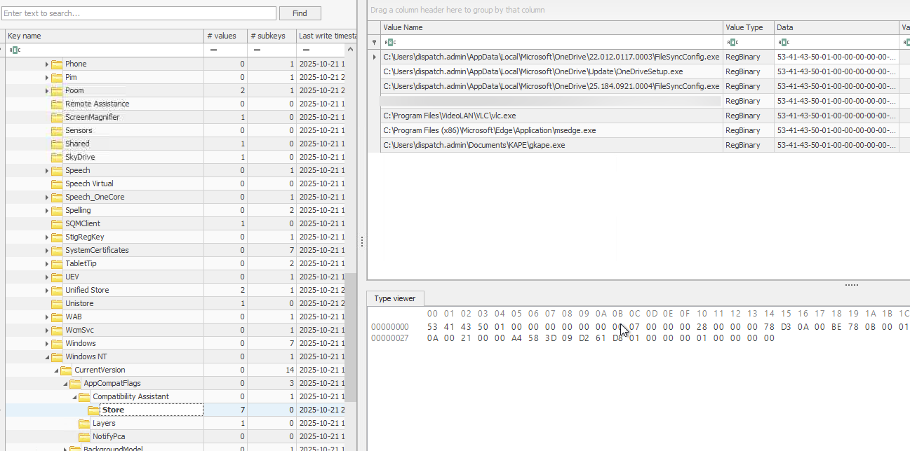

Alternatively, from the table earlier, we could look into this:

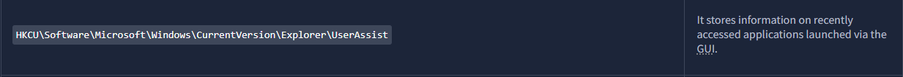

Search "UserAssist" in the search bar.

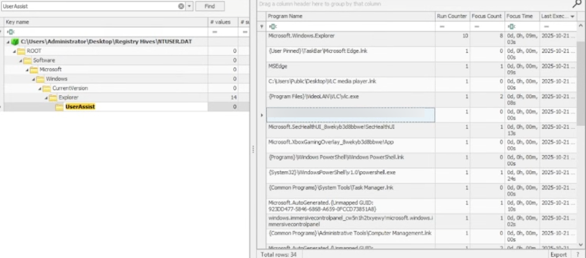

And we find the path of the application executed by the user.

For the 3rd question, we need to find the value which was added by the application to maintain persistence on startup.

Let's check the Run folder in the SOFTWARE hive.

From the table, we can see where to look:

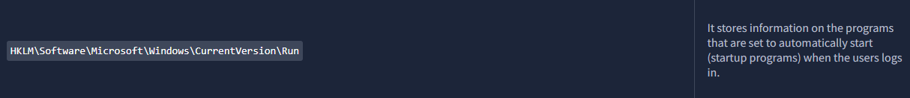

Navigate to the following registry key:
`ROOT\Software\Microsoft\Windows\CurrentVersion\Run`

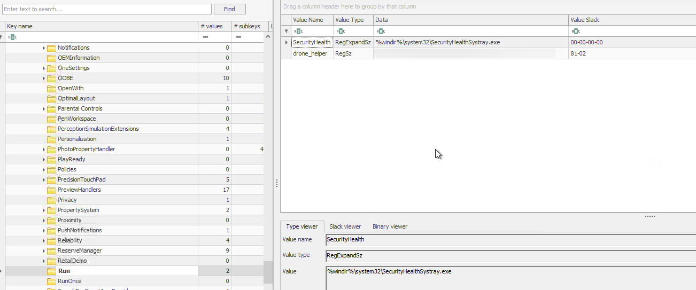

And we have our answer.

## Conclusion

Registry forensics is a vital component of digital investigations, providing a wealth of information about system configuration, user activity, and potential malicious actions. By analyzing specific registry hives and keys—such as those detailing installed programs, recent user activities, and auto-start entries—investigators can reconstruct events, identify compromised systems, and uncover persistence mechanisms used by attackers. In this exercise, we successfully extracted critical evidence from the dispatch-srv01 registry, including the malicious application installed, its execution path, and the persistence mechanism it employed. This underscores the importance of the Windows Registry as a foundational source of forensic evidence in incident response and security analysis.

Thanks for reading this walkthrough. I hope you found it helpful.

Keep Learning :)
