# Room Name: CyberChef - Hoperation Save McSkidy

McSkidy is being held in King Malhare’s Quantum Warren.  
Sir BreachBlocker III is in charge of guarding the fortress and has set up many security measures to stop any escape. His defenses are very strong.

Even so, McSkidy was able to send important clues to the team using harmless bunny pictures.

One message explained that five locks must be disabled to create an escape path. These locks can be broken by studying how they work and by using the guards’ built-in chat system.

The guards can be tricked into sharing important information or even passwords, but you must understand and use their language. (Feels like some kind of encoding!)

Let’s set up our virtual environment by starting both the attacker and target machines.

Let’s understand some encoding and decoding basics and techniques before we try to understand their language!

## Important Concepts

### Encoding and Decoding

Encoding is a method to transform data to ensure compatibility between different systems. It differs from encryption in purpose and process.

| Encoding | Encryption |
|--------|------------|
| Purpose | Compatibility |
| Usability | Security |
| Confidentiality | |
| Process | Standardized | Algorithm + Key |
| Security | No | Yes |
| Speed | Fast | Slow |
| Examples | Base64 | TLS |

Decoding is the process of converting encoded data back to its original, readable, and usable form.

### CyberChef Overview

CyberChef is also known as the Cyber Swiss Army Knife. Ready to cook some recipes?

| Area | Description |
|-----|-------------|
| Operations | Repository of diverse CyberChef capabilities |
| Recipe | Fine-tune and chain the operations area |
| Input | Here you provide the input for your recipe |
| Output | Here is the output of your recipe |

### Simple Example

Open CyberChef and try to encode the string `"IamRoot"` using Base64 encoding.

In the operations tab, simply drag and drop the **To Base64** operation from the operations repository to the recipe area.

In the input tab, provide the string `"IamRoot"`.

In the output tab, you will see the encoded string `"SWFTUm9vdA=="`.

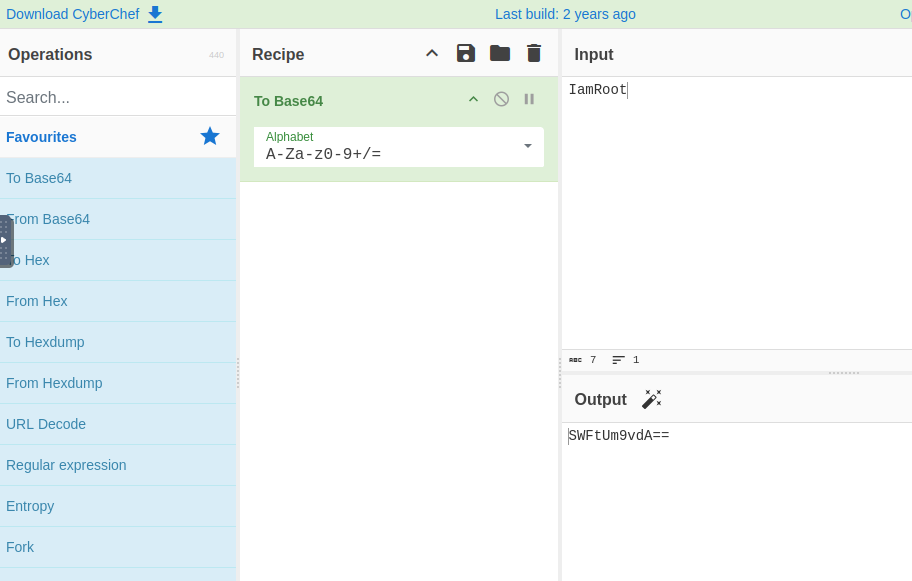

## Inspecting Web Pages

The browser also receives and sends data in the form of HTTP requests and responses.  
Sometimes it could contain some encoded data.

Depending on your browser, you can access the functionality as shown below:

| Browser | Menu path |
|--------|-----------|
| Chrome | More tools > Developer tools |
| Firefox | Menu (☰) > More tools > Web Developer Tools |
| Microsoft Edge | Settings and more (...) > More tools > Developer tools |
| Opera | Developer > Developer tools |
| Safari | Develop > Show Web Inspector (Requires enabling the "Develop" menu in Preferences > Advanced) |

For a better experience, click **F12** and the three dots to dock the dev tools to the right.

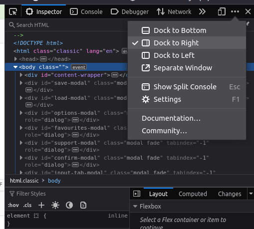

## First Lock - Outer Gate

Let’s access the web app at <http://10.81.184.67:8080>.

Click on the **Outer Gate** button to access the first lock.

Clicking on the **Bash!** button, we get some hints.

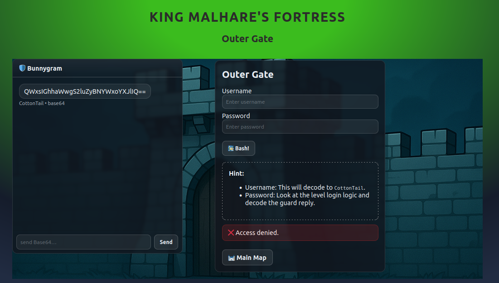

Which reveals that the username decodes to `CottonTail`, but for the password we need to look at the live login logic and decode it.

Open the developer tools and go to the **Network** tab.

Refresh the page and select the `level1` file in the network tab.

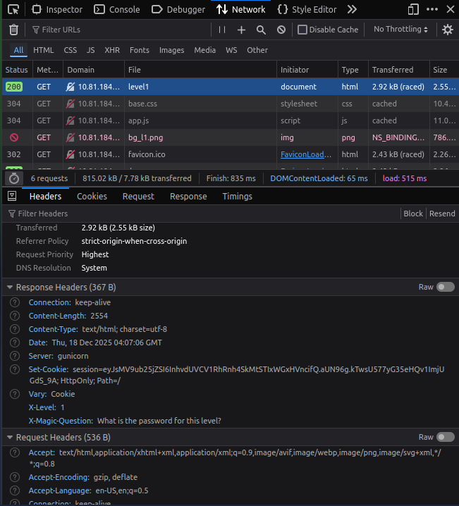

You can see under the headers section we see an **X-Magic-Question**, specifically under Response Headers.

**Note:** `X-Magic-Question` is a custom HTTP header added by the website or application. It is not a standard browser or HTTP header. It is where McSkidy is hiding the clues.

Use the encoded magic question in the chat. The guard will answer with the encoded level password.

Encode the question using Base64 encoding and send it to the guard.

Decode the answer to get the password.

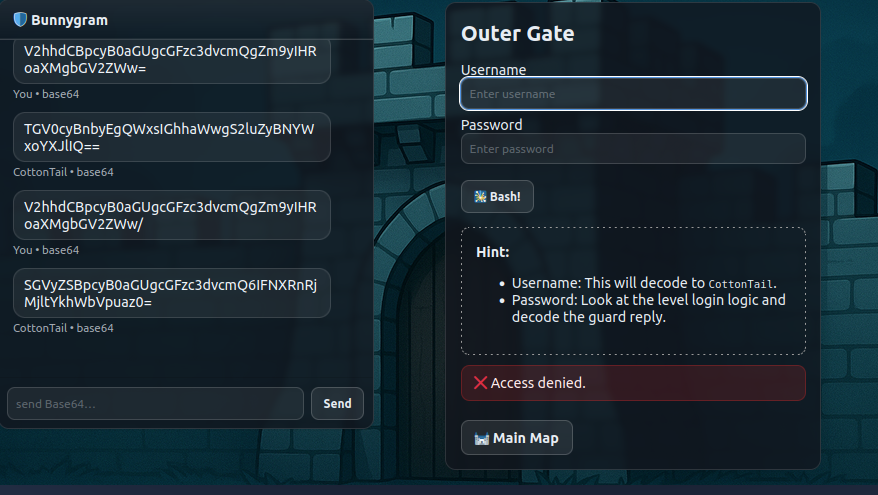

Ensure the username is encoded and the password is decoded before submitting it, and click on the **Bash!** button to open the next lock.

## Second Lock - Outer Wall

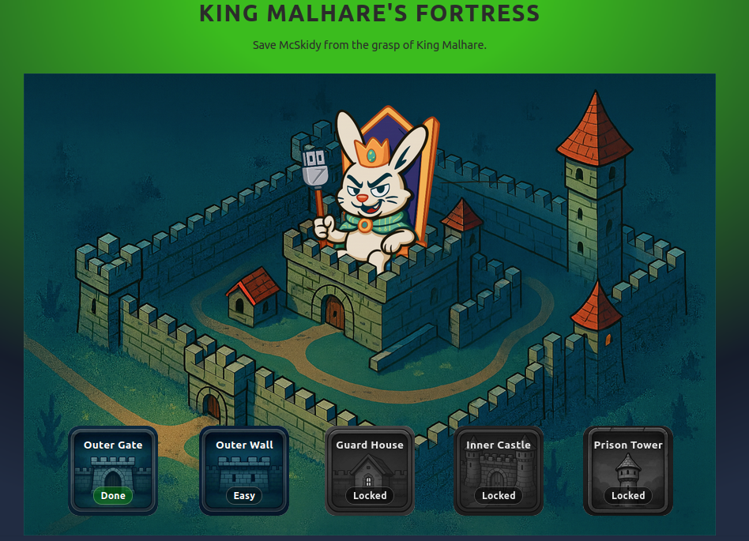

Again, do the same: press **F12** and select the `level2` file in the network tab.

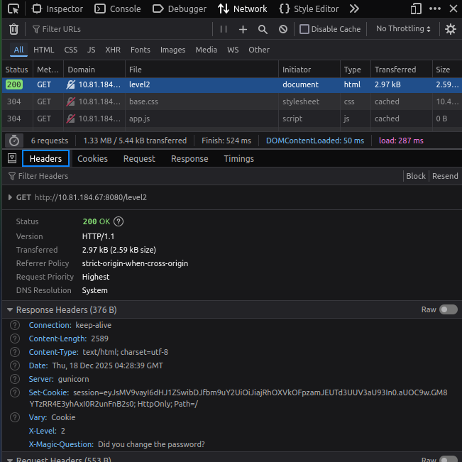

Here we see another question.

In the debugger section, you can see the login logic for this level.

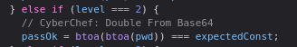

We need to double decode the Base64 encoded password we get from the guard to get the password.

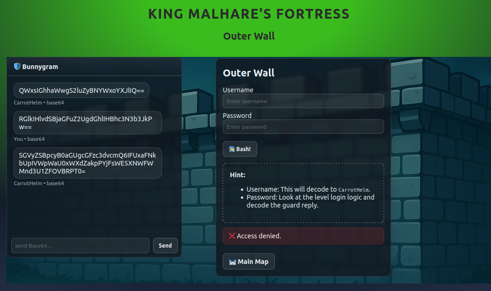

## Third Lock - Guard House

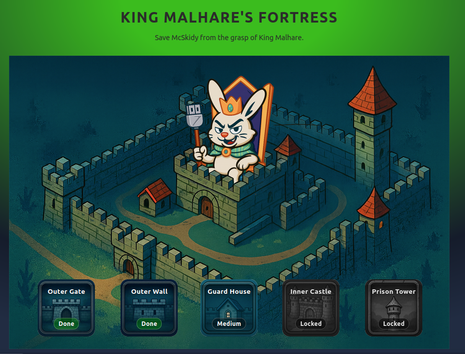

Similarly, look in the header section of the response and find the `X-Magic-Question`, but there is no such question.

We instead have an `X-Recipe-Key`.

If we look at the logic for this level, we can see the password is XORed with the `X-Recipe-Key` and then encoded using Base64 encoding.

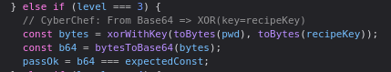

### Let’s understand XOR operation

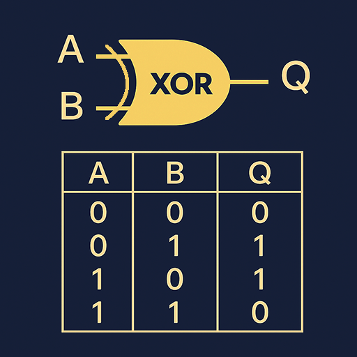

XOR involves a bitwise exclusive OR operation between data and a key.

Here we have the key. Let’s ask the guard for the data in encoded form — `"password please"` in encoded form.

It does take some time to give a reply, so be patient.

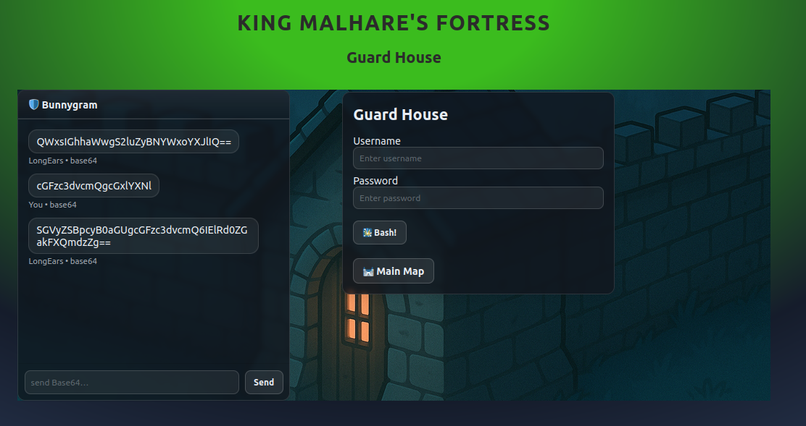

Now we have the data and the key. Let’s decode the data using the XOR operation.

Open the XOR tool in CyberChef, provide the key that was given, and enter the data we got from the guard.

**Why do we set UTF-8 encoding in CyberChef?**

Strings are internally Unicode.

A function named `toBytes()` almost always means:

> Convert string → byte array using UTF-8

UTF-8 is the default and safest assumption unless explicitly stated otherwise.

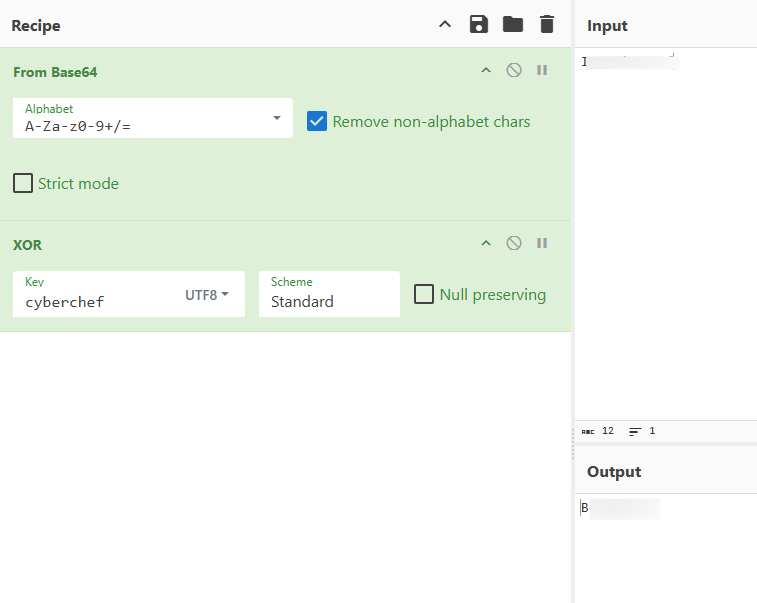

Here we get the password for this level.

## Fourth Lock - Inner Castle

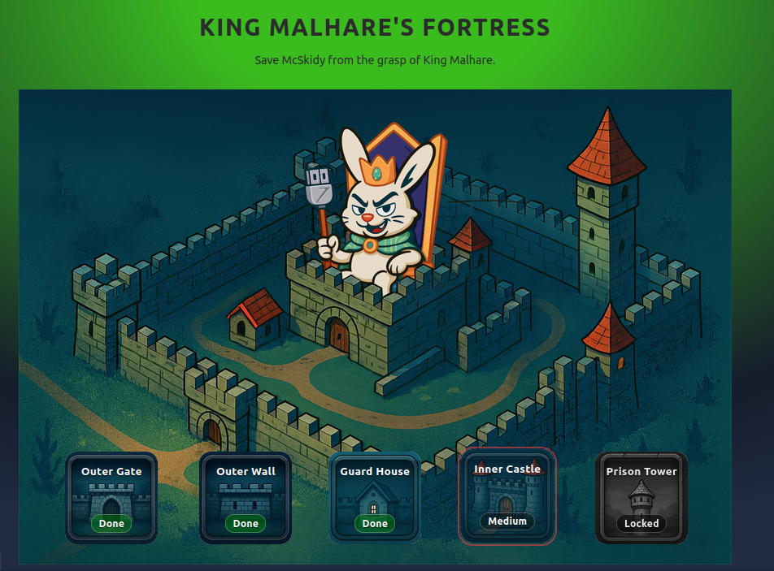

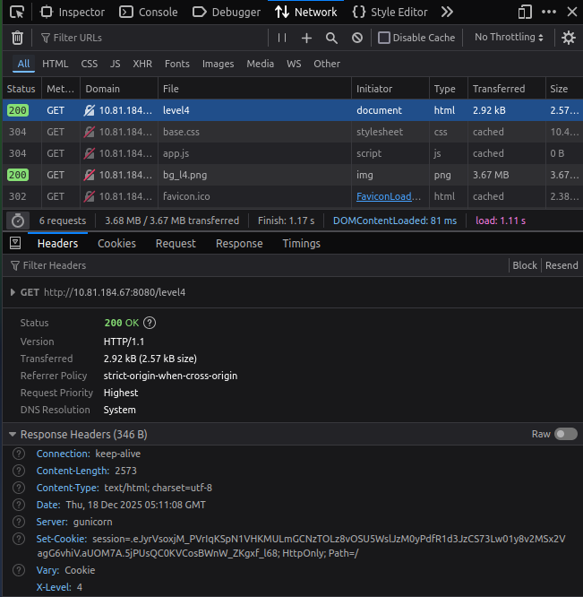

This time, we have nothing here.

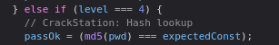

In the login logic, we see a hash lookup using CrackStation.

This time, again try to ask the guard for the hash using `"password please"` in encoded form.

It does reveal the password, but on Base64 decoding we see another encoded form.

This time we don’t know what encoding it is.

Let’s head to CrackStation and try to search for the hash.

**CrackStation** — it does not *crack* the hash; it just searches for the hash in its database.

From the website itself:

> CrackStation uses massive pre-computed lookup tables to crack password hashes. These tables store a mapping between the hash of a password, and the correct password for that hash. The hash values are indexed so that it is possible to quickly search the database for a given hash. If the hash is present in the database, the password can be recovered in a fraction of a second. This only works for "unsalted" hashes.

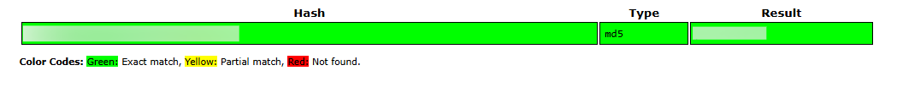

## Fifth Lock - Prison Tower

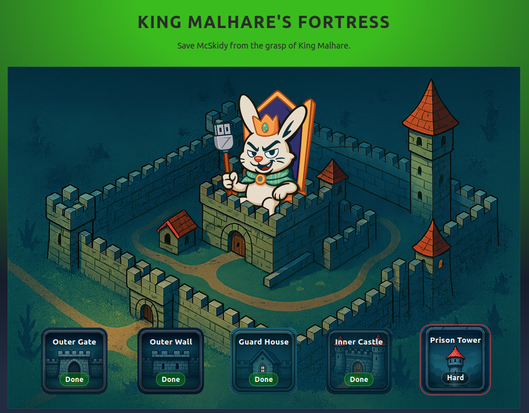

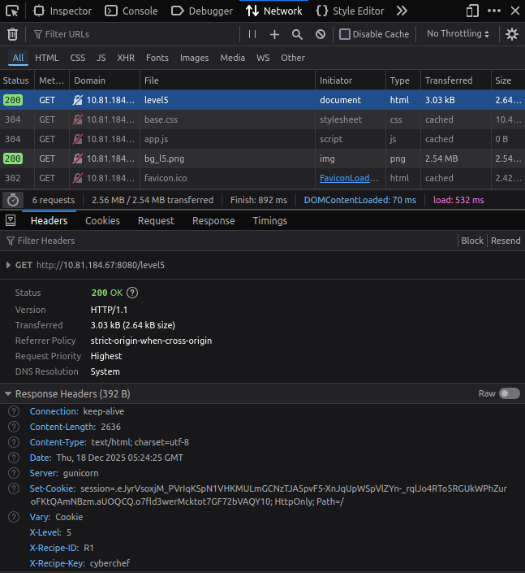

This time, we have the `X-Recipe-ID` and `X-Recipe-Key`.

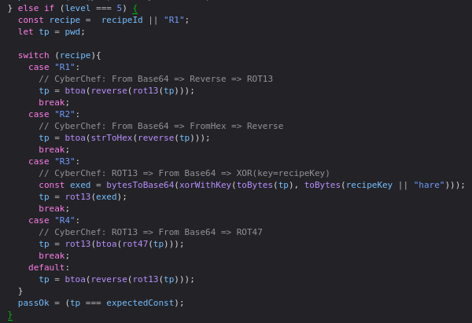

From the login logic, decoding each recipe:

| Recipe ID | Reverse Logic |
|-----------|---------------|
| 1 | From Base64 ⇒ Reverse ⇒ ROT13 |
| 2 | From Base64 ⇒ From Hex ⇒ Reverse |
| 3 | ROT13 ⇒ From Base64 ⇒ XOR (extracted key) |
| 4 | ROT13 ⇒ From Base64 ⇒ ROT47 |

Asking the guard, we have the encoded form of the password.

Let’s use the reverse logic to decode the password.

We have **R1** as the Recipe ID (you could have it different) and solve it according to the reverse logic.

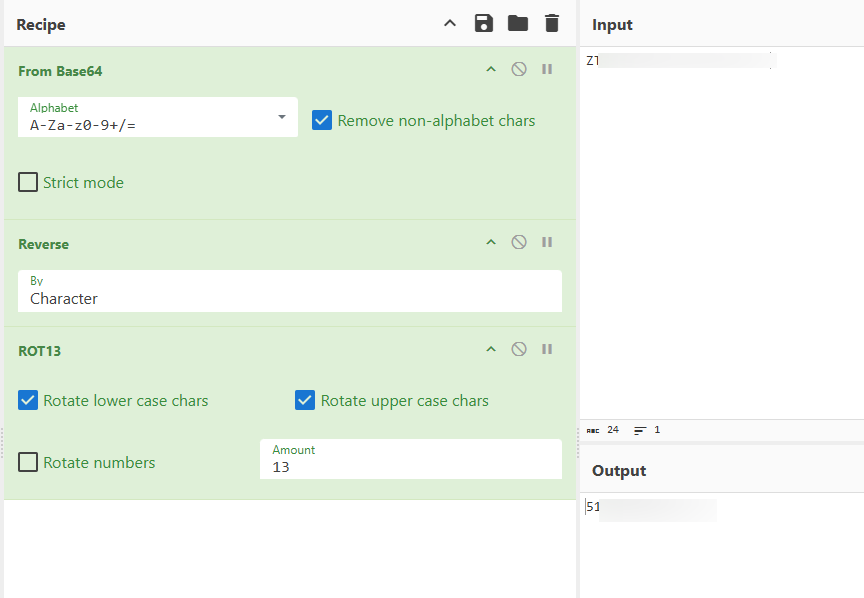

We have finally found the password for the final lock.

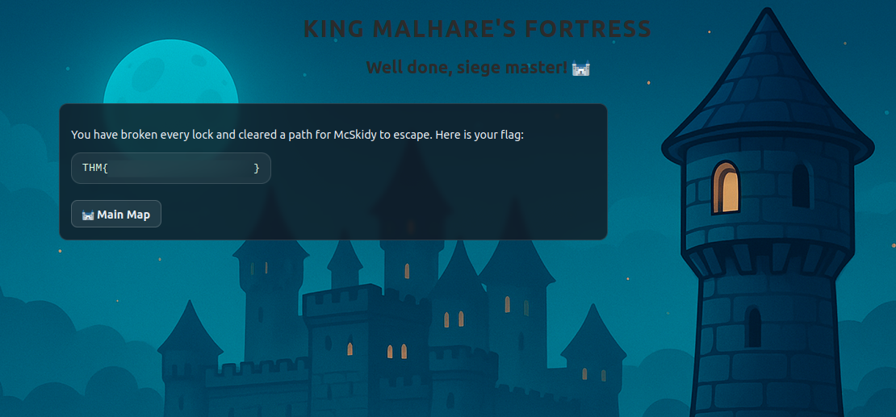

As McSkidy passed by the Inner Castle, she heard a thunderous voice:  
> “Why should Christmas have all the fun?”

And finally, McSkidy manages to get back to Wareville, just in time as TBFC was about to be hit by another disaster.

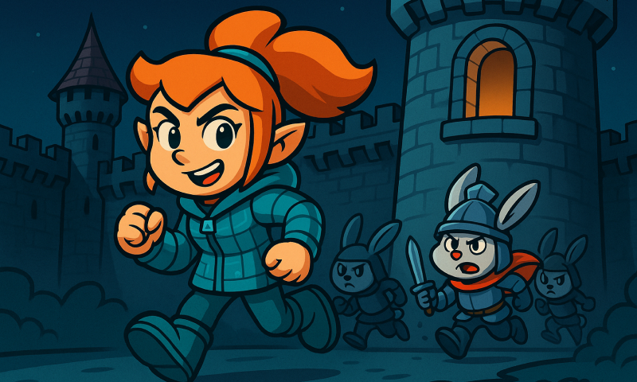

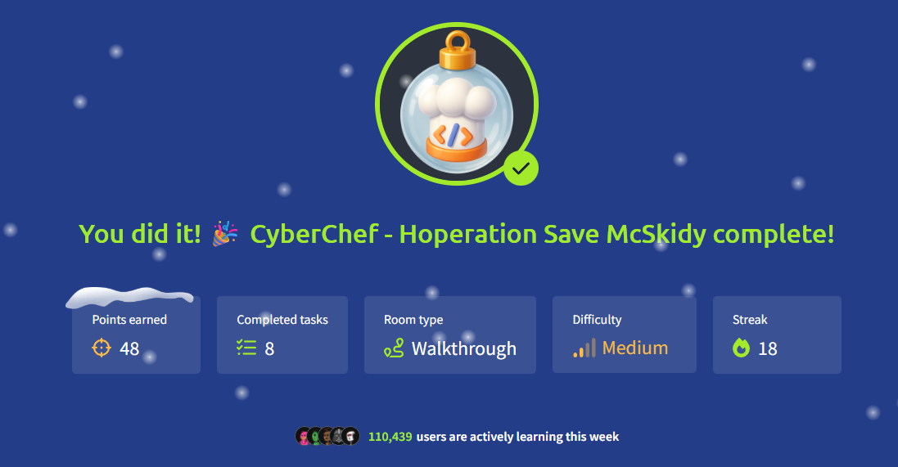

## Conclusion

Through careful observation, analysis, and the clever use of encoding and decoding techniques, we successfully disabled all five locks guarding King Malhare’s Quantum Warren. By leveraging CyberChef, browser developer tools, and an understanding of how data is transformed and exchanged, each security mechanism was methodically broken without brute force.

This challenge demonstrated how seemingly harmless encodings can conceal critical information and how understanding underlying logic, rather than relying solely on tools, makes all the difference. From Base64 and XOR operations to hash lookups and chained decoding recipes, every lock reinforced the importance of thinking like both an attacker and a defender.

In the end, McSkidy’s hidden clues, combined with our persistence and technical insight, led to her safe escape back to Wareville. The operation highlights a key lesson in cybersecurity: strong defenses can still be undermined when communication channels and data transformations are misunderstood or improperly secured.

Thanks for reading!

Keep practicing and happy hacking :)