# Room Name: Obfuscation - The Egg Shell File

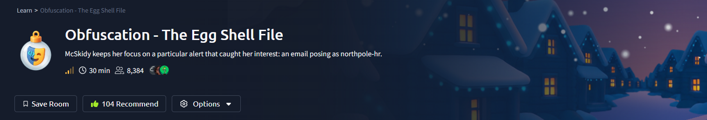

Since the wormhole appeared, something has felt off in WareVille. Everyone at TBFC is on high alert. Systems are malfunctioning, dashboards are surging, and SOC alerts will not stop firing. In the middle of the turmoil, McSkidy focuses on one suspicious alert. It is an email claiming to be from northpole-hr. It is packed with carrot emojis, but one detail stands out. There is no North Pole human resources department. TBFC’s HR operates out of the South Pole.

As she investigates further, McSkidy discovers that the email downloaded a small PowerShell file. Inside the script are strings of seemingly random characters. They look like pure gibberish, with nothing immediately readable.

McSkidy recognizes this as a common tactic used by malicious actors called obfuscation, a technique for hiding code and data. But what exactly is obfuscation? And how can it be unraveled?

Lets boot up our target machine and see what we have.

Lets understand some theoretical concepts first.

## Obfuscation & DeObfuscation

### Understanding the Gibberish

Obfuscation means intentionally making data difficult to read or understand. Attackers use it to avoid simple security checks and to slow down investigations.

For example, imagine a security tool that automatically blocks any file containing the phrase the bandit yeti. To get around this, an attacker could slightly change the text so it no longer matches the blocked phrase. One simple way to do this is by using a cipher called ROT1.

ROT1 works by shifting every letter forward by one place in the alphabet. The letter a becomes b, b becomes c, and so on. Using ROT1, the phrase carrot coins go brr becomes dbsspu dpjot hp css.

Attackers can make this harder to spot by using ROT13 instead, which shifts each letter forward by 13 places.

### Obfuscation in the Real World

So far, the examples have been very simple. In real attacks, obfuscation techniques are often more complex.

One common technique is XOR. Each character is stored as a byte, and each byte is combined with a key using the XOR operation. You do not need to understand the math behind it. What matters is that XOR changes the original bytes into different ones, often producing symbols or characters that do not look readable.

XOR obfuscation is difficult to do by hand, but there are tools that make it easy. One popular tool is CyberChef.

To obfuscate a string using XOR in CyberChef, follow these steps:

- Open CyberChef in your browser.
- At the top right, find the Input box and paste the text carrot supremacy.
- In the Operations list on the left, search for XOR and drag it into the Recipe area in the middle.
- Adjust the settings for the XOR operation. Set the Key to a and make sure the dropdown next to Key is set to HEX.
- The result should appear automatically in the Output section. If it does not, click BAKE at the bottom.

You should see that carrot supremacy is transformed into ikxxe~*y zxogkis

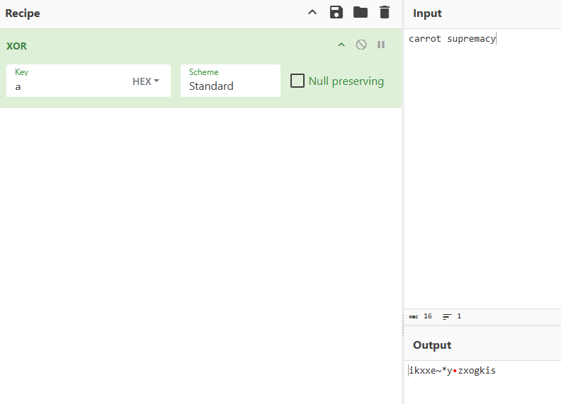

### Detecting Patterns

A benefit of using common obfuscation techniques is that they are often easy to reverse once you recognize them.

Here are some visual clues that can help you identify the technique being used:

- ROT1: Words look almost correct but each letter is one step off. Spaces stay the same.
- ROT13: Three letter words are a good clue. For example, the becomes gur and and becomes naq. Spaces stay the same.
- Base64: Long strings made mostly of letters and numbers, sometimes including + or /. These often end with = or ==.
- XOR: Usually looks like random or unusual characters, but the length stays the same as the original text. If the same short key was reused, you might notice repeating patterns.

Once you suspect a certain technique, you can use CyberChef to reverse it. For example, to undo Base64 encoding, use From Base64 instead of To Base64.

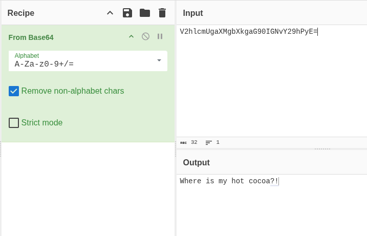

### Unfamiliar Patterns

If you are unsure which cipher was used, you can try different CyberChef operations and see if the text becomes readable.

CyberChef also has an operation called Magic. This feature automatically tests common decoding methods for you. To use it, add the Magic operation and review the results. It will show several possible outputs, and you decide which one makes sense. You can enable Intensive mode to try more options before it stops.


This will not solve every case, especially when custom keys or unusual combinations are used. Think of it as a helpful starting point. One of the challenges below cannot be solved using Magic alone.

### Layered Obfuscation

To make analysis harder, attackers often combine multiple obfuscation techniques in layers.

For example, a script might first be compressed using gzip, then XORed with the key x, and finally encoded with Base64. This process could produce a long string like the one shown below.

To reverse layered obfuscation, you must undo each step in the reverse order. In this example, you would first Base64 decode the data, then apply XOR with the key x, and finally decompress it using gzip. The screenshot below shows how these operations can be chained together in CyberChef to recover the original content.

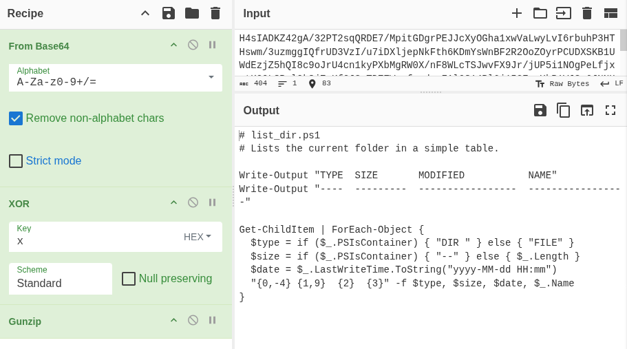

### Unwrapping the Easter Egg

McSkidy noticed something suspicious about the email that was received. She extracted a PowerShell script from the attached PDF and placed it on an isolated virtual machine to safely analyze it. The script contains obfuscation, and she needs help understanding it.

Open SantaStealer.ps1 from the VM’s Desktop using Visual Studio. After it opens, scroll to the section labeled Start here. Follow the instructions in the comments, save the file, and then run the script from a PowerShell terminal.

To open PowerShell, click Start or press the Windows key, type PowerShell, and press Enter. Then run the following commands:

```powershell
PS C:\Users\Administrator> cd .\Desktop\
PS C:\Users\Administrator\Desktop> .\SantaStealer.ps1
````

A second challenge will appear after that. This time, you must obfuscate the attackers API key using XOR.

Follow the Part 2 instructions in the script comments, then run the script again to obtain the final flag.

Lets see the 1st part of the challenge.

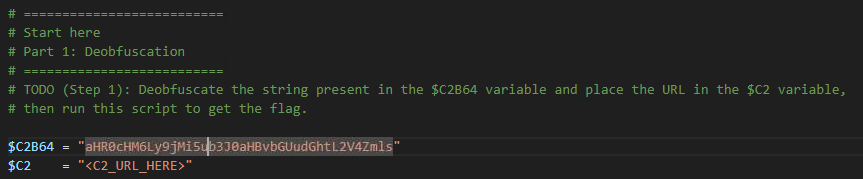

so lets deobfuscate the base64 encoded string.

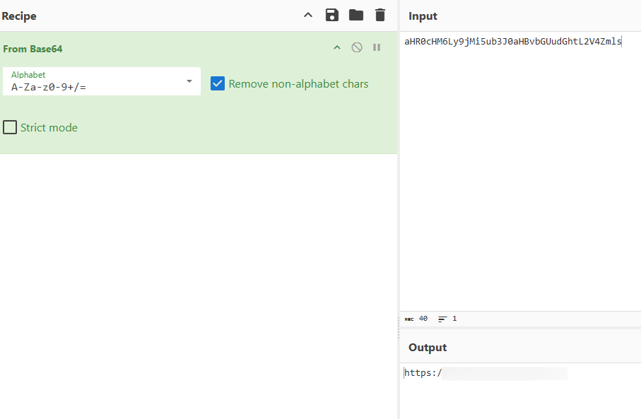

put the url found in the C2 variable value and run the powershell script.

either run the powershell script from powershell terminal or from visual studio.

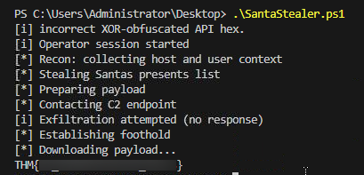

and we have found the 1st flag.

For the Part 2

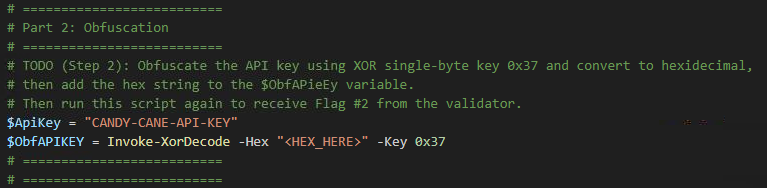

we need to first XOR with 0x37 and then convert the output to hex.

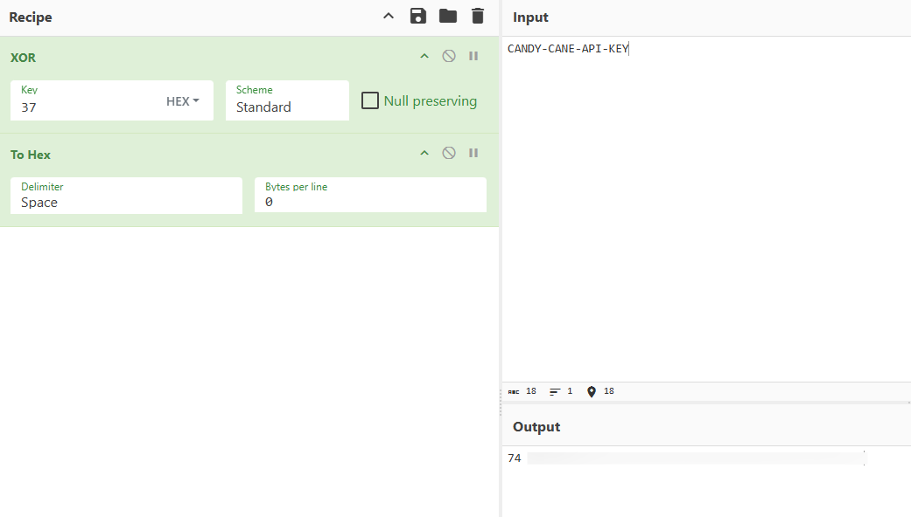

replace the hex code found with the <HEX_HERE> and run the powershell script.

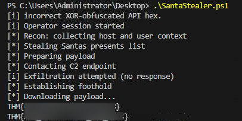

and we have found the 2nd flag.

## Conclusion:

In this room, we explored how obfuscation is used by attackers to conceal malicious intent and how analysts can methodically break it down. Starting from a suspicious phishing email, we followed the trail to an obfuscated PowerShell script and uncovered how simple and layered techniques such as Base64 encoding and XOR can be used to hide critical data.

By understanding common obfuscation patterns and using tools like CyberChef, we were able to deobfuscate hidden strings, identify command-and-control information, and successfully retrieve both flags. This exercise highlights an important lesson in threat analysis. Obfuscated code may look intimidating at first, but with the right approach, tools, and patience, it can be unraveled.

Ultimately, this room reinforces the importance of recognizing obfuscation techniques, knowing how to reverse them, and applying those skills in real-world investigations where attackers rely on confusion and complexity to stay hidden.

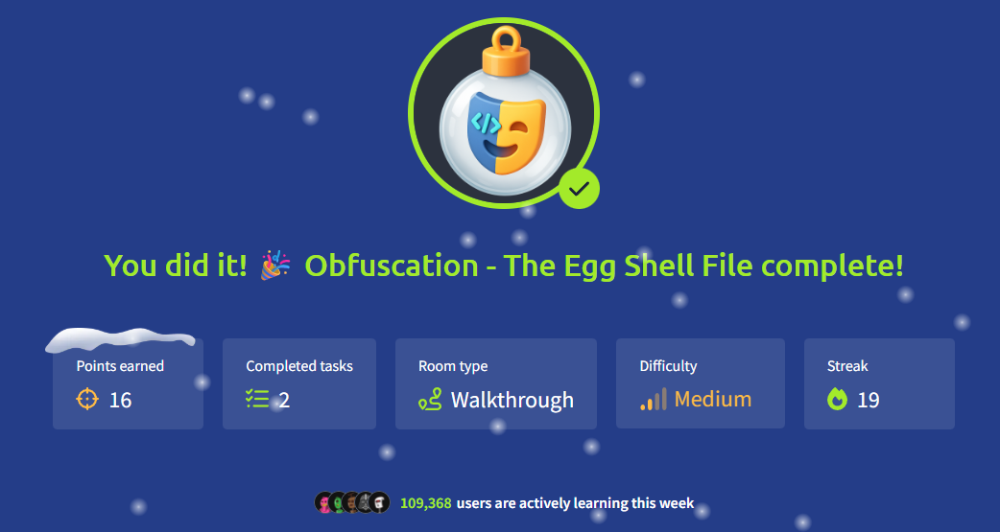

Thanks for reading my writeup.

Keep Learning :)


