# Room Name: ICS/Modbus - Claus for Concern


The snow falls heavily over Wareville as chaos erupts at TBFC headquarters. What should be the busiest shipping day of the season has turned into a disaster.

“Another chocolate egg?!” shouts a frustrated warehouse worker, holding up yet another Easter-themed package. “We’re supposed to be shipping Christmas presents!”

Delivery drones buzz overhead, their mechanical hums sounding almost mocking. Each one returns from its route empty, having successfully delivered its cargo—but the cargo is all wrong.

You’re called into the command centre, where screens flicker with delivery statistics. Everything looks normal on the surface: 1,000 presents in stock, 98% success rate, and all systems are operational. But the phones won’t stop ringing with confused citizens asking why they’re receiving chocolate eggs instead of the toys and gifts they ordered.

The logistics manager pulls up a delivery manifest. “Look at this,” she says, pointing at the screen. “The system indicates that we delivered a teddy bear to the Miller family, but they received a chocolate bunny instead. Same weight, exact dimensions, but a completely different item.”

Then, on one of the monitoring screens, a message flashes for just a second before disappearing:

> 🐰 EGGSPLOIT v6.66 - Property of HopSec Island 🐰  
> “Why should Christmas have all the fun?” — King Malhare

Someone has compromised the drone fleet’s control systems. The attack is sophisticated, falsifying sensor data, manipulating inventory selection, and erasing all traces. This isn’t just a prank—it’s a calculated assault on Christmas itself.

Your job: investigate the TBFC Drone Delivery System, uncover how King Malhare’s Eggsploit team has compromised it, and restore Christmas deliveries before SOC-mas is ruined.

---

## Mysterious Discovery

As you walk through the warehouse control room, something catches your eye—a crumpled piece of paper on the floor near the PLC terminal. It looks like it was dropped in a hurry.

You pick it up and unfold it. The handwriting is hurried, almost frantic:

```
TBFC DRONE CONTROL - REGISTER MAP
(For maintenance use only)

HOLDING REGISTERS:
HR0: Package Type Selection
     0 = Christmas Gifts
     1 = Chocolate Eggs
     2 = Easter Baskets

HR1: Delivery Zone (1-9 normal, 10 = ocean dump!)

HR4: System Signature/Version
     Default: 100
     Current: ??? (check this!)

COILS (Boolean Flags):
C10: Inventory Verification
     True = System checks actual stock
     False = Blind operation

C11: Protection/Override
     True = Changes locked/monitored
     False = Normal operation

C12: Emergency Dump Protocol
     True = DUMP ALL INVENTORY
     False = Normal

C13: Audit Logging
     True = All changes logged
     False = No logging

C14: Christmas Restored Flag
     (Auto-set when system correct)

C15: Self-Destruct Status
     (Auto-armed on breach)

CRITICAL: Never change HR0 while C11=True!
Will trigger countdown!

- Maintenance Tech, Dec 19
```

You stare at the note, confusion washing over you. “Register map? Coils? What is all this?”

The terminology is foreign—HR0, C11, “Modbus” scribbled in the margin. But something about it feels important, like a key you don’t yet know how to use.

You pocket the note carefully. “I’ll figure out what this means later,” you think. For now, you need to understand the systems you’re dealing with.

Little do you know, this crumpled note will be exactly what saves Christmas…

---

Let’s boot up the attacker and target machines.

## What is SCADA?

### SCADA (Supervisory Control and Data Acquisition)

SCADA systems are the “command centres” of industrial operations. They act as the bridge between human operators and the machines doing the work. Think of SCADA as the nervous system of a factory—it senses what’s happening, processes that information, and sends commands to make things happen.

TBFC uses a SCADA system to oversee its entire drone delivery operation. Without it, operators would have no way to monitor hundreds of drones, manage inventory, or ensure packages reach the right destinations. It’s the invisible orchestrator of Christmas logistics.

### Components of a SCADA System

A SCADA system typically consists of four key components:

| Component | Description | Example in TBFC Warehouse |
|-----------|-------------|----------------------------|
| **Sensors & Actuators** | The eyes and hands of the system. Sensors measure conditions (temperature, pressure, position), actuators perform actions (motors, valves). | Sensors detect packages on conveyors; actuators control robotic arms loading drones. |
| **PLCs (Programmable Logic Controllers)** | The brains executing automation logic. They read sensor data, make decisions, and send commands. | PLC decides: *If package weight matches egg AND destination is Zone 5, load onto Drone 7*. |
| **Monitoring Systems** | Visual interfaces like CCTV cameras, dashboards, alarm panels. | Security cameras on port 80 show real-time footage of the packaging floor. |
| **Historians** | Databases storing operational data for analysis. | Records every package loaded, every drone launched, every system change. |

### SCADA in the Drone Delivery System

TBFC’s compromised SCADA system manages several critical functions:

| Function | How It’s Used | Attack Impact |
|----------|--------------|---------------|
| **Package Type Selection** | Decides whether to load gifts, eggs, or baskets. | Controlled by a simple numeric value (HR0) that determines which conveyor activates. |
| **Delivery Zone Routing** | Each package must reach the correct neighborhood. Zones 1–9 = districts, Zone 10 = ocean disposal (failsafe). | Sabotage target: dumping inventory into the ocean. |
| **Visual Monitoring** | CCTV camera feed provides real-time observation. | Lets operators verify system behavior; critical for incident response. |
| **Inventory Verification** | Before loading, checks if the requested item exists in stock. | When disabled, system blindly follows malicious commands. |
| **System Protection Mechanisms** | Security features to prevent unauthorized changes. | Weaponized by King Malhare as part of his trap. |
| **Audit Logging** | Records all configuration changes, logins, modifications. | Attackers turn logging off to cover their tracks. |

### Why SCADA Systems Are Targeted

Industrial control systems like SCADA have become increasingly attractive targets for cybercriminals and nation-state actors. Here’s why:

- **Legacy software with known vulnerabilities** – Many SCADA systems were installed decades ago and never updated.
- **Default credentials unchanged** – Administrators often prioritize uptime over changing passwords.
- **Designed for reliability, not security** – Most were built before cybersecurity was a concern; authentication, encryption, and access controls were afterthoughts.
- **Control physical processes** – Compromising SCADA has real-world consequences (blackouts, contamination, sabotage).
- **Connected to corporate networks** – The “air-gapped” myth is largely fiction; connectivity provides entry points.
- **Protocols lack authentication** – Protocols like Modbus (port 502) allow anyone to read/write values without proving identity.

> In early 2024, the first ICS/OT malware, **FrostyGoop**, was discovered. It can directly interface with industrial control systems via the Modbus TCP protocol, enabling arbitrary reads and writes to device registers over TCP port 502.  
> King Malhare has weaponized these same tactics, not to cause blackouts, but to sabotage Christmas deliveries by directly manipulating the control system through Modbus.

In the next task, we’ll explore the PLC—the component he’s actually compromised.

---

## PLC & Modbus Protocol

### What is a PLC?

A **PLC (Programmable Logic Controller)** is an industrial computer designed to control machinery and processes in real-world environments. Unlike your laptop or smartphone, PLCs are purpose-built machines engineered for extreme reliability and harsh conditions.

PLCs are designed to:
- **Survive harsh environments** – Operate in extreme temperatures, vibration, dust, moisture, and electromagnetic interference.
- **Run continuously without failure** – Operate 24/7 for years, sometimes decades, without rebooting.
- **Execute control logic in real-time** – Respond to sensor inputs within milliseconds.
- **Interface directly with physical hardware** – Connect directly to sensors (measuring temperature, pressure, position) and actuators (motors, valves, switches).

### What is Modbus?

**Modbus** is the communication protocol that industrial devices use to talk to each other. Created in 1979, it’s one of the oldest and most widely deployed industrial protocols. Its longevity isn’t due to sophisticated features—quite the opposite. Modbus succeeded because it’s simple, reliable, and works with almost any device.

Think of Modbus as a basic request-response conversation:

```
Client:  "PLC, what’s the current value of register 0?"
Server:  "Register 0 currently holds the value 1."
```

This simplicity makes Modbus easy to implement and debug, but it also means security was never a consideration. **There’s no authentication, no encryption, no authorization checking.** Anyone who can reach the Modbus port can read or write any value.

### Modbus Data Types

Modbus organizes data into four distinct types, each serving a specific purpose:

| Type | Purpose | Values | Example Use Cases |
|------|---------|--------|-------------------|
| **Coils** | Digital outputs (on/off) | 0 or 1 | Motor running? Valve open? Alarm active? |
| **Discrete Inputs** | Digital inputs (on/off) | 0 or 1 | Button pressed? Door closed? Sensor triggered? |
| **Holding Registers** | Analog outputs (numbers) | 0–65535 | Temperature setpoint, motor speed, zone selection |
| **Input Registers** | Analog inputs (numbers) | 0–65535 | Current temperature, pressure reading, flow rate |

The distinction between inputs and outputs is important. **Coils** and **Holding Registers** are writable—you can change their values to control the system. **Discrete Inputs** and **Input Registers** are read-only—they reflect sensor measurements that you observe but cannot directly modify.

In TBFC’s drone control system, you’ll find:

| Address | Name | Purpose |
|---------|------|---------|
| **HR0** | Package Type Selection | 0=Gifts, 1=Eggs, 2=Baskets |
| **HR1** | Delivery Zone | 1–9 normal, 10 ocean dump |
| **HR4** | System Signature | Version identifier (attacker’s calling card) |
| **C10** | Inventory Verification | True = checks stock, False = blind operation |
| **C11** | Protection/Override | True = changes locked/monitored |
| **C12** | Emergency Dump Protocol | True = dump all inventory |
| **C13** | Audit Logging | True = log changes, False = no logging |
| **C14** | Christmas Restored Flag | Auto-set when system is correct |
| **C15** | Self-Destruct Status | Auto-armed on breach |

Remember that crumpled note you found earlier? Now it makes complete sense. The maintenance technician was documenting these exact Modbus addresses and their meanings.

### Modbus Addressing

Each data point in Modbus has a unique address—think of it like a house number on a street. When you want to read or write a specific value, you reference it by its address number.

**Critical detail:** Modbus addresses start at 0, not 1. This zero-indexing catches many beginners off guard. When documentation mentions “Register 0,” it literally means the first register, not the second.

Examples from the TBFC system:
- **Holding Register 0 (HR0)** = Package type selector
- **Holding Register 1 (HR1)** = Delivery zone
- **Holding Register 4 (HR4)** = System signature
- **Coil 10 (C10)** = Inventory verification flag
- **Coil 11 (C11)** = Protection mechanism flag
- **Coil 15 (C15)** = Self-destruct status

### Modbus TCP vs Serial Modbus

Originally, Modbus operated over serial connections using RS‑232 or RS‑485 cables. Physical isolation provided a degree of security—you needed physical access to intercept or inject commands.

Modern industrial systems use **Modbus TCP**, which encapsulates the protocol inside standard TCP/IP network packets. Modbus TCP servers listen on **port 502** by default.

This network connectivity brings enormous benefits—remote monitoring, easier integration, centralized management—but it also exposes historically isolated systems to network-based attacks.

King Malhare exploited exactly this vulnerability. The TBFC drone control system’s Modbus TCP port (502) was accessible over the network without any authentication required. He didn’t need to break into the facility—he simply connected to port 502 and started issuing commands as if he were authorized.

### The Security Problem

Modbus has **no built-in security mechanisms**:

- **No authentication** – Protocol doesn’t verify who’s making requests.
- **No encryption** – All communication happens in plaintext.
- **No authorization** – No concept of permissions; if you can connect, you can read/write anything.
- **No integrity checking** – Beyond basic checksums, no cryptographic verification that commands haven’t been tampered with.

Modern security solutions exist (VPNs, firewalls, Modbus security gateways) but they’re add‑ons, not part of the protocol itself. Many industrial facilities haven’t implemented these protections.

### Connecting the Dots

Now you understand why the OpenPLC web interface showed nothing useful. King Malhare bypassed it entirely. He connected directly to the Modbus TCP port and manipulated the registers and coils that control system behavior.

That note you found? The maintenance technician must have discovered what was happening and started documenting the compromised values. The warning at the bottom—“Never change HR0 while C11=True!”—suggests they figured out the trap mechanism before getting interrupted.

In the next task, we’ll use Python and the pymodbus library to investigate the system exactly the way King Malhare attacked it—by directly reading and writing Modbus values.

---

## Practical

### Initial Reconnaissance

Let’s start with a simple nmap scan to see if ports 22, 80, and 502 are open on our target machine.

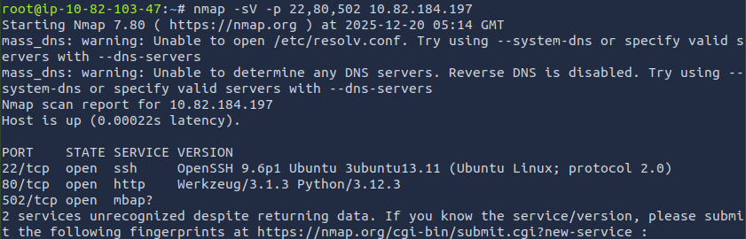

-sV - it is used to get the version of the service running on the target machine.

**Key findings:**
- **Port 80** – HTTP service (the CCTV camera feed)
- **Port 502** – (mbap) Modbus TCP (the PLC communication protocol)

This is typical of an industrial control system setup—a web interface for monitoring and Modbus for programmatic control.

### Visual Confirmation: The CCTV Feed

Navigate to `http://10.82.184.197` in your browser.

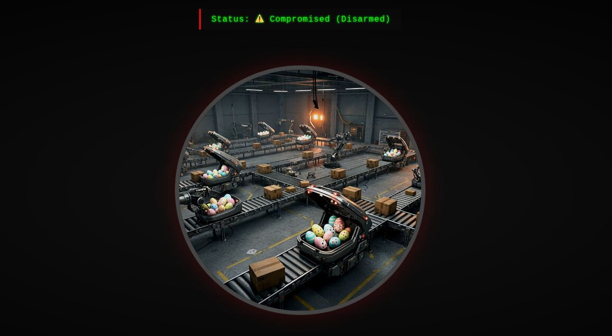

We see:
- Pastel‑colored chocolate eggs being sorted
- Easter‑themed packaging on the assembly line
- Delivery drones loading eggs instead of gifts
- Status display showing: **Compromised**

The system isn’t broken—it’s working perfectly, just delivering the wrong items. This is a classic sign of a logic manipulation attack rather than a system failure.

Keep this tab open; it will update as we make changes to the system, providing real‑time feedback.

### Modbus Reconnaissance

We’ll need to interrogate the Modbus server directly. This is where Python and the pymodbus library become essential.

> **Note:** If you are on AttackBox, the first five steps are already done for you.

**Step 1: Install PyModbus**
```bash
pip3 install pymodbus==3.6.8
```
*This installs the Python library that will let us communicate with the Modbus server using the Modbus TCP protocol.*

**Step 2: Establish Connection**
```python
>>> from pymodbus.client import ModbusTcpClient
>>> 
>>> # Connect to the PLC on port 502
>>> client = ModbusTcpClient('10.82.184.197', port=502)
>>> 
>>> # Establish connection
>>> if client.connect():
...     print("Connected to PLC successfully")
... else:
...     print("Connection failed")
... 
Connected to PLC successfully
>>>
```
*This code creates a connection to the PLC's Modbus interface on port 502. Notice how no authentication was required—this demonstrates a critical security weakness in the Modbus protocol.*

**Step 3: Reading Holding Registers**

Holding registers store numeric configuration values. According to the note, HR0 controls package type selection.

**Check HR0 (Package Type):**
```python
>>> # Read holding register 0 (Package Type)
>>> result = client.read_holding_registers(address=0, count=1, slave=1)
>>> 
>>> if not result.isError():
...     package_type = result.registers[0]
...     print(f"HR0 (Package Type): {package_type}")
...     if package_type == 0:
...         print("  Christmas Presents")
...     elif package_type == 1:
...         print("  Chocolate Eggs")
...     elif package_type == 2:
...         print("  Easter Baskets")
... 
HR0 (Package Type): 1
  Chocolate Eggs
>>>
```
*This reads the first holding register (HR0) which controls what type of packages get loaded. The value "1" confirms the system is configured to load chocolate eggs instead of Christmas presents.*

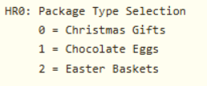

**Check HR1 (Delivery Zone):**
```python
>>> # Read holding register 1 (Delivery Zone)
>>> result = client.read_holding_registers(address=1, count=1, slave=1)
>>> 
>>> if not result.isError():
...     zone = result.registers[0]
...     print(f"HR1 (Delivery Zone): {zone}")
...     if zone == 10:
...         print("  WARNING: Ocean dump zone")
...     else:
...         print(f"  Normal delivery zone")
... 
HR1 (Delivery Zone): 5
  Normal delivery zone
>>>
```
*This reads HR1 to check if packages are being sent to normal zones or the emergency ocean dump zone (10). Zone 5 is normal, so at least this isn't activated yet.*

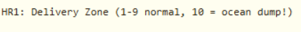

**Check HR4 (System Signature):**
```python
>>> # Read holding register 4 (System Signature)
>>> result = client.read_holding_registers(address=4, count=1, slave=1)
>>> 
>>> if not result.isError():
...     signature = result.registers[0]
...     print(f"HR4 (System Signature): {signature}")
...     if signature == 666:
...         print("  EGGSPLOIT DETECTED - King Malhare's signature")
... 
HR4 (System Signature): 666
  EGGSPLOIT DETECTED - King Malhare's signature
>>>
```
*This reads HR4, which contains a system signature. The value 666 is King Malhare's calling card—confirmation that the Eggsploit framework has compromised this system.*

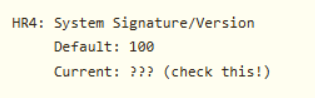

**Step 4: Reading Coils**

Coils are boolean flags that control system behavior. The note mentioned several critical coils.

**Check C10 (Inventory Verification):**
```python
>>> # Read coil 10 (Inventory Verification)
>>> result = client.read_coils(address=10, count=1, slave=1)
>>> 
>>> if not result.isError():
...     verification = result.bits[0]
...     print(f"C10 (Inventory Verification): {verification}")
...     if not verification:
...         print("  DISABLED - System not checking stock")
... 
C10 (Inventory Verification): False
  DISABLED - System not checking stock
>>>
```
*This reads coil 10, which should be True to enable inventory checks. False means the system blindly follows commands without verifying if items actually exist—a classic attack technique.*

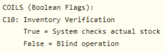

**Check C11 (Protection/Override):**
```python
>>> # Read coil 11 (Protection/Override)
>>> result = client.read_coils(address=11, count=1, slave=1)
>>> 
>>> if not result.isError():
...     protection = result.bits[0]
...     print(f"C11 (Protection/Override): {protection}")
...     if protection:
...         print("  ACTIVE - Changes are being monitored")
... 
C11 (Protection/Override): True
  ACTIVE - Changes are being monitored
>>>
```
*This reads coil 11, which enables protection mechanisms. When True, the system monitors for changes. Remember the warning: changing HR0 while this is True triggers the countdown trap!*

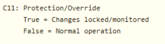

**Check C15 (Self-Destruct Status):**
```python
>>> # Read coil 15 (Self-Destruct Status)
>>> result = client.read_coils(address=15, count=1, slave=1)
>>> 
>>> if not result.isError():
...     armed = result.bits[0]
...     print(f"C15 (Self-Destruct Armed): {armed}")
...     if not armed:
...         print("  Not armed yet - safe for now")
... 
C15 (Self-Destruct Armed): False
  Not armed yet - safe for now
>>>
```
*This reads coil 15 to check if the self-destruct mechanism is armed. False means it's safe for now, but will arm if we trigger the trap.*

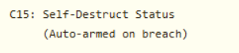

**Step 5: Understanding the Trap**
- HR0 is set to 1 (forcing eggs)
- C11 protection is enabled (monitoring for changes)
- If anyone changes HR0 while C11 is True, C15 gets armed
- Once C15 is armed, a 30‑second countdown begins
- After 30 seconds, C12 (Emergency Dump) activates, and everything dumps to Zone 10 (ocean)

### Complete Reconnaissance Script

Let’s create a comprehensive script to see the full system state. Exit the Python interpreter (press `Ctrl+D` or type `exit()`), then create a new file:

```bash
nano reconnaissance.py
```

Paste the following code:

```python
#!/usr/bin/env python3

from pymodbus.client import ModbusTcpClient

PLC_IP = "10.82.184.197"
PORT = 502
UNIT_ID = 1

# Connect to PLC
client = ModbusTcpClient(PLC_IP, port=PORT)

if not client.connect():
    print("Failed to connect to PLC")
    exit(1)

print("=" * 60)
print("TBFC Drone System - Reconnaissance Report")
print("=" * 60)
print()

# Read holding registers
print("HOLDING REGISTERS:")
print("-" * 60)

registers = client.read_holding_registers(address=0, count=5, slave=UNIT_ID)
if not registers.isError():
    hr0, hr1, hr2, hr3, hr4 = registers.registers
    
    print(f"HR0 (Package Type): {hr0}")
    print(f"  0=Christmas, 1=Eggs, 2=Baskets")
    print()
    
    print(f"HR1 (Delivery Zone): {hr1}")
    print(f"  1-9=Normal zones, 10=Ocean dump")
    print()
    
    print(f"HR4 (System Signature): {hr4}")
    if hr4 == 666:
        print(f"  WARNING: Eggsploit signature detected")
    print()

# Read coils
print("COILS (Boolean Flags):")
print("-" * 60)

coils = client.read_coils(address=10, count=6, slave=UNIT_ID)
if not coils.isError():
    c10, c11, c12, c13, c14, c15 = coils.bits[:6]
    
    print(f"C10 (Inventory Verification): {c10}")
    print(f"  Should be True")
    print()
    
    print(f"C11 (Protection/Override): {c11}")
    if c11:
        print(f"  ACTIVE - System monitoring for changes")
    print()
    
    print(f"C12 (Emergency Dump): {c12}")
    if c12:
        print(f"  CRITICAL: Dump protocol active")
    print()
    
    print(f"C13 (Audit Logging): {c13}")
    print(f"  Should be True")
    print()
    
    print(f"C14 (Christmas Restored): {c14}")
    print(f"  Auto-set when system is fixed")
    print()
    
    print(f"C15 (Self-Destruct Armed): {c15}")
    if c15:
        print(f"  DANGER: Countdown active")
    print()

print("=" * 60)
print("THREAT ASSESSMENT:")
print("=" * 60)

if hr4 == 666:
    print("Eggsploit framework detected")
if c11:
    print("Protection mechanism active - trap is set")
if hr0 == 1:
    print("Package type forced to eggs")
if not c10:
    print("Inventory verification disabled")
if not c13:
    print("Audit logging disabled")

print()
print("REMEDIATION REQUIRED")
print("=" * 60)

client.close()
```
*This comprehensive script reads multiple registers and coils at once, giving us a complete picture of the system state. It checks all the critical values mentioned in the maintenance note and provides a threat assessment.*

Save and run the script:

```bash
python3 reconnaissance.py
```

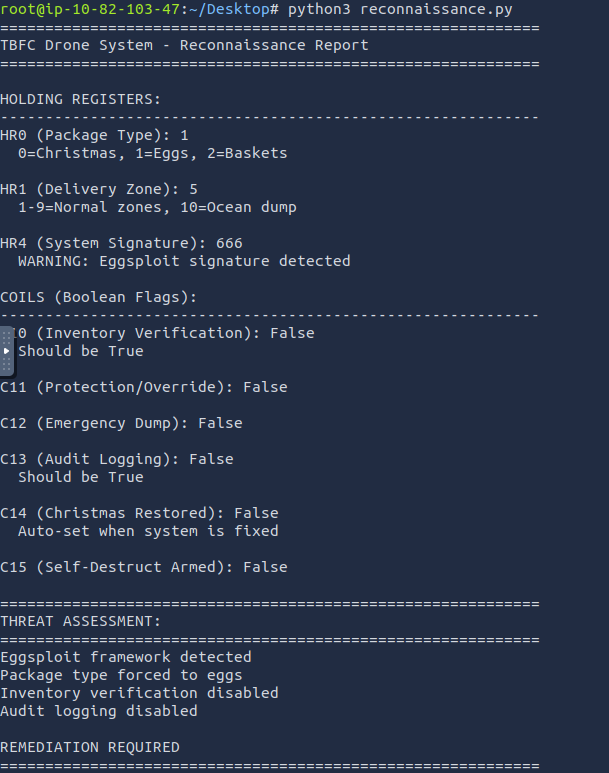

### Safe Remediation

Based on our reconnaissance, we need to:
1. **Disable protection mechanism (C11) FIRST**
2. Change package type to Christmas gifts (HR0 = 0)
3. Enable inventory verification (C10 = True)
4. Enable audit logging (C13 = True)
5. Verify C15 never got armed

**The order is critical.** If we change HR0 before disabling C11, the trap triggers.

Create the remediation script:

```bash
nano restore_christmas.py
```

Paste the following:

```python
#!/usr/bin/env python3
from pymodbus.client import ModbusTcpClient
import time

PLC_IP = "10.82.184.197"
PORT = 502
UNIT_ID = 1

def read_coil(client, address):
    result = client.read_coils(address=address, count=1, slave=UNIT_ID)
    if not result.isError():
        return result.bits[0]
    return None

def read_register(client, address):
    result = client.read_holding_registers(address=address, count=1, slave=UNIT_ID)
    if not result.isError():
        return result.registers[0]
    return None

# Connect to PLC
client = ModbusTcpClient(PLC_IP, port=PORT)

if not client.connect():
    print("Failed to connect to PLC")
    exit(1)

print("=" * 60)
print("TBFC Drone System - Christmas Restoration")
print("=" * 60)
print()

# Step 1: Check current state
print("Step 1: Verifying current system state...")
time.sleep(1)

package_type = read_register(client, 0)
protection = read_coil(client, 11)
armed = read_coil(client, 15)

print(f"  Package Type: {package_type} (1 = Eggs)")
print(f"  Protection Active: {protection}")
print(f"  Self-Destruct Armed: {armed}")
print()

# Step 2: Disable protection
print("Step 2: Disabling protection mechanism...")
time.sleep(1)

result = client.write_coil(11, False, slave=UNIT_ID)
if not result.isError():
    print("  Protection DISABLED")
    print("  Safe to proceed with changes")
else:
    print("  FAILED to disable protection")
    client.close()
    exit(1)

print()
time.sleep(1)

# Step 3: Change package type to Christmas
print("Step 3: Setting package type to Christmas presents...")
time.sleep(1)

result = client.write_register(0, 0, slave=UNIT_ID)
if not result.isError():
    print("  Package type changed to: Christmas Presents")
else:
    print("  FAILED to change package type")

print()
time.sleep(1)

# Step 4: Enable inventory verification
print("Step 4: Enabling inventory verification...")
time.sleep(1)

result = client.write_coil(10, True, slave=UNIT_ID)
if not result.isError():
    print("  Inventory verification ENABLED")
else:
    print("  FAILED to enable verification")

print()
time.sleep(1)

# Step 5: Enable audit logging
print("Step 5: Enabling audit logging...")
time.sleep(1)

result = client.write_coil(13, True, slave=UNIT_ID)
if not result.isError():
    print("  Audit logging ENABLED")
    print("  Future changes will be logged")
else:
    print("  FAILED to enable logging")

print()
time.sleep(2)

# Step 6: Verify restoration
print("Step 6: Verifying system restoration...")
time.sleep(1)

christmas_restored = read_coil(client, 14)
new_package_type = read_register(client, 0)
emergency_dump = read_coil(client, 12)
self_destruct = read_coil(client, 15)

print(f"  Package Type: {new_package_type} (0 = Christmas)")
print(f"  Christmas Restored: {christmas_restored}")
print(f"  Emergency Dump: {emergency_dump}")
print(f"  Self-Destruct Armed: {self_destruct}")
print()

if christmas_restored and new_package_type == 0 and not emergency_dump and not self_destruct:
    print("=" * 60)
    print("SUCCESS - CHRISTMAS IS SAVED")
    print("=" * 60)
    print()
    print("Christmas deliveries have been restored")
    print("The drones will now deliver presents, not eggs")
    print("Check the CCTV feed to see the results")
    print()
    
    # Read the flag from registers
    flag_result = client.read_holding_registers(address=20, count=12, slave=UNIT_ID)
    if not flag_result.isError():
        flag_bytes = []
        for reg in flag_result.registers:
            flag_bytes.append(reg >> 8)
            flag_bytes.append(reg & 0xFF)
        flag = ''.join(chr(b) for b in flag_bytes if b != 0)
        print(f"Flag: {flag}")
    
    print()
    print("=" * 60)
else:
    print("Restoration incomplete - check system state")

client.close()
print()
print("Disconnected from PLC")
```
*This is the main remediation script that fixes the system in the correct order. It follows these critical steps:*
1. *Checks current state to understand what we're dealing with*
2. *Disables the protection mechanism (C11) FIRST - this is crucial to avoid the trap*
3. *Changes package type back to Christmas (HR0 = 0)*
4. *Re-enables security features (inventory verification and audit logging)*
5. *Verifies the restoration was successful*
6. *Extracts and displays the flag from the system*

Save and run the script:

```bash
python3 restore_christmas.py
```

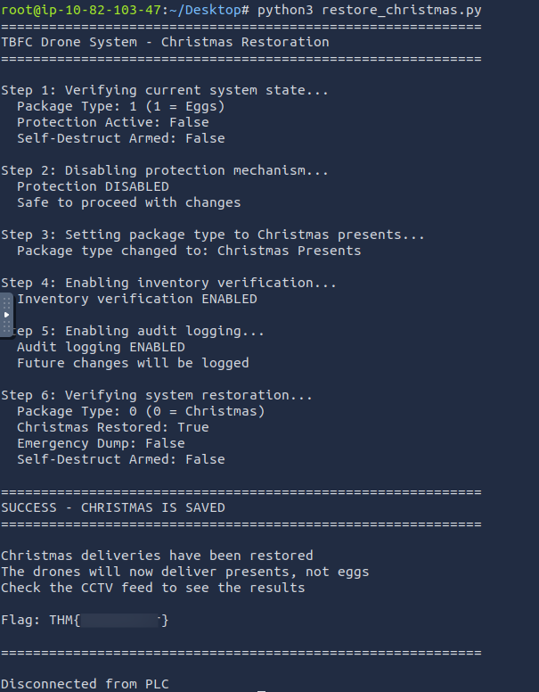

Check back the CCTV feed to see the results:

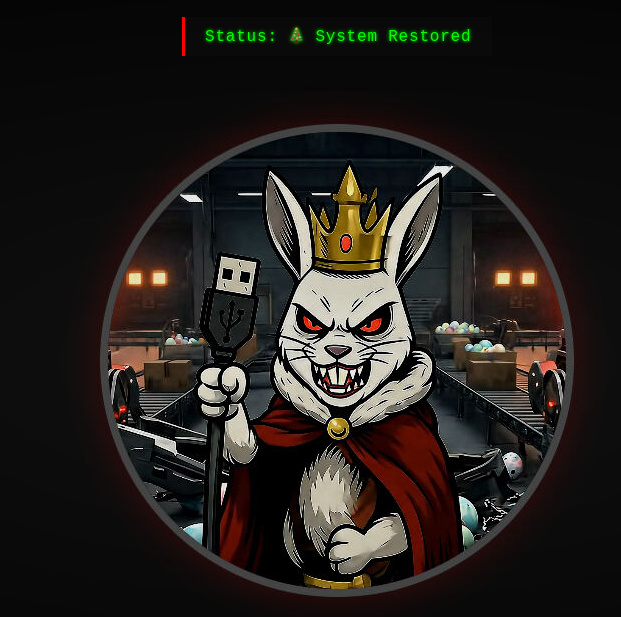

We see **System restored** and King Malhare’s defeat.

### What If You Triggered the Trap?

If you had tried to change HR0 before disabling C11, here’s what would have happened:
1. C15 (Self‑Destruct) would arm immediately
2. A 30‑second countdown would begin
3. After 30 seconds, C12 (Emergency Dump) would activate
4. HR1 would change to 10 (ocean zone)
5. All remaining inventory would be dumped
6. The CCTV would show the trap activation screen
7. You would need to restart the challenge

This demonstrates why understanding industrial control systems before making changes is critical. In real‑world scenarios, triggering safety mechanisms or traps could have severe physical consequences.

### Post‑Incident Analysis

King Malhare’s attack was sophisticated because it:
- Used unauthenticated Modbus access (port 502)
- Manipulated configuration values directly at the protocol level
- Disabled safety mechanisms (verification, logging)
- Implemented a trap to prevent easy remediation
- Left a signature (666) as a calling card

The maintenance technician who left the note likely discovered the compromise but was interrupted before they could fix it. Their documentation saved Christmas by warning about the trap mechanism.

**Key Takeaways:**
- **Modbus has no security** – Anyone with network access can control industrial systems
- **Order of operations matters** – In ICS security, changing things in the wrong order can trigger safety mechanisms
- **Documentation is critical** – The maintenance note provided the map needed to fix the system
- **Visual feedback helps** – The CCTV feed gave real-time confirmation of changes
- **Trap mechanisms exist** – Attackers can weaponize safety features against defenders


# Conclusion

As we complete this investigation, let us reflect on what we have learned together about Industrial Control Systems and Modbus security.

This room introduced us to a world where cybersecurity meets physical operations. We discovered that industrial systems like SCADA and PLCs control real world processes, from factory assembly lines to fictional drone delivery networks. These systems prioritize reliability over security, often running on decades old protocols.

The Modbus protocol, with its complete lack of authentication and encryption, served as our primary lesson. Anyone who can reach port 502 can issue commands as if they are authorized operators. This simplicity makes Modbus widely adopted but dangerously insecure.

Our experience demonstrated that remediating industrial system compromises requires careful planning. We could not simply revert the package selection to Christmas gifts. We first had to disable the protection mechanism, then make our changes in the correct sequence. This order of operations matters because industrial systems often have safety interlocks and protective measures that can be triggered unintentionally.

The visual feedback from the CCTV camera provided immediate confirmation that our actions were working. This highlights an important aspect of industrial security, physical processes give visible results that digital systems do not.

The maintenance technician's note proved invaluable. Good documentation often makes the difference between successful incident response and extended downtime. In industrial environments, where systems may run for decades, documentation becomes even more critical.

For those new to ICS security, remember that this field bridges the digital and physical worlds. The same techniques that manipulated drone deliveries could, in reality, affect power grids, water treatment plants, or manufacturing facilities. Understanding these systems helps us protect the infrastructure that society depends on.

We have taken our first steps into a critical area of cybersecurity. The principles we explored here, the careful approach to system changes, and the recognition of physical consequences apply far beyond this fictional scenario. As we continue our learning journey, let us carry forward this awareness that not all cybersecurity is about data protection, some of it is about protecting the physical processes that sustain our daily lives.


Thanks for reading this walkthrough. I hope you found it helpful.

Keep Learning!

