# Room Name: Race Conditions - Toy to The World

The Best Festival Company (TBFC) has launched its limited edition SleighToy, with only ten pieces available at midnight. Within seconds, thousands rushed to buy one, but something strange happened. More than ten lucky customers received confirmation emails stating that their orders were successful. Confusion spread fast. How could everyone have bought the "last" toy? McSkidy was called in to investigate.

She quickly noticed that multiple buyers completed their purchases at the exact same moment, slipping through the system’s timing flaw. Sir Carrotbane’s mischievous Bandit Bunnies had found a way to exploit this chaos by flooding the checkout with rapid clicks. By morning, TBFC faced angry shoppers, missing stock, and a mystery that revealed just how dangerous a few milliseconds could be during the holiday rush.

Lets boot up the attacker and target machines.

While they are booting up, lets learn about race conditions.

## Race Conditions

A race condition happens when two or more actions occur at the same time, and the system’s outcome depends on the order in which they finish. In web applications, this often happens when multiple users or automated requests simultaneously access or modify shared resources such as inventory or account balances. If proper synchronisation is not in place, this can lead to unexpected results such as duplicate transactions, oversold items, or unauthorised data changes.

### Types of Race Conditions

**Time of Check to Time of Use (TOCTOU):**  
A TOCTOU race condition happens when a program checks something first and uses it later, but the data changes in between. This means what was true at the time of the check might no longer be true when the action happens. It is like checking if a toy is in stock, and by the time you click "Buy", someone else has already purchased it. For example, two users buy the same last item at the same time because the stock was checked before it was updated.

In short, the decision is made using outdated information.

**Shared resource:**  
This occurs when multiple users or systems try to change the same data simultaneously without proper control. Since both updates happen at nearly the same time, the final result depends on which one finishes last, creating confusion. Think of two cashiers updating the same inventory spreadsheet at once, where one overwrites the other’s work.

In short, multiple actions compete for the same data at the same time.

**Atomicity violation:**  
An atomic operation should happen all at once, either fully completed or not executed at all. When parts of a process run separately, another request can occur in between and cause inconsistent results. It is like paying for an item, but before the system confirms it, someone else changes the price. For example, a payment is recorded, but the order confirmation fails because another request interrupts the process.

In short, an operation is interrupted before it can fully finish.

## Time for Some Action

Now that we know some basics, lets look at a practical example of a race condition.

First, we will configure Firefox to route traffic through Burp Suite. On the AttackBox, open Firefox, click the FoxyProxy icon (1), and select the Burp profile (2) so all browser requests are sent to Burp.

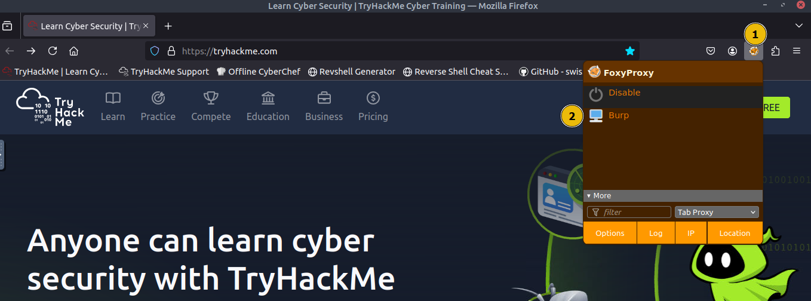

Open the Burp Suite icon on the desktop.

You will see an introductory screen. Choose **Temporary project in memory** and click **Next**.

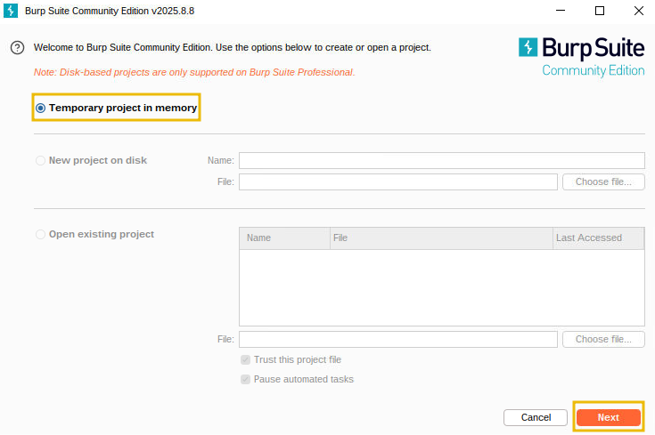

On the configuration screen, click **Start Burp** to start the application.

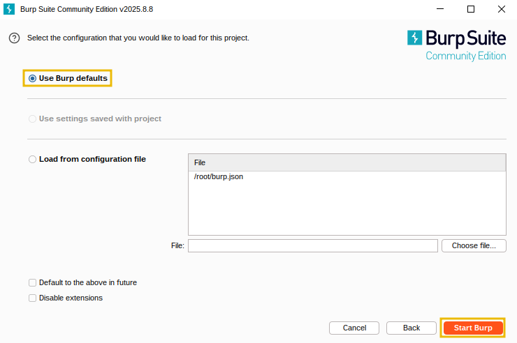

Before proceeding, ensure that you turn off Intercept in Burp Suite. Open the **Proxy** tab and select the **Intercept** sub-tab. If the button says "Intercept on", click it so it changes to "Intercept off". This ensures that Burp Suite no longer holds your browser requests and allows them to pass through normally.

Open the browser and navigate to the target website (http://10.82.162.38).

Enter the credentials:
- Username: attacker  
- Password: attacker@123  

After logging in, you will arrive at the main dashboard, which shows the limited edition SleighToy with only 10 units available.

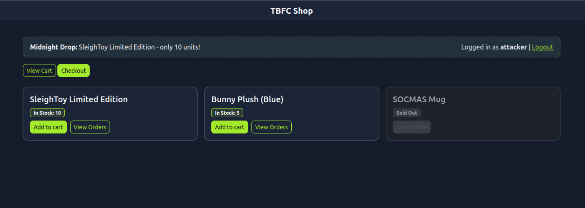

To make a legitimate purchase, click **Add to Cart** for the SleighToy and then click **Checkout** to go to the checkout page.

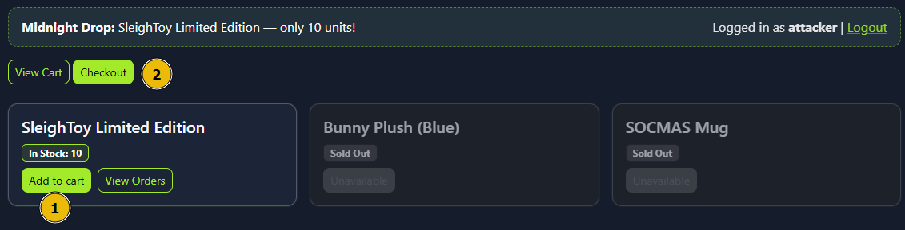

On the checkout page, click **Confirm & Pay** to complete the purchase. You should see a success message confirming the order.

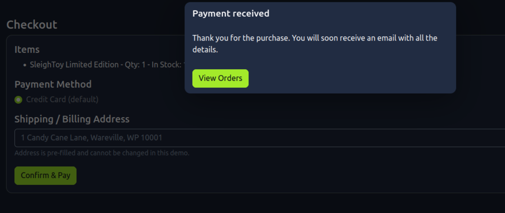

### Exploiting the Race Condition

Now that we have made a legitimate request, navigate back to Burp Suite and click **Proxy > HTTP history**. Find the POST request to the `/process_checkout` endpoint created by the checkout action. Right click that entry and choose **Send to Repeater**, which copies the exact HTTP request, including headers, cookies, and body, into Burp’s Repeater tool.

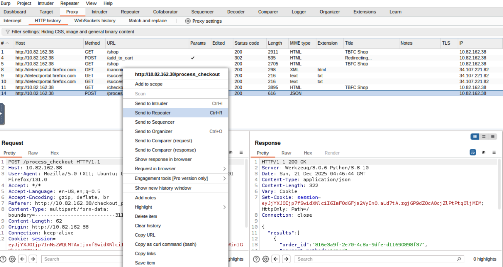

Next, switch to the **Repeater** tab and confirm the request appears there. Right click on the first tab, select **Add tab to group**, and click **Create tab group**.

Then, right click the request tab and select **Duplicate tab**. When prompted, enter the number of copies you want, for example 15. You will now have multiple identical request tabs inside the group.

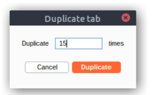

Next, use the Repeater toolbar **Send** dropdown menu and select **Send group in parallel (last-byte sync)**. This launches all copies at once and waits for the final byte from each response, maximising timing overlap to trigger race conditions.

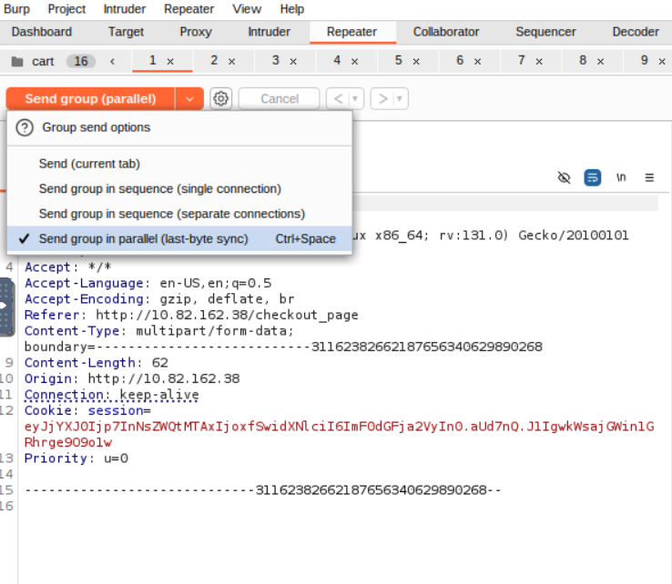

Click **Send group (parallel)** to launch all 15 requests to the server simultaneously. The server attempts to process them at the same time, which causes the timing bug to appear due to multiple orders being handled concurrently.

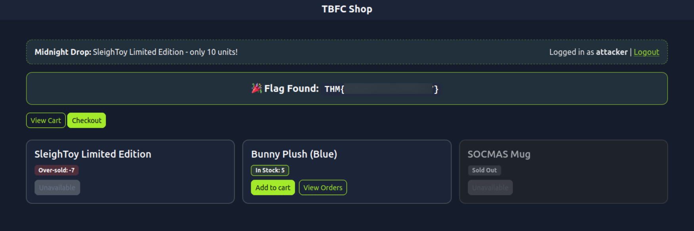

We can see that the **In Stock** value for the SleighToy Limited Edition has become negative, indicating that the server processed multiple orders at once and triggered a race condition.  
We also obtained the flag.

Lets try the same process for the Bunny Plush (Blue).

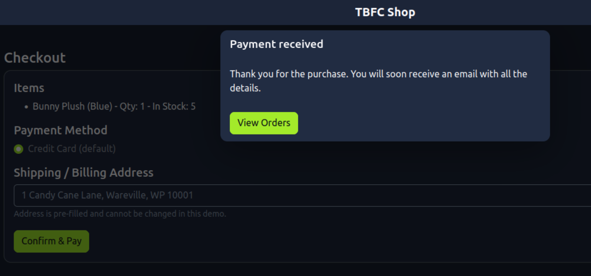

Move the `/process_checkout` request to Repeater and repeat the same steps.

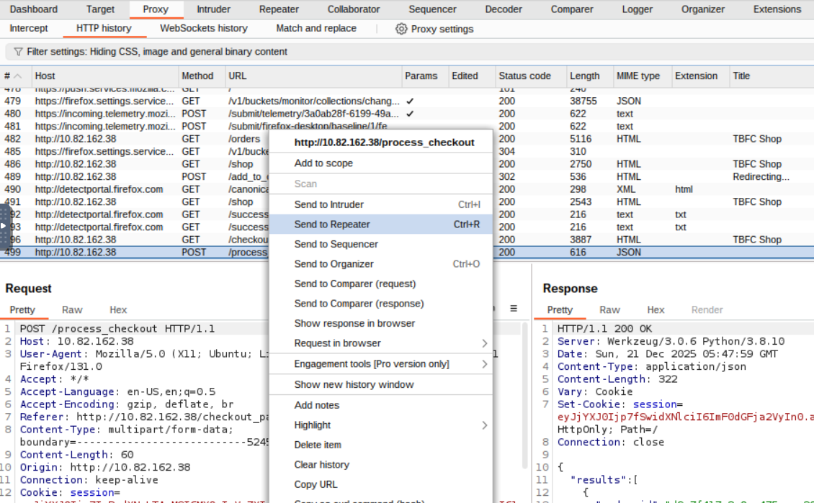

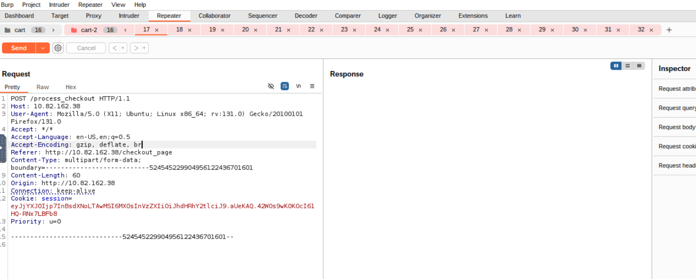

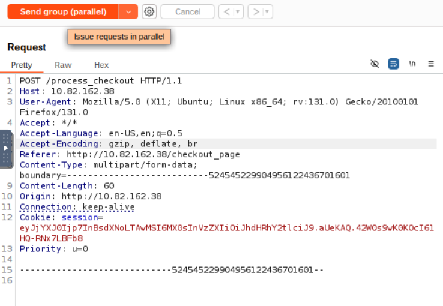

After returning to the website and checking the stock for Bunny Plush (Blue), we can see that the **In Stock** value has also become negative (-12). This confirms that the server again processed multiple orders simultaneously, leading to another race condition.  
We also obtained the second flag.

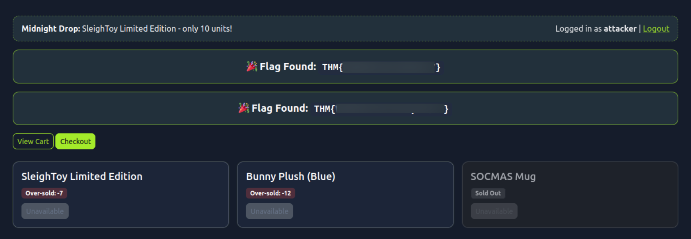

## Mitigation

The attacker logged in and made a normal purchase of the limited SleighToy. Using Burp Suite, the checkout request was captured and sent multiple times in parallel. Because the application did not handle simultaneous checkouts correctly, each request succeeded before the stock value could update. This allowed the attacker to buy more toys than were available, pushing the stock into negative values.

Some mitigation measures to prevent this vulnerability include:

- Use atomic database transactions so stock deduction and order creation execute as a single, consistent operation.
- Perform a final stock validation immediately before committing the transaction.
- Implement idempotency keys for checkout requests to prevent duplicate processing.
- Apply rate limiting or concurrency controls to block rapid, repeated checkout attempts from the same user or session.

## Conclusion

This exercise highlights how small timing flaws can have serious security and business impacts when applications are not designed to handle concurrent actions safely. By exploiting race conditions during the checkout process, an attacker was able to bypass stock limits and force the system into an inconsistent state. Understanding how race conditions occur, how they can be exploited, and how to mitigate them is essential for building secure and reliable web applications, especially in high demand environments where many users interact with shared resources simultaneously.

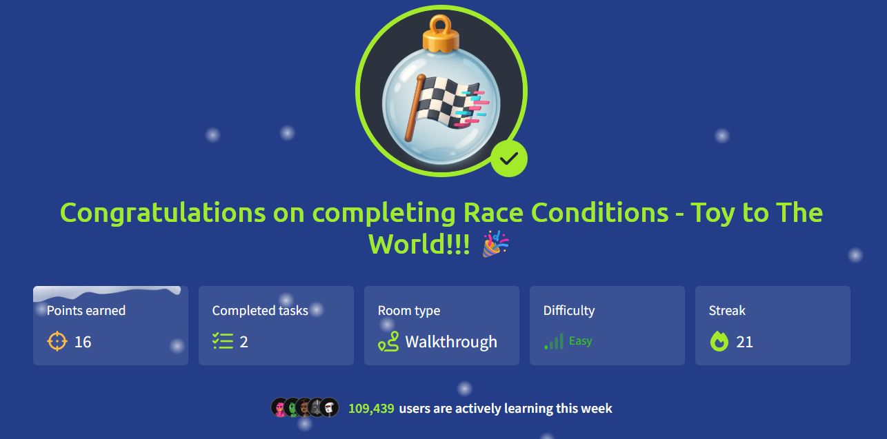

Thanks for reading this walkthrough.

Keep Learning and Stay Safe!

