# Room Name: C2 Detection - Command & Carol

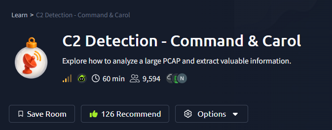

Following recent attacks by the minions of King Malhare, the TBFC (TryHackMe Blue Force Corps) is on high alert. However, the prolonged quiet has made the team restless. Taking initiative, Sir Elfo suggests proactively hunting for Command & Control (C2) traffic within their meticulously collected network data. Many elves object, citing the vast amount of traffic to sift through. Sir Elfo reassures them: "Don't fret! I have a powerful tool to assist us, RITA (Real Intelligence Threat Analytics). We simply need to convert our PCAP file to Zeek logs, and RITA will do the heavy lifting!"

Let's boot up the target machine and learn the basics.

## Detecting C2 with RITA

### The Magic of RITA

**Real Intelligence Threat Analytics (RITA)** is an open-source framework from Active Countermeasures designed to detect command and control (C2) communication by analyzing network traffic logs. C2 refers to the channel attackers use to remotely control compromised systems.

RITA's primary features include:
- C2 beacon detection
- DNS tunneling detection
- Long connection identification
- Data exfiltration detection
- Threat intelligence feed checking
- Scoring connections by severity
- Showing hosts communicating with external IPs
- Displaying when an external host was first seen

It correlates data like IP addresses, ports, timestamps, and connection durations. RITA then runs analysis modules to detect:
- Periodic connection intervals
- Excessive DNS queries
- Long or random subdomains
- Unusual data volumes over HTTPS, DNS, or non-standard ports
- Self-signed or short-lived certificates
- Known malicious IPs from threat feeds

**Important:** RITA requires input in the form of **Zeek logs**.

**Zeek** is an open-source network security monitoring tool. It is not a firewall or IPS/IDS; it doesn't block traffic or use signatures. Instead, it observes traffic (via SPAN ports, taps, or PCAPs) and converts it into structured, enriched logs. These logs provide transaction data and extracted content, which are crucial for incident detection and threat hunting.

### PCAP, I Convert Ye to Zeek Logs

Zeek can convert Packet Capture (PCAP) files into structured logs for analysis.

On the target machine, navigate to the home directory and list the files:

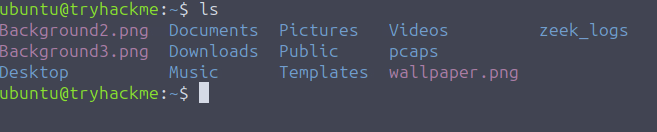

- The `pcaps/` directory contains real-world incident PCAPs from Bradly Duncan's blog.
- The `zeek_logs/` directory holds pre-generated Zeek logs.

Let's convert a PCAP ourselves using the command:
```bash
zeek readpcap pcaps/AsyncRAT.pcap zeek_logs/asyncrat
```

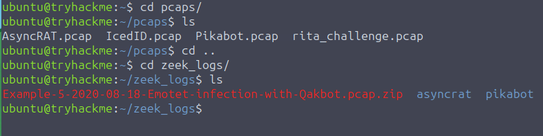
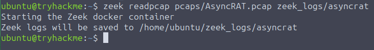

Navigate to the new log directory and list its contents:

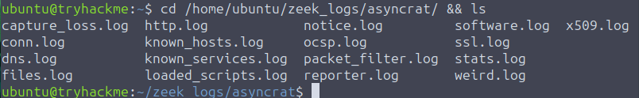

Various log files are generated (like `conn.log`, `http.log`, `ssl.log`). While RITA handles these automatically, you can inspect them using `cat` for more detail. For comprehensive documentation, visit the [Zeek Logs Reference](https://docs.zeek.org/en/master/logs/index.html).

### Now, Analyze This RITA

With Zeek logs ready, we can import them into RITA:

```bash
rita import --logs ~/zeek_logs/asyncrat/ --database asyncrat
```

RITA will parse and analyze the data.

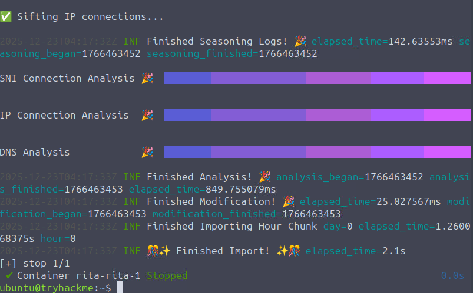

**Note:** Larger datasets yield better insights with fewer false positives. Our sample is small but sufficient for demonstration.

View the results with:
```bash
rita view asyncrat
```

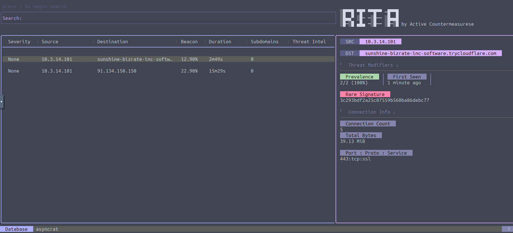

The interface has three main sections: Search Bar, Results Pane, and Details Pane.

#### Search Bar
Press `/` to enter search mode. Use search fields (for example, `dst:malware.com`) to filter results. Press `?` for help on search syntax. Press `Esc` to exit search.

#### Results Pane
This pane lists potential threats with columns:
- **Severity:** Score based on threat modifiers.
- **Source & Destination IP/FQDN**
- **Beacon Likelihood**
- **Duration:** Long connections may indicate C2.
- **Subdomains:** Many subdomains can signal C2 or exfiltration.
- **Threat Intel:** Matches against known threat feeds.

In our sample, two entries stand out: a suspicious FQDN (`sunshine-bizrate-inc-software[.]trycloudflare[.]com`) and an IP (`91[.]134[.]150[.]150`). Use arrow keys to select an entry.

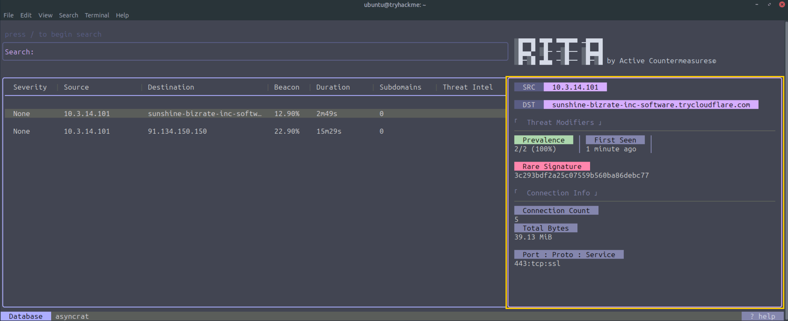

#### Details Pane
Provides in-depth information in two categories:

**1. Threat Modifiers**
Criteria that elevate threat likelihood:
- *MIME type/URI mismatch*
- *Rare signature* (for example, unusual User-Agent)
- *Prevalence* (low percentage of internal hosts talking to an external one)
- *First Seen* (new external hosts are more suspicious)
- *Missing host header* in HTTP
- *Large amount of outgoing data*
- *No direct connections* (indicative of hidden C2)

**2. Connection Info**
Basic metadata about the connection:
- *Connection count:* High counts may indicate beaconing.
- *Total bytes sent:* Large volumes may signal data exfiltration.
- *Port number, Protocol, Service:* Non-standard ports or missing SSL warrant investigation.

## What Is This?

Even entries with low severity scores can be indicators of compromise. Our small dataset may affect scores (for example, "First Seen" may be less reliable), but we can still analyze manually.

**First Entry:** The long FQDN `sunshine-bizrate-inc-software[.]trycloudflare[.]com` is flagged as malicious on VirusTotal.

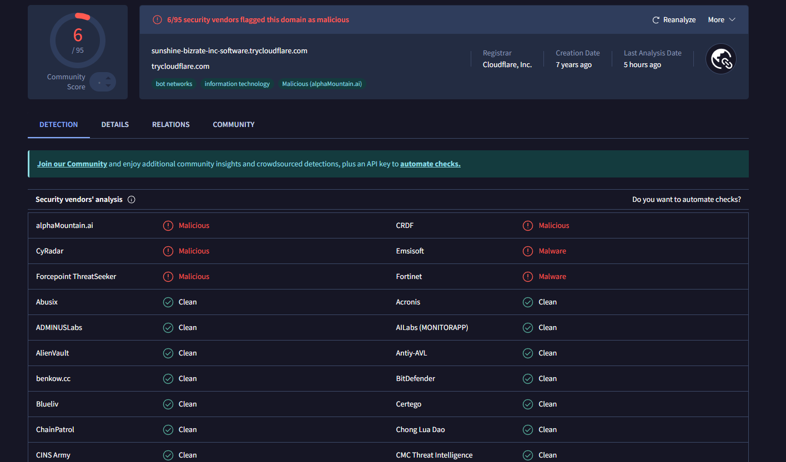

**Second Entry:** The IP `91[.]134[.]150[.]150` is also flagged as malicious.

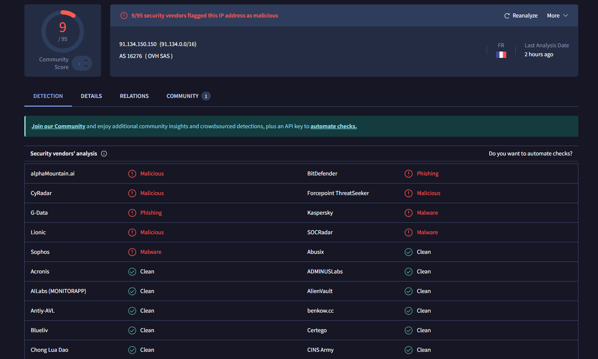

We got lucky with known Indicators of Compromise (IoCs). Attackers often rotate infrastructure, so we must dig deeper when IoCs aren't known.

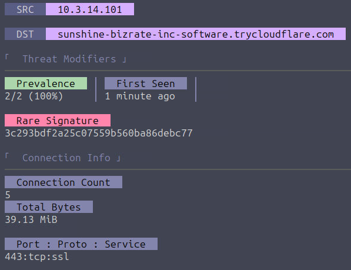
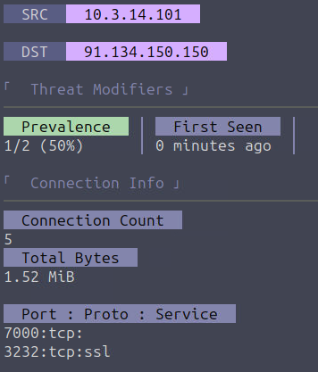

For the first entry, RITA flagged a *rare signature*, meaning its TLS/SSL handshake pattern is uncommon compared to normal traffic, often a sign of malware C2.

For the second entry, the *long duration*, *non-standard ports*, and *malicious IP* strongly warrant further investigation. You could pivot to examine the original Zeek logs or PCAP for more context. (Caution: Some PCAPs contain live malicious elements.)

### Each Will Do His Part

Now, let's analyze `~/pcaps/rita_challenge.pcap` with RITA and answer the provided questions.

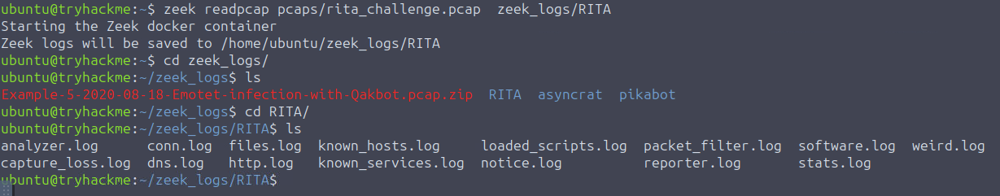

First, convert it to Zeek logs:
```bash
zeek readpcap pcaps/rita_challenge.pcap zeek_logs/ritachallenge
```

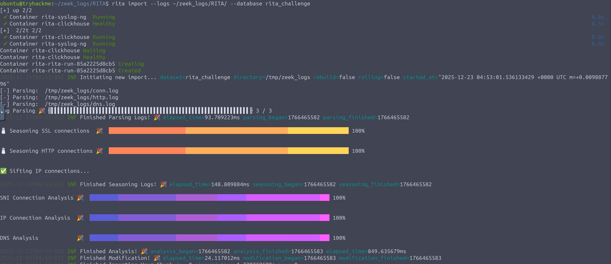

Import into RITA:
```bash
rita import --logs ~/zeek_logs/ritachallenge --database rita_challenge
```

View the database:
```bash
rita view rita_challenge
```

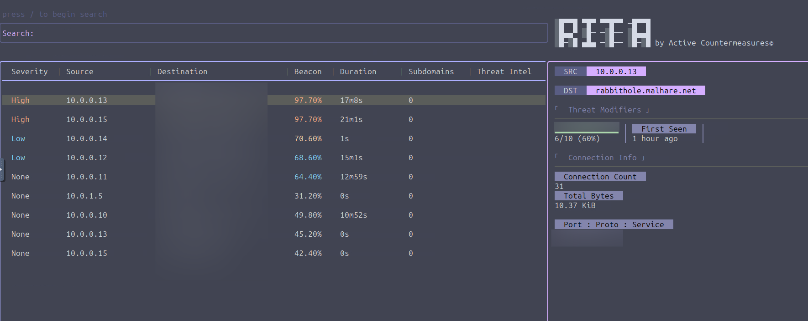

**Q1: Total hosts communicating with `malhare.net`?**
Count the rows where the destination is `rabbithole.malhare.net`, or use the search filter: `dst:rabbithole.malhare.net`.

**Q2: Which threat modifier shows the number of hosts communicating with a destination?**
Check the *Prevalence* modifier in the Details Pane for any entry.

**Q3: Highest number of connections to `rabbithole.malhare.net`?**
Navigate through each relevant row and check the *Connection Count* in the Details Pane.

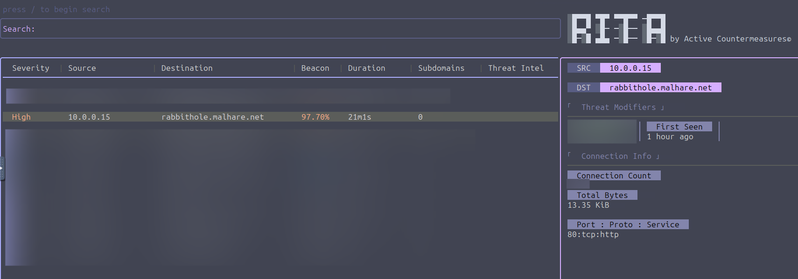

**Q4: Search filter for entries communicating with `rabbithole.malhare.net`, beacon score > 70%, sorted by duration (descending)?**
Press `/` then `?` to see filter syntax. Construct a query using the below image:

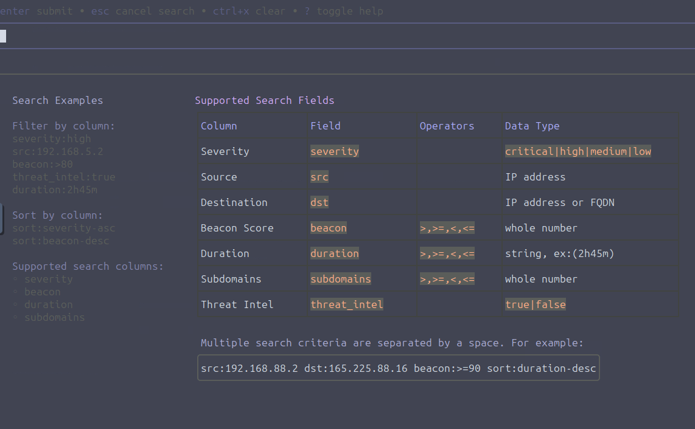

**Q5: Port used by host `10.0.0.13` to connect to `rabbithole.malhare.net`?**
Select the row where source is `10.0.0.13` and destination is the domain, then check the *Port* in the Connection Info. Alternatively, use the search:
```
src:10.0.0.13 dst:rabbithole.malhare.net
```


## Conclusion

RITA is a powerful tool for automating the detection of Command & Control traffic within network logs. By leveraging Zeek to structure raw PCAP data, RITA applies multiple analytical modules to score connections, highlight anomalies, and cross-reference threat intelligence. 

This workflow transforms the daunting task of manual traffic analysis into an efficient, guided threat hunt. While no tool is infallible, and smaller datasets can increase false positives, RITA provides a critical lens for identifying suspicious patterns, rare signatures, and known IoCs. Mastering RITA, combined with fundamental network analysis skills, significantly enhances a defender's ability to uncover hidden threats and secure their environment.


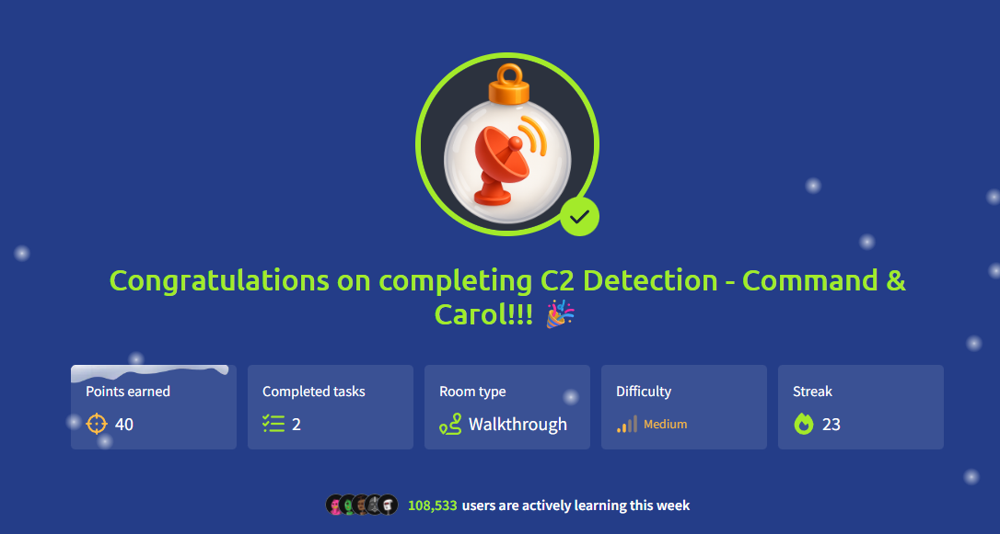


Thanks for reading my walkthrough!

Keep Learning and have a great day:)