# Room Name: AWS Security - S3cret Santa

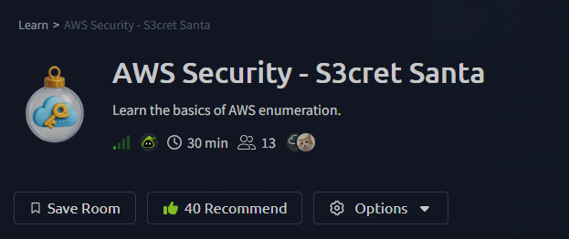

## The Mission

One of our stealthiest infiltrated elves managed to hop their way into Sir Carrotbane's office and, lo and behold, discovered a bundle of cloud credentials just lying around on his desktop like forgotten carrots. The agent suspects these could be the key to regaining access to TBFC's cloud network. If only the poor hare had the faintest clue what "the cloud" is, he'd burrow in himself.

**Our task:** Help the elf utilize these credentials to regain access to TBFC's cloud network.

Boot the target machine and get ready to explore the world of cloud.

---

## What is AWS?

**AWS (Amazon Web Services)** is a cloud computing platform that provides on-demand computing resources, storage, databases, networking, and security services over the internet. Instead of owning physical servers, companies rent these services to build and run applications. AWS is widely used, making it a common target in cloud security assessments.

AWS accounts can be accessed programmatically by using an Access Key ID and a Secret Access Key (just like using username and password). For this room, both of those will be automatically configured for you. The AWS CLI will look for credentials at `~/.aws/credentials`

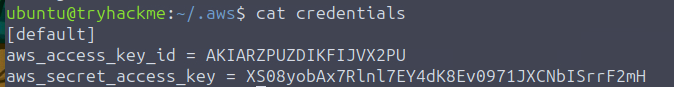

## Using Amazon Security Token Service (STS)

Amazon Security Token Service (STS) allows us to use the credentials of a user that we have saved during our AWS CLI configuration.

*Note: STS is an AWS service that provides temporary security credentials.*

We can use the get-caller-identity call to retrieve information about the user we have configured for the AWS CLI. Let's run the following command:

```
aws sts get-caller-identity
```

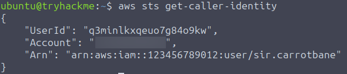

---

## IAM: Users, Roles, Groups and Policies

### IAM Overview

Amazon Web Services uses the Identity and Access Management (IAM) service to manage users and their access to various resources, including the actions that can be performed against those resources. Therefore, it is crucial to ensure that the correct access is assigned to each user according to the requirements. Misconfiguring IAM has led to several high-profile security incidents in the past, giving attackers access to resources they were not supposed to access. Companies like Toyota, Accenture and Verizon have been victims of such attacks, often exposing customer data or sensitive documents. Below, we will discuss the different aspects of IAM that can lead to sensitive data exposure if misconfigured.

### IAM Users

A user represents a single identity in AWS. Each user has a set of credentials, such as passwords or access keys, that can be used to access resources. Furthermore, permissions can be granted at a user level, defining the level of access a user might have.

### IAM Groups

Multiple users can be combined into a group. This can be done to ease the access management for multiple users. For example, in an organization employing hundreds of thousands of people, there might be a handful of people who need write access to a certain database. Instead of granting access to each user individually, the admin can grant access to a group and add all users who require write access to that group. When a user no longer needs access, they can be removed from the group.

### IAM Roles

An IAM Role is a temporary identity that can be assumed by a user, as well as by services or external accounts, to get certain permissions. Think of Sir Carrotbane, and how, depending on the battle ahead, he might need to assume the role of an attacker or a defender. When becoming an attacker, he will get permission to wield his shiny swords, but when assuming the role of a defender, he will instead get permission to carry a shield to better defend King Malhare.

### IAM Policies

Access provided to any user, group or role is controlled through IAM policies. A policy is a JSON document that defines:
- What action is allowed (Action)
- On which resources (Resource)
- Under which conditions (Condition)
- For whom (Principal)

Consider the following hypothetical policy:

**IAM Policy example**
```json
{
  "Version": "2012-10-17",
  "Statement": [
    {
      "Sid": "AllowSpecificUserReadAccess",
      "Effect": "Allow",
      "Principal": {
        "AWS": "arn:aws:iam::123456789012:user/Alice"
      },
      "Action": [
        "s3:GetObject"
      ],
      "Resource": "arn:aws:s3:::my-private-bucket/*"
    }
  ]
}
```

This policy grants access to the AWS user Alice (Principal) to get an object from an S3 bucket (Action) for the S3 bucket named my-private-bucket (Resource).

---

## Practical: Enumerating a User's Permissions

### Enumerating Users

Alright, let's see what we can do with the credentials we got from Sir Carrotbane's office, since we have already configured them in our environment. We can start interacting with the AWS CLI to find more information. Let's begin by enumerating users. We can do so by running the following command in the terminal:

```
aws iam list-users
```

We will see an output that lists all the users, as well as some other useful information such as their creation date.

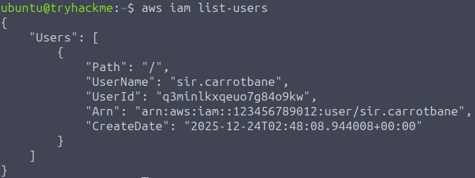

### Enumerating User Policies

Policies can be inline or attached. Inline policies are assigned directly in the user (or group/role) profile and hence will be deleted if the identity is deleted. These can be considered as hard-coded policies as they are hard-coded in the identity definitions. Attached policies, also called managed policies, can be considered reusable. An attached policy requires only one change in the policy, and every identity that policy is attached to will inherit that change automatically.

Let's see what inline policies are assigned to Sir Carrotbane by running the following command.

```
aws iam list-user-policies --user-name sir.carrotbane
```

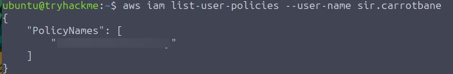

Great! We can see an inline policy in the results. Let's take note of its name for later.

Maybe Sir Carrotbane has some policies attached to their account. We can find out by running the following command.

```
aws iam list-attached-user-policies --user-name sir.carrotbane
```

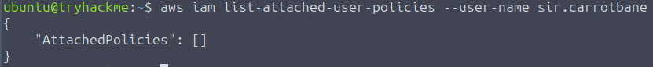

Hmmm, not much here. Perhaps we can check if Sir Carrotbane is part of a group. Let's run this command to do that.

```
aws iam list-groups-for-user --user-name sir.carrotbane
```

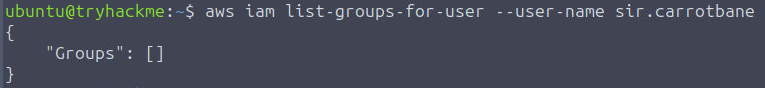

Looks like sir.carrotbane is not a part of any group.

Let's get back to the inline policy we found for Sir Carrotbane's account. Let's see what permissions this policy grants by running the following command (replace POLICYNAME with the actual policy name you found):

```
aws iam get-user-policy --policy-name POLICYNAME --user-name sir.carrotbane
```


So, it looks like Sir Carrotbane has access to enumerate all the different kinds of users, groups, roles and policies (IAM entities), but that is about it. That is not a lot of help getting TBFC's access back. We might need to try something different to do that. If you look carefully, you'll notice sir.carrotbane can perform the `sts:AssumeRole` action. Maybe there's still hope!

---

## Assuming Roles

### Enumerating Roles

The `sts:AssumeRole` action we previously found allows sir.carrotbane to assume roles. Perhaps we can try to see if there's any interesting ones available. Let's start by listing the existing roles in the account.

```
aws iam list-roles
```

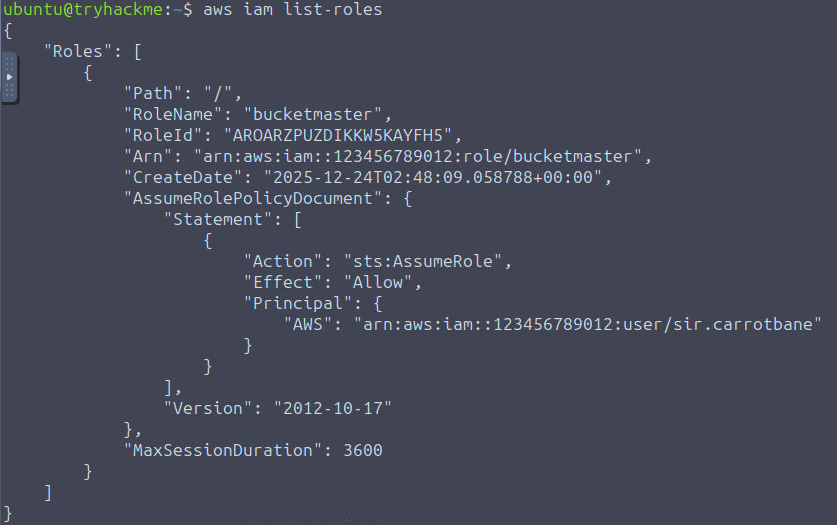

Bingo! There's a role named `bucketmaster`, and it can be assumed by sir.carrotbane. Let's find out what policies are assigned to this role. Just as users, roles can have inline policies and attached policies. To check the inline policies, we can run the following command.

```
aws iam list-role-policies --role-name bucketmaster
```

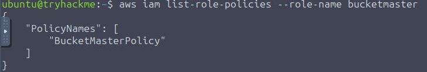

Looks like we only have the inline policy assigned. Let's see what permissions we can get from the policy.

```
aws iam get-role-policy --role-name bucketmaster --policy-name BucketMasterPolicy
```


Well, what do we have here? We can see that the bucketmaster role can perform three different actions (`ListAllBuckets`, `ListBucket` and `GetObject`) on some resources of a service named S3. This might just be the breakthrough we were looking for. More on this service later.

### Assuming Role

To gain privileges assigned by the bucketmaster role, we need to assume it. We can use AWS STS to obtain the temporary credentials that enable us to assume this role.

```
aws sts assume-role --role-arn arn:aws:iam::123456789012:role/bucketmaster --role-session-name TBFC
```

This command will ask STS, the service in charge of AWS security tokens, to generate a temporary set of credentials to assume the bucketmaster role. The temporary credentials will be referenced by the session-name "TBFC" (you can set any name you want for the session). Let's run the command:

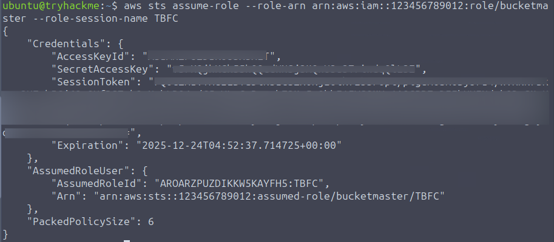

The output will provide us the credentials we need to assume this role, specifically the AccessKeyID, SecretAccessKey and SessionToken. To be able to use these, run the following commands in the terminal, replacing with the exact credentials that you received on running the assume-role command.

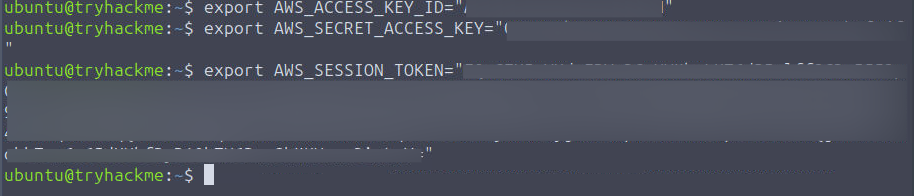

Once we have done that, we can officially use the permissions granted by the bucketmaster role. To check if you have correctly assumed the role, you can once again run:

```
aws sts get-caller-identity
```

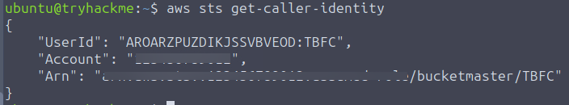

This time, it should show you are now using the bucketmaster role.

---

## Grabbing a File from S3

### What Is S3?

Amazon S3 stands for Simple Storage Service. It is an object storage service provided by Amazon Web Services that can store any type of object such as images, documents, logs and backup files. Companies often use S3 to store data for various reasons, such as reference images for their website, documents to be shared with clients, or files used by internal services for internal processing. Any object you store in S3 will be put into a "Bucket". You can think of a bucket as a directory where you can store files, but in the cloud.

### Listing Contents From a Bucket

Since our profile has permission to `ListAllBuckets`, we can list the available S3 buckets by running the following command:

```
aws s3api list-buckets
```


There is one interesting bucket in there that references easter. Let's check out the contents of this directory.

```
aws s3api list-objects --bucket easter-secrets-123145
```

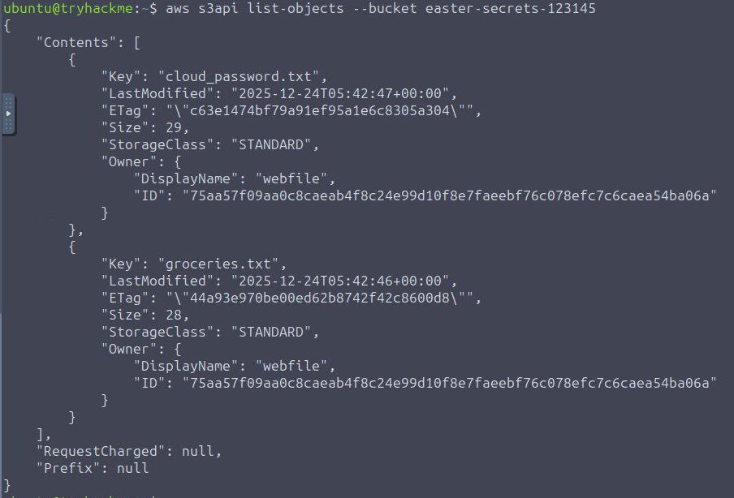

Now let's copy the file in this directory to our local machine. This might have a secret message.

```
aws s3api get-object --bucket easter-secrets-123145 --key cloud_password.txt cloud_password.txt
```

We have successfully infiltrated Sir Carrotbane's S3 bucket and exfiltrated some sensitive data.

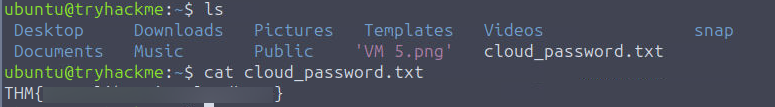

We get the flag inside the file.

---

## Conclusion

This hands-on walkthrough demonstrated a complete cloud reconnaissance and escalation path, starting from exposed AWS credentials to retrieving sensitive data from S3 storage. By leveraging IAM enumeration, role assumption, and S3 bucket exploration, we successfully navigated through AWS services to complete our mission. The exercise showcases how seemingly limited initial access can be methodically expanded through proper cloud service understanding, ultimately leading to successful data exfiltration in a real-world cloud security scenario.

## *Complete Command List with Explanations*

### Phase 1: Initial Verification

| Command | Purpose | Why We Did It |
|---------|---------|---------------|
| `aws sts get-caller-identity` | Verify AWS identity | Confirm our credentials are valid and see who we're logged in as |
| **Result**: Shows our User ID, Account number, and ARN | | |

### Phase 2: User Enumeration

| Command | Purpose | Why We Did It |
|---------|---------|---------------|
| `aws iam list-users` | List all IAM users | See who else exists in the AWS account |
| `aws iam list-user-policies --user-name sir.carrotbane` | List inline policies for sir.carrotbane | Check what permissions are directly attached to our user |
| `aws iam list-attached-user-policies --user-name sir.carrotbane` | List managed policies for sir.carrotbane | Check reusable policies attached to our user |
| `aws iam list-groups-for-user --user-name sir.carrotbane` | Check group membership | See if sir.carrotbane inherits permissions from any groups |

### Phase 3: Policy Analysis

| Command | Purpose | Why We Did It |
|---------|---------|---------------|
| `aws iam get-user-policy --policy-name POLICYNAME --user-name sir.carrotbane` | View specific policy details | Understand exactly what permissions we have |

**Key Finding**: Discovered `sts:AssumeRole` permission - this allows us to switch to other roles!

### Phase 4: Role Exploration

| Command | Purpose | Why We Did It |
|---------|---------|---------------|
| `aws iam list-roles` | List all IAM roles | Find roles we might be able to assume |
| `aws iam list-role-policies --role-name bucketmaster` | Check role's inline policies | See what permissions the role has |
| `aws iam get-role-policy --role-name bucketmaster --policy-name BucketMasterPolicy` | View role policy details | Understand the role's S3 permissions |

**Key Finding**: `bucketmaster` role has S3 permissions (`ListAllBuckets`, `ListBucket`, `GetObject`)

### Phase 5: Role Assumption

| Command | Purpose | Why We Did It |
|---------|---------|---------------|
| `aws sts assume-role --role-arn arn:aws:iam::123456789012:role/bucketmaster --role-session-name TBFC` | Assume the bucketmaster role | Get temporary credentials with S3 access |
| `export AWS_ACCESS_KEY_ID="..."`<br>`export AWS_SECRET_ACCESS_KEY="..."`<br>`export AWS_SESSION_TOKEN="..."` | Set temporary credentials | Switch our active session to the new role |
| `aws sts get-caller-identity` | Verify role assumption | Confirm we're now acting as bucketmaster |

### Phase 6: S3 Exploration & Data Exfiltration

| Command | Purpose | Why We Did It |
|---------|---------|---------------|
| `aws s3api list-buckets` | List all S3 buckets | Find available storage containers |
| `aws s3api list-objects --bucket easter-secrets-123145` | List contents of specific bucket | See what files exist in the interesting bucket |
| `aws s3api get-object --bucket easter-secrets-123145 --key cloud_password.txt cloud_password.txt` | Download file from S3 | Retrieve the sensitive data (flag) |

---

## Attack Path Summary

**Credentials Discovery** → **Identity Verification** → **User Permission Enumeration** → **Policy Analysis** → **Role Discovery** → **Role Assumption** → **S3 Enumeration** → **Data Exfiltration**

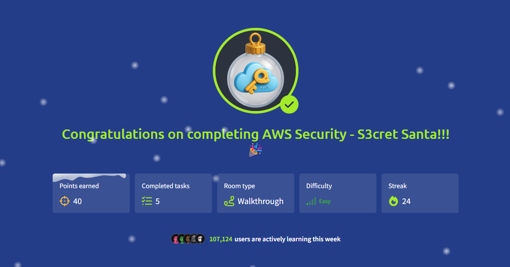

Thanks for reading!

Keep Learning!