# Room Name: Exploitation with cURL - Hoperation Eggsploit

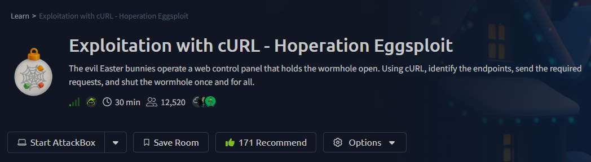

According to blue-team intel, the wormhole is held open by a control panel on the Evil Bunnies' web server. The team must shut it down first to cut off reinforcements before facing King Malhare.

However, the terminal they have is bare. No Burp Suite, no browser, just a command prompt.

But that is fine. The team will use the command line and cURL to speak HTTP directly, sending requests, reading responses, and finding the endpoints that shut the portal.

Let’s boot up the attack box and the target machine.

---

## Web Hacking Using cURL

### HTTP Requests Using cURL

Applications, like our browsers, communicate with servers using HTTP (Hypertext Transfer Protocol). Think of HTTP as the language used to ask a server for resources such as pages, images, or JSON data, and to receive responses back.

When you access a website, your browser sends an HTTP request to the web server. If the request is valid, the server replies with an HTTP response containing the data needed to display the website.

In the absence of a browser, you can still speak HTTP directly from the command line. The simplest way to do this is with cURL.

cURL is a command-line tool for crafting HTTP requests and viewing raw responses. It is ideal when you need precision or when GUI tools are not available.

---

### Trying Out cURL

Open a command prompt and run the following command:

```
curl http://10.82.136.84/
```

When this command is executed, cURL sends an HTTP GET request for the site’s home page. An HTTP response is received containing the response body, which is then printed directly in the terminal.

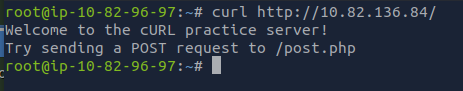

---

### Sending POST Requests

Assume we find a login form whose POST target is `/post.php`. When you log in through a browser, it sends a POST request to the server containing the credentials you entered. We can simulate the same behavior directly from the terminal.

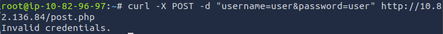

You should receive the response **Invalid credentials**.

Here is what is happening:

* `-X POST` tells cURL to use the POST method.
* `-d` defines the data being sent in the request body.
* The data is sent in URL-encoded format, which is the same format used by HTML forms.

If the application expects additional fields such as a login button or a CSRF token, those can be included as well.

(I dont  know what happened with the AttackBox , so i shifted with the OpenVPN connection and followed along)

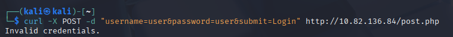

To view the full server response including headers and possible redirects, add the `-i` flag.

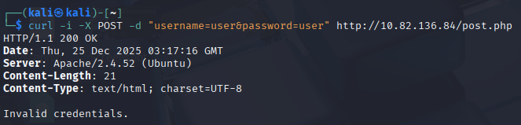

If the site responds with a `Set-Cookie` header, that is a good sign. It indicates that a session has been created or that authentication logic has been triggered.

---

### Using Cookies and Sessions

Once you log in, web applications rely on cookies to maintain your session. Browsers handle this automatically, but with cURL, cookies must be managed manually.

This can be done in two steps.

**Step 1: Save the cookies**

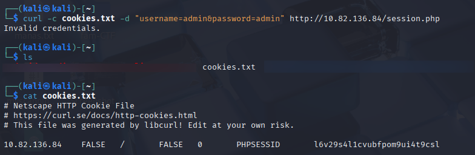

The `-c` option tells cURL to write any cookies received from the server into a file, in this case `cookies.txt`.
You will often see a session cookie such as `PHPSESSID=xyz123`.

**Step 2: Reuse the saved cookies**

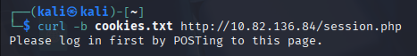

The `-b` option instructs cURL to send the saved cookies with the next request, just like a browser would.

This technique is the basis of session replay testing, where valid session cookies are reused to access protected functionality.

---

### Automating Login and Performing Brute Force Using cURL

Now that we can send POST requests and manage sessions, we can automate requests. In this section, we simulate a brute-force attack against a weak login form.

Create a file named `passwords.txt` and add the following passwords:

```
admin123
password
letmein
secretpass
secret
```

Next, create a simple bash script named `loop.sh` and add the following code:

```
for pass in $(cat passwords.txt); do
  echo "Trying password: $pass"
  response=$(curl -s -X POST -d "username=admin&password=$pass" http://10.82.136.84/bruteforce.php)
  if echo "$response" | grep -q "Welcome"; then
    echo "[+] Password found: $pass"
    break
  fi
done
```

Grant execute permissions to the script and run it.

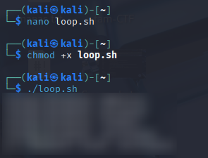

Here is how this works:

* `$(cat passwords.txt)` reads each password from the file.
* `curl -s` sends the request silently without a progress meter.
* The server response is stored in a variable.
* `grep -q` checks whether the response contains a success string such as “Welcome”.
* Once found, the correct password is printed and the loop exits.

This approach is exactly what tools like Hydra, Burp Intruder, and WFuzz automate. By performing it manually, you gain a clear understanding of what happens behind the scenes: repeated HTTP POST requests with changing parameters and response analysis.

---

### Bypassing User-Agent Checks

Some applications block cURL by checking the User-Agent header. For example, the server may reject requests with `User-Agent: curl/7.x.x`.

To specify a custom User-Agent, use the `-A` flag.

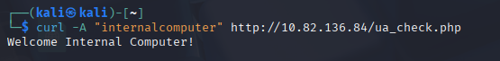

To verify the check:

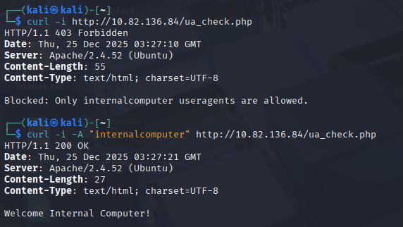

If the first request fails and the second succeeds, it confirms that a User-Agent check is in place and that it has been bypassed through spoofing.

---

## Questions

**Q1:** Make a POST request to the `/post.php` endpoint with the username `admin` and the password `admin`. What flag do you receive?

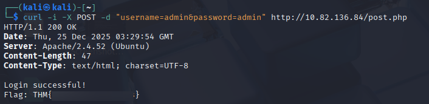

**Q2:** Make a request to the `/cookie.php` endpoint with the username `admin` and the password `admin`, and save the cookie. Reuse that saved cookie on the same endpoint. What flag do you receive?

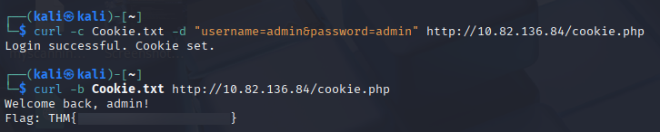

**Q3:** After performing the brute-force attack on the `/bruteforce.php` endpoint, what is the password of the admin user?


**Q4:** Make a request to the `/agent.php` endpoint with the User-Agent set to `TBFC`. What flag do you receive?

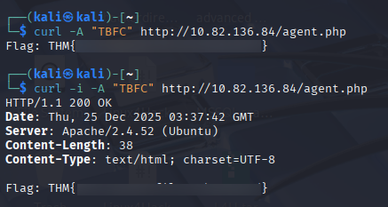

---

## Conclusion

This room demonstrated that effective web exploitation does not depend on advanced tools or graphical interfaces. Even with nothing more than a terminal, cURL is powerful enough to fully interact with web applications at the HTTP level.

By manually crafting GET and POST requests, handling cookies and sessions, spoofing headers, and automating requests using simple bash scripts, we replicated the core techniques used by professional tools such as Burp Suite and Hydra. More importantly, we understood why these techniques work instead of treating them as black boxes.

This exercise reinforced a key red-team lesson: if you understand HTTP, you understand web hacking. Browsers, proxies, and scanners are simply conveniences. The real attack surface is the request and the response.


Thanks for reading my walkthrough and following along through this entire Advent of Cyber 2025 journey.

*Keep learning and keep growing.*
