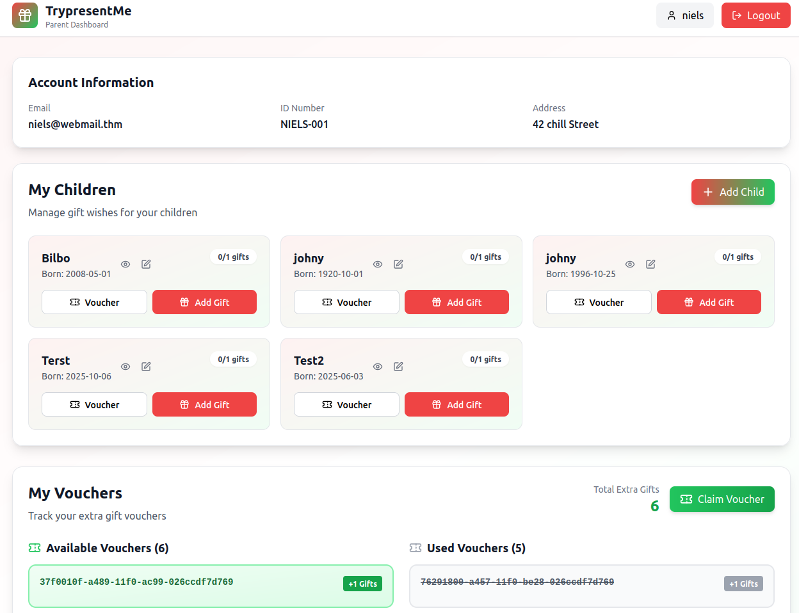
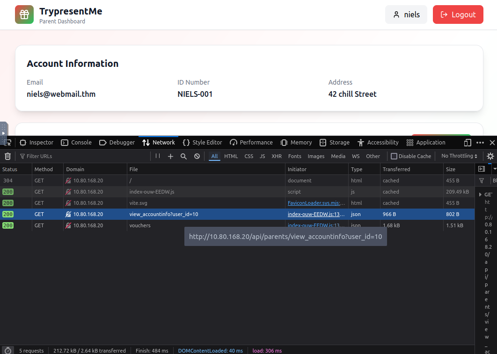
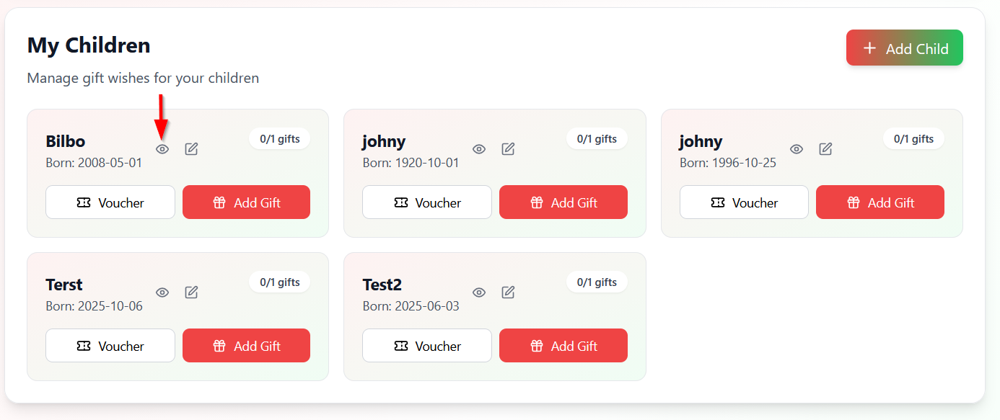
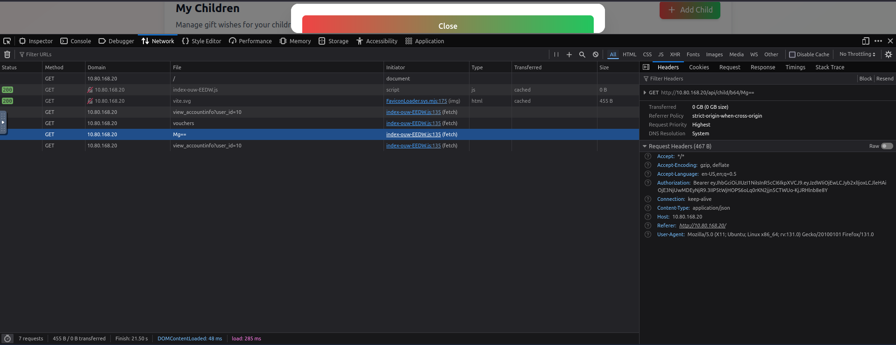
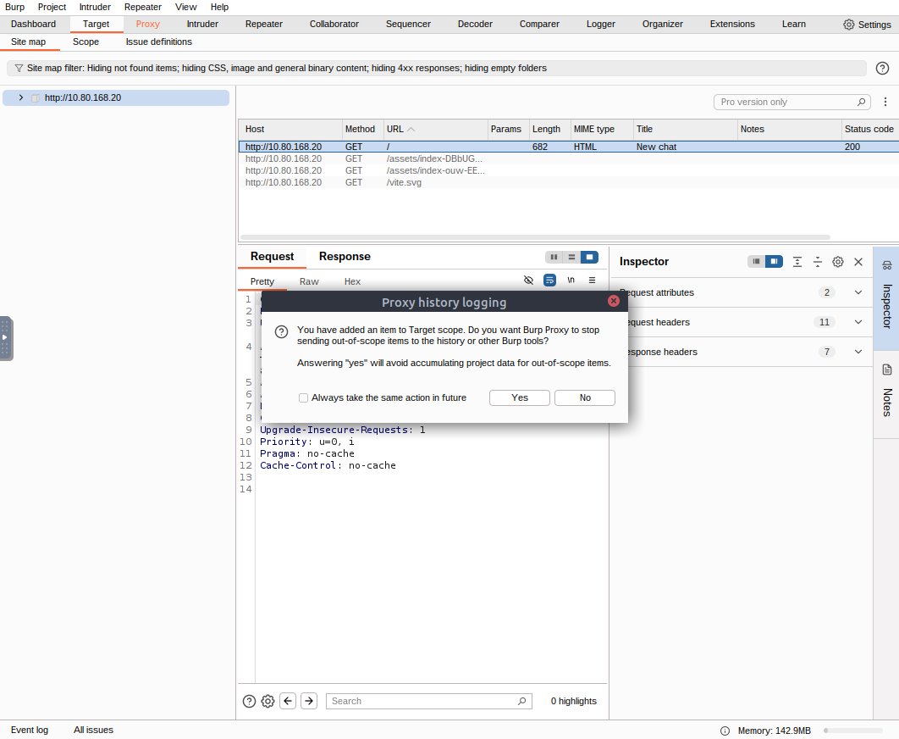
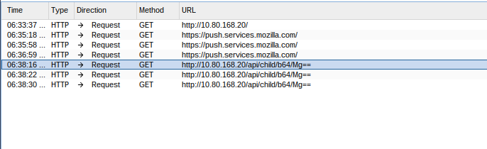
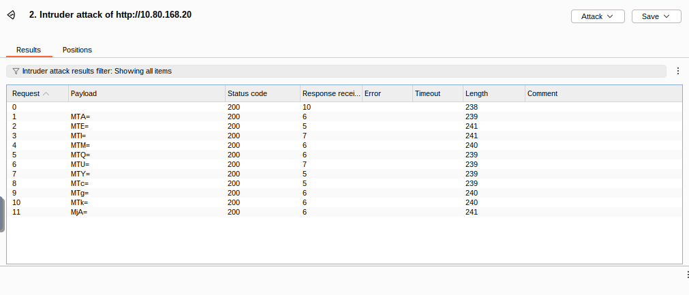
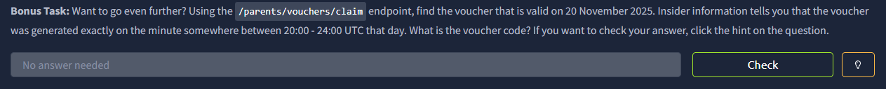
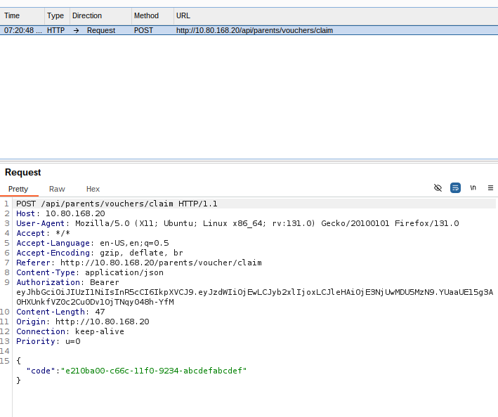
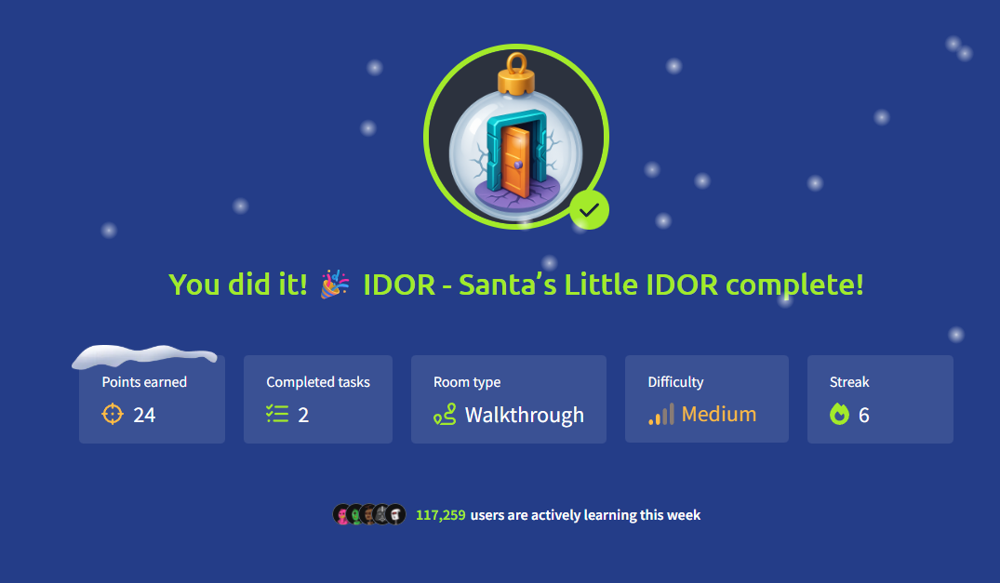

***Room Name: IDOR - Santa's Little IDOR***


With McSkidy missing, the support team has been receiving a lot of calls from parents who can't activate vouchers on the TryPresentMe website. They are also receiving many phishing emails containing information that is not public.

When looking into one of the cases, they found a suspicious account named "Sir Carrotbane," which has many vouchers assigned to it. So we are here to help the TBFC staff investigate the website and fix the vulnerabilities.

Let's boot both the attack box and target machine.

---

Let's talk about some links that might look like this:

`https://awesome.website.thm/TrackPackage?packageID=1001`

Well, the `packageID` can simply be changed to any other number, and maybe it works. This is a potential case of **IDOR (Insecure Direct Object Reference)**.

IDOR is a type of vulnerability where an application allows a user to access or modify objects or data that they are not authorized to access or modify.

Web applications often use references to determine what data to return when you make a request. The problem arises when these references are not properly validated, leading to unauthorized access to data.

Let's actually look at why this happens so often.

| packageID | person         | address                   | status          |
| :-------- | :------------- | :------------------------ | :-------------- |
| 1001      | Alice Smith    | 123 Main St, Springfield  | Delivered       |
| 1002      | Bob Johnson    | 42 Elm Ave, Shelbyville   | In Transit      |
| 1003      | Carol White    | 9 Oak Rd, Capital City    | Out for Delivery |
| 1004      | Daniel Brown   | 77 Pine St, Ogdenville    | Pending         |
| 1005      | Eve Martinez   | 5 Maple Ln, North Haverbrook | Returned     |

If a user wants to know the status of their package and makes a web request, the simplest method is to allow the user to supply their `packageID`. We recover data from the database using the simplest SQL query:

```sql
SELECT person, address, status FROM Packages WHERE packageID = value;
```

However, since `packageID` is a sequential number, it becomes pretty obvious to guess the package IDs of other customers. And since the web application isn't verifying that the person making the request is the same person as the one who owns the package, an IDOR vulnerability appears, allowing attackers to recover details for packages belonging to other users. Even worse is when a feature like this doesn't require a user to authenticate, then there would be no way to even tell who is making the request!

To dive a bit deeper, we need to understand authentication, authorization, and privilege escalation.

---

**Note from the co-authors of the room:**

IDOR (Insecure Direct Object Reference) sounds fancy, but it doesn't describe the vulnerability very well. "Direct Object Reference" is a term used to describe a reference to an object in a system (like `/user/1`). That's not a problem. The real issue is that the system doesn't verify that the user making the request is authorized to access the object.

A lot of people try to fix "IDORs" by hiding or encoding IDs, like changing `/user/1` to `/user/ea4242421`. This might be a bit harder to guess, but it's still vulnerable to IDORs. That's why we prefer to call it an **Authorization Bypass** instead of IDOR. It exactly describes the issue: a user is able to access an object that they are not authorized to access.

---

Let's get to the root cause of this vulnerability. Before that, let's understand the basic principles of authentication and authorization.

**Authentication**: The process by which you verify who you are. For example, supplying your username and password.  
**Authorization**: The process by which the web application verifies your permissions. For example, are you allowed to visit the admin page of a web application, or are you allowed to make a payment using a specific account?

Authentication is not just supplying your username and password. After providing those credentials, you receive a cookie/token called session information. Every request you make to the web application contains this session information. That's why sometimes you will notice that websites will often redirect you back to the login page, meaning your session has expired, and you need to re-authenticate to get a new session.

If the application doesn't know who you are (authentication), it can't verify if you are allowed to access the object (authorization). So we need to fix authentication before authorization to tackle IDORs.

Let's see some privilege escalation types:

1. **Vertical Privilege Escalation**: Gaining access to more features or data than you are authorized to access.  
   *Example:* An admin gaining access to user data.

2. **Horizontal Privilege Escalation**: Gaining access to the same level of features or data as another user.  
   *Example:* A user gaining access to another user's data.

IDOR is usually a horizontal privilege escalation. You are allowed to make use of the track package functionality, but you should be restricted to only performing that tracking action for packages you own.

---

Let's get to the practical and see how IDOR works.

Visit the website (target machine IP) and try to log in with the credentials provided.  
On logging in, we see a dashboard:



Let's press **F12** to open the Developer Tools, or right-click and select **Inspect**.

Click on the **Network** tab and refresh the page:



Click on the `view_accountinfo?user_id=10` request:


Go to the **Response** tab, and you'll see the application is using `user_id` to fetch other user details.

Let's change the `user_id` to `11` and see what happens.  
Go to the **Storage** tab, expand the **Local Storage** dropdown on the left side, and edit the `user_id` to `11`.

Now refresh the page, and you will see that you are able to access another user's details:


Now we see the simplest form of IDOR.

But as we know earlier, some applications use encoding to hide the IDs.  
Let's set the `user_id` back to `10` and try to find more about it.

Click on the eye icon of the first child, like below:



Again, go to the Developer Tools, into the **Network** tab, and refresh the page:



You will see a `GET` request, and the file column shows `"Mg=="`. This is a base64-encoded `user_id`. We simply decode it to get the `user_id`, which is `2`.

Try it on the CyberChef website, base64 decode:


Back on the first child, if you were to click on the edit icon, you will see some more requests in the Network tab.

It might look like gibberish at first, but it's actually an MD5 hash of the `user_id`.  
(Sometimes you can use [https://hashes.com/en/tools/hash_identifier](https://hashes.com/en/tools/hash_identifier) to identify the hash type.)


Sometimes you need to dig even deeper for IDOR. It could stem from the actual algorithm being used.

Let's look at the vouchers and see what algorithm was used to generate them.

**UUID (Universally Unique Identifier)** is a 128-bit number used to identify objects, entities, or information in computer systems.

Back to the website, scroll to see the "My Vouchers" section and copy any of the available voucher UUIDs.  
Go to the website provided UUID decoder: [https://www.uuidtools.com/decode](https://www.uuidtools.com/decode)

Paste the UUID and click on Decode:


The main insight we get from this reveal is that we know the version used (1). In fact, we also know the exact date when the code was generated. This can be used, for example, if elves always generate vouchers between 20:00 and 21:00. We can create UUIDs for the entire time period (3600 UUIDs) and simply brute-force attack to recover all the valid vouchers. (Damn! A very clever trick.)

---

Now we know how various IDORs are found. Let's fix them and avoid them in the future.

The best way to stop IDOR is to make sure that the user making the request is authorized to access the object **each time** the request is made. Hiding or encoding IDs is **not** a solution.

Whenever a request comes in, check:  
> "Does this user own or have permission to view this item?"

If not, reject the request.

For public links, use random or hard-to-guess IDs, but these alone won't make your application secure. Always test your app by trying to access objects you are **not** authorized to access and make sure it's blocked.

Finally, record and monitor failed access attempts to spot patterns and potential attacks, as it could be a sign of an IDOR attack.

---

**For the 3rd question**, to find the `user_id` of the parent that has 10 children, you can do the same as we did earlier: change the `user_id` to 12, 13, 14, and so on, until you see the parent with 10 children. (It won't take many iterations, just give it a try!)


---

**For the Bonus Tasks:**

First, try it on your own; then we'll guide you.


**For the 1st Bonus Task**, we are asked to find the `id_number` of the child born on **2019-04-17**.

Let's use Burp Suite to intercept the request. Open up Burp in your attacker machine.  
Click through the defaults and start Burp:


If you go to the **Proxy** tab, you will see that we have requests being intercepted at `127.0.0.1:8080`.


So everything we do inside the web application goes through Burp, and we can intercept and even automate our tasks.

Make sure **Intercept is on** and reload our page.  
We see the page loading, and then we see the request in Burp Suite.

To make our work tidy and easy:  
Go to the **Target** tab, right-click the `http://target_machine_ip`, and **Add to Scope**. This makes Burp Suite only intercept requests from this website and not any other website or browser-related requests.



Interact with any of the children, and you will see the request in Burp Suite:



Right-click on the request and **Send to Intruder**.

Now we need to define where we are going to run our payload.

In the `GET` request, we know we need to keep changing the `"Mg=="` to other values to get the `id_number` of the child born on 2019-04-17.  
Select the `"Mg=="` and click on the **Add §** (Payload).

Open a terminal and create a `.txt` file on the desktop with these file contents:


These values are MD5-encoded values from 10 to 20, which we will use as a payload.

Back in Burp, select the **Load** button and select the `.txt` file we created:


And we simply click on **Start Attack** (orange button):



We see a status code of 200 for each one, meaning success for all of them.

Clicking on each request and looking in the **Response** section, we can see the `id_number` of the child born on 2019-04-17:


Damn, a lot of things to learn! We got our answer to the 1st Bonus Task.

---

Let's move to the **2nd Bonus Task**:



We are asked to find the voucher that is valid on **20 November 2025**.  
We also got some insider info that for every minute, a voucher was generated somewhere between **20:00 and 24:00 UTC** on that day.

If we do the math, that's **4 hours × 60 minutes = 240 minutes**. So we need to generate 240 UUIDs and try to find the valid voucher.

(Damn, that looks like a lot of work!)

Well, we leverage AI, the ultimate tool to save our time and effort.  
It gave me a Python code to generate 240 UUIDs, and I piped it to a file

Here in Burp, I opened up the endpoint given in the question and clicked on "Claim Voucher" to enter a voucher to get this request:



And load the payload and start the attack:


Well, to be honest, after giving it some time, I did not get the desired result. Basically, all of my requests gave me 404:


I am currently looking into it and will update here in my write-up when I get a solution to this.



---

Well, that was a lot of learning - especially the encoded IDORs. Also, the Burp Suite questions were a lot of fun to solve.

A lot of credit actually goes to David Ackerman, the 1st Video Walkthrough instructor. Especially those bonus tasks.

Thanks for reading.  
Keep Learning!