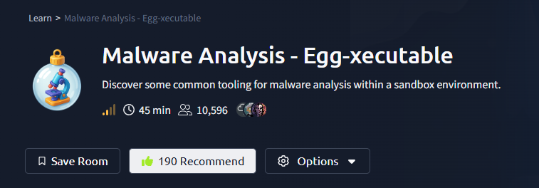
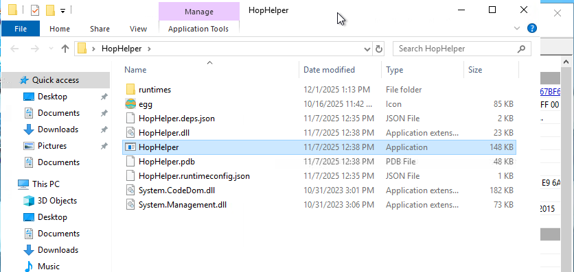
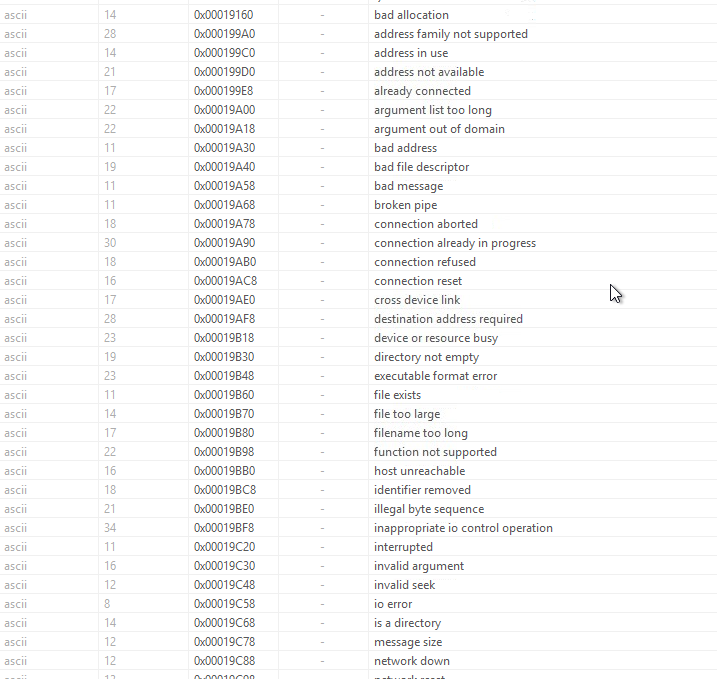
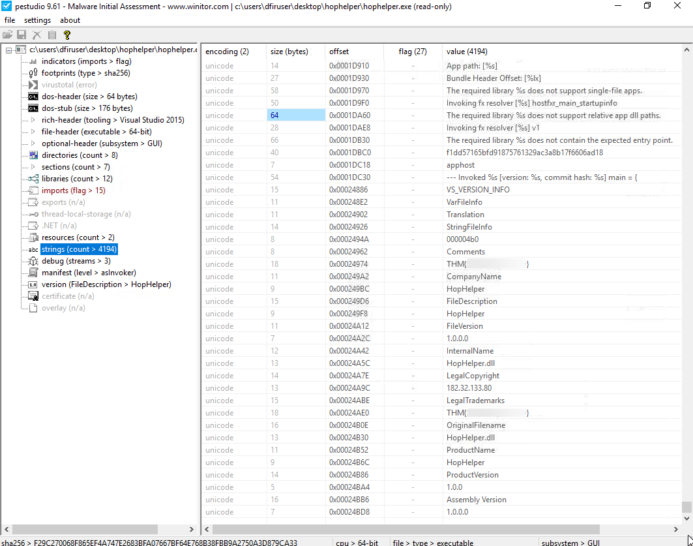
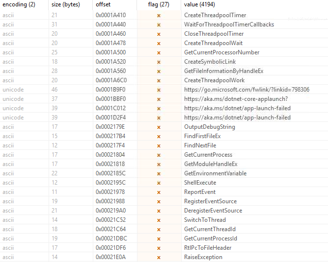
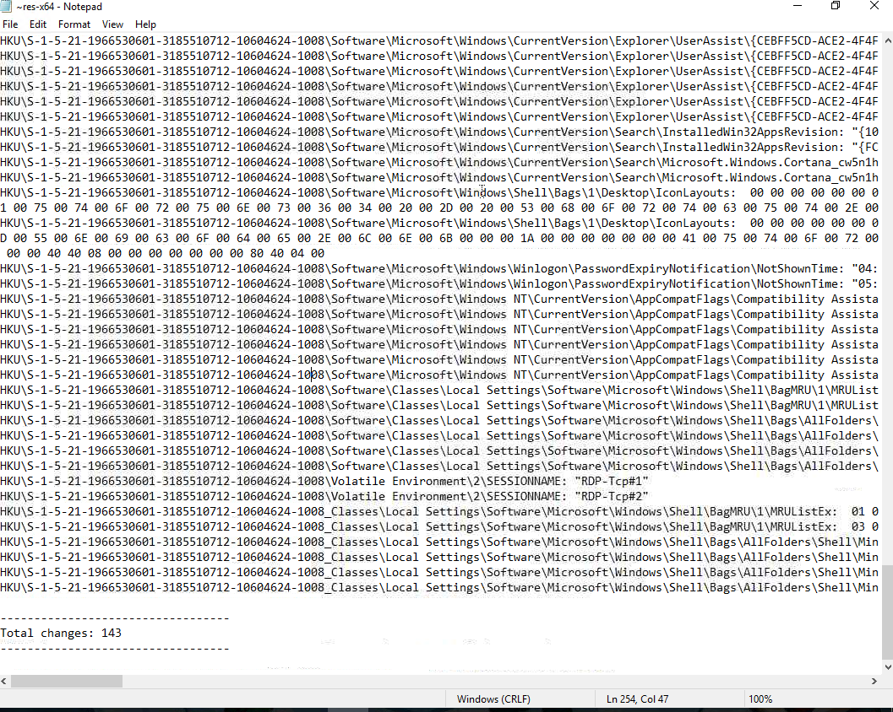

# Room Name: Malware Analysis - Egg-xecutable

The SOC team at TBFC is alert, poised, and ready to respond to any potential cyber threats. Meanwhile, the town of Wareville is quiet in the middle of the night.

Suddenly, the elves receive an email in unison from Elf McClause, Head of Elf Affairs, in their inboxes.

> **From:** Elf McClause  
> **Subject:** A new schedule awaits  
> **Attachments:** HopHelper.exe  
>  
> To all Elves,  
>  
> Going forward, we will be using a new program for creating and viewing team rotas.  
>  
> This new program will revolutionize how rotas are made here at The Best Festival Company.  
>  
> Please contact IT support if you have issues running the program.  
>  
> Kind regards, remain the best,  
>  
> Elf McClause  
> Head of Elf Affairs

A member of the SOC team screams, “Why is Elf McClause working at 3 AM?”  
Definitely a question worth asking.

Elf McBlue is immediately suspicious.  
Their years of experience in the SOC have taught them not to download “out of the blue” attachments.

So here we are, tasked with investigating the executable shared: `HopHelper.exe`.

Let’s start the target machine and set up our analysis environment.

---

## Before diving into the analysis, let’s look at some crucial concepts.

### Principles of Malware Analysis

Malware analysis is the process of examining and analyzing malicious software to understand its behavior, purpose, and potential impact on a system.  
By analyzing the behavior of the malware, we can understand its purpose and potential impact on a system.

Instead of fearing malware, we proactively approach by translating technical findings into practical defense measures and understanding how malware works.

### 2 Main branches of malware analysis:
1. **Static Analysis**  
2. **Dynamic Analysis**

**Static Analysis:** Examining the code of the malware without executing it.  
**Dynamic Analysis:** Examining the behavior of the malware while it is executing.

### Sandboxes

Sandboxes are safe, isolated environments for analysis that allow us to analyze malware without affecting other systems.

We follow the golden rule of malware analysis: *never run dangerous applications on devices you care about.*

Most of the time, it is a virtual machine or a container.  
This allows us to control how the system operates and benefit from taking snapshots of the system state, allowing us to create and restore the machine to various stages of its status.

---

Having covered the fundamentals, let’s move to the practical section.

As we saw previously, we use **static analysis** to examine the code of the malware without executing it.

It can be a quick and effective way to understand how the sample may work and how to identify it.

### What can we gather with static analysis?

1. **Checksums** – Used to track and catalog files and executables (SHA256, MD5 hashes).
2. **Strings** – A sequence of readable characters within the file or executable, e.g., IP addresses, URLs, commands, or even passwords.
3. **Imports** – Functions or libraries that the executable depends on. Applications mostly use OS functions or third-party libraries to interact with the system, e.g., `CreateFileW`, `WriteFileW`, `CloseHandle`, etc.
4. **Resources** – Embedded data within the executable, e.g., icons, cursors, dialogs, etc. This can be helpful as malware might use a Word document icon to hide itself as a Word document.

Still, even if we have all this information, we can’t be sure if it is malicious or not.  
Attackers use obfuscation to hide their code and make it harder to analyze, helping it to evade anti-viruses and even security analysts.

---

### Demonstrating PeStudio

As I do not have a `downloader.exe` demo sample, we will be directly using the file `HopHelper.exe`, following the same instructions as we would for any other sample.

Open PeStudio from the desktop shortcut.  
Either drag and drop the file or open the file and select the `HopHelper` application.

On loading, we see the file hash (SHA256) in the 1st line, which is a unique identifier for the file.  
Keep note of this:  
`F29C270068F865EF4A747E2683BFA07667BF64E768B38FBB9A2750A3D879CA33`

Try to search this hash on VirusTotal or any other online database.

  
(Surprisingly, the file looks clean.)

We even see the file size: 151040 bytes.  
We see file type as executable, 64-bit.

The tool also shows it was built using:  
`Microsoft Linker 14.29 | Visual Studio 2015`

This tells us it was compiled using a normal and common Windows development toolchain. (Not proof that it is safe.)

---

Next, let’s have a look at the strings in the left pane.  
Maybe we could get an idea of the attacker’s command infrastructure.

At the start, we see some random strings. If we scroll past them, we can see some readable strings.

Like `bad allocation`, `address family not supported`, etc.  
These are common error messages that we see in code (C/C++).

They come from common Windows runtime libraries like:

*   MSVCRT (Microsoft C Runtime)
*   WS2_32 (Winsock errors)
*   NTDLL (system-level errors)

Does this reveal that it is malware? No. They simply show that the program uses standard networking or file-handling functions.

Why are these strings present?  
Because when you link with default Windows libraries, these error messages are included in the binary, even if the application barely uses them.

If you scroll past more, we mostly see names of Windows API functions such as `CreateEventEx`, `CreateSemaphore`, `InitializeCriticalSectionEx`, `CreateThreadpoolTimer`, `GetTickCount64`, and others.

These are all standard Windows functions used for threading, timers, and synchronization.  
They appear in almost every normal Windows executable because they are part of the default system libraries.

So again, nothing here looks suspicious or malware-like.  
This simply tells us that the program is using regular Windows functionality.

Near the end, we see a flag for our question:

If you were to sort the flag column and take a look at all the values that are flagged, PeStudio shows around 27 API functions marked.  
These do **not** mean the file is malicious. They simply indicate APIs that *could* be used for malware if someone wanted to.

Most of these functions are common Windows APIs related to:

*   Threadpool timers
*   Process information
*   Event logging
*   Debugging
*   Symbolic links

The presence of Microsoft .NET URLs such as:

*   `https://aka.ms/dotnet-core-applaunch`
*   `https://aka.ms/dotnet/app-launch-failed`

Shows that this is actually a .NET self-contained application, which normally includes a large set of Windows API imports.

So nothing here stands out as malicious. These are standard APIs that almost every .NET application contains.

---

### Conclusion (Static Analysis)

Based on the metadata, hashes, and strings we examined, the file looks like a normal 64-bit .NET application with standard Windows API references. The flagged APIs are common functions used by regular programs and do not indicate malicious behavior on their own. The presence of official Microsoft .NET links further supports that this is a self-contained .NET build. Overall, nothing in the static analysis suggests that this file is malicious.

---

## Let’s move to dynamic analysis.

As we have seen earlier, dynamic analysis is the process of executing the malware to understand its behavior.

### Let’s see a tool: Regshot

Regshot is a widely used tool when analyzing malware, especially on the Windows platform.  
It creates 2 snapshots of the registry (the registry is a database of settings and options for the system and applications): one before the execution of the sample and one after the execution of the sample.  
Then the results can be compared to identify any changes.

One of the main aims of malware is to establish persistence, meaning it seeks to run as soon as the system starts.  
A common technique that malware uses is to add a ‘Run’ key to the registry to automate application execution at startup.

Open up Regshot from the desktop shortcut.  
Let’s create our first snapshot. Press `1st shot` and then `Shot` on the dropdown. Note the settings (save as HTML document, also output path to the desktop).  
It might take a while to create the snapshot (please be patient).

When done, you might see something like this:

---

### Let’s actually run the sample now.

**Disclaimer:** We are on an isolated and safe machine, so we are not worried about any damage to the system. Please be aware of this and do not, in any case, run unknown samples on your system. If you are not sure what you are doing, please ask for help.

We go to the HopHelper folder and run the application.

We see some changes, such as a dialog box with:

> King Malhare sending his regards

And we see icons of some application shortcuts turned into some Easter egg icons.

Close the dialog box and click on `2nd shot` and then `Shot` on the dropdown.

Now, on the compare tab below the 2nd shot after it ran, save it as a TXT file.

Now if you see the TXT file, you will notice some changes like:

*   Keys added: 20
*   Values deleted: 4
*   Values added: 58
*   Values modified: 61
*   Total Changes: 143

For the question to be answered, search for the term `run` in the TXT file. You will find it.

---

### Next, we will use ProcMon (Process Monitor) from the Sysinternals Suite.

Process Monitor is used to monitor and investigate how processes are interacting with the Windows operating system. It is a powerful tool that allows us to see exactly what a process is doing, for example, reading and writing registry keys, searching for files, or creating network connections.

Open up ProcMon from the desktop shortcut and rerun the sample.

Allow a minute to pass and then stop the process.

Let’s apply some filters to make it easier to analyze.

Apply the filter:  
`Process Name` is `HopHelper.exe`, then `Add` and `OK`.

You will see a lot of events.

Again, apply another filter, as we are trying to find if there was any external network connection made:  
`Operation` contains `TCP`, then `Add` and `OK`.

With this filter applied, we can clearly see several TCP Connect, Send, and Receive events.  
This confirms that the sample did attempt to make outbound network communication.

From the TCP events in ProcMon, we can see the sample is connecting to a host named `breachblocker-sandbox` over HTTP. This suggests the executable is communicating with a local web panel or simulated C2 server inside the sandbox environment.

---

### Conclusion:

Static analysis showed no obviously malicious code, but dynamic analysis revealed clear behavioral indicators: registry modifications, UI changes, and outbound TCP communication. The executable attempted to reach a local sandbox “web panel,” confirming that despite appearing clean, it performs actions consistent with controlled malware behavior.

Thank you for reading this walkthrough. I hope you found it helpful.

Keep learning and keep practicing!
